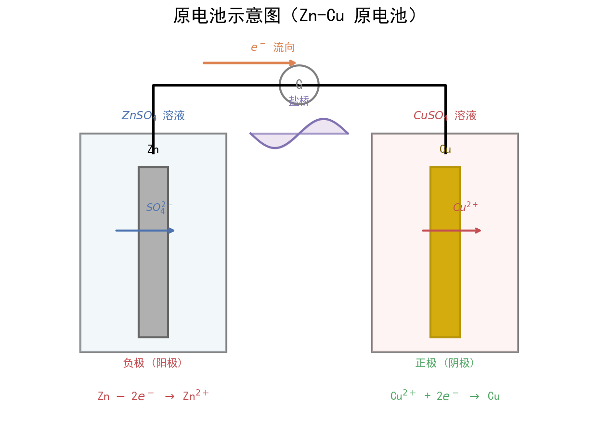

# 化学反应与能量

| 字段 | 内容 |
|------|------|
| **来源** | 人教版必修第二册 第六章 + 广东选择性考试 |
| **时间标签** | #高一筑基 |
| **难度** | ★★★☆☆ |
| **状态** | ⚠️待强化 |
| **试卷来源** | #广东选择性考试 |
| **广东考情** | 考查频率：中高频（近5年广东卷3-4次考查，常结合能量变化图像、盖斯定律计算）；难度定位：中档（盖斯定律计算需构建方程组，热化学方程式书写需规范）；特色描述：广东卷常结合新能源、碳中和等情境考查反应热，如锂电池、氢能源、CO₂资源化利用等；赋分提示：反应热计算是赋分"稳定得分区"，确保方程式书写规范和焓变符号准确 |

---




## 核心内容

### 关键概念
- **反应热（Q）**：化学反应中吸收或放出的热量，单位kJ或kJ/mol，与反应条件有关
- **焓变（ΔH）**：恒压条件下的反应热，ΔH = H(生成物) - H(反应物)，单位kJ/mol
  - ΔH < 0：放热反应（体系能量降低，环境获得热量）
  - ΔH > 0：吸热反应（体系能量升高，环境提供热量）
- **活化能（Eₐ）**：反应物分子变成活化分子所需的最低能量，决定反应速率，与反应热无直接关系
- **燃烧热**：1mol纯物质完全燃烧生成稳定氧化物时放出的热量，单位kJ/mol，如H₂O为液态
- **中和热**：稀溶液中强酸与强碱发生中和反应生成1mol H₂O(l)时放出的热量，ΔH = -57.3 kJ/mol

### 核心公式/定理

```
1. 键能法计算焓变：
   ΔH = Σ(反应物键能) - Σ(生成物键能)
   > 断键吸热，成键放热，反应热 = 吸热 - 放热

2. 盖斯定律：
   化学反应的焓变只与始态和终态有关，与反应途径无关
   
   若反应③ = 反应① + 反应②，则 ΔH₃ = ΔH₁ + ΔH₂
   若反应③ = 反应① - 反应②，则 ΔH₃ = ΔH₁ - ΔH₂
   若反应③ = n×反应①，则 ΔH₃ = n×ΔH₁

3. 能量图像法：
   ΔH = E(生成物总能量) - E(反应物总能量)
   ΔH = Eₐ(正) - Eₐ(逆)
```
> 适用条件：键能法适用于已知各物质键能数据时；盖斯定律适用于无法直接测定焓变、需通过已知反应间接计算时
> 注意事项：① 热化学方程式需标注物质状态(s/l/g/aq)；② ΔH有正负号，放热为负，吸热为正；③ 方程式系数变化，ΔH等比例变化；④ 可逆反应焓变指完全反应时的热效应

### 方法步骤

#### 盖斯定律计算步骤
1. **找目标**：写出目标反应的化学方程式
2. **选已知**：从已知反应中找出与目标反应相关的物质
3. **调方向**：将已知反应方程式颠倒（ΔH变号）或乘系数（ΔH等比例变化）
4. **加和消**：将调整后的方程式相加，消去中间产物，得到目标方程式
5. **对应算**：目标ΔH等于各调整后方程式ΔH的代数和

#### 热化学方程式书写步骤
1. 写出配平的化学方程式
2. 标注各物质的状态（s、l、g、aq）
3. 在方程式右侧写出ΔH，注明正负号和单位kJ/mol
4. 检查：ΔH与化学计量数成正比；正逆反应ΔH数值相等、符号相反

### 常见放热/吸热反应速记

| 放热反应（ΔH < 0） | 吸热反应（ΔH > 0） |
|---------------------|---------------------|
| 燃烧反应 | 大多数分解反应（如CaCO₃分解） |
| 中和反应 | 少数分解反应（如H₂O₂分解放热） |
| 金属与酸/水反应 | 盐类水解（弱酸/弱碱盐） |
| 大多数化合反应（如N₂+3H₂→2NH₃） | 大多数化合反应的逆反应（即分解） |
| 缓慢氧化（如铁生锈） | 碳与CO₂反应：C + CO₂ → 2CO |
| 铝热反应 | 碳与水蒸气反应：C + H₂O → CO + H₂ |
| 合成氨、工业制硫酸 | Ba(OH)₂·8H₂O + NH₄Cl反应 |

### 记忆口诀/技巧
> 盖斯定律口诀："目标反应当基准，已知反应来拼凑，倒转变号乘变倍，加和消去中间物，ΔH对应同运算"
> 
> 能量变化口诀："反应物在上放热降，反应物在下吸热升，活化能是门槛高，催化剂降低不改变ΔH"

---

## 关联卡片

- [化学反应速率与化学平衡](高二深化_化学_核心知识网络_化学反应速率与化学平衡.md) — 能量变化与反应速率（活化能）、勒夏特列原理（吸放热对平衡的影响）
- [电化学体系](高二深化_化学_核心知识网络_电化学体系.md) — 原电池和电解池中的能量转化（化学能↔电能）与反应热的关系
- [盖斯定律计算专题](高二深化_化学_典型题型与方法_盖斯定律计算通法.md) — 盖斯定律的方程组构建技巧与计算训练（待建）

---

## 备注

1. **广东卷情境化趋势**：广东卷常结合以下情境考查反应热：
   - 碳中和：CO₂催化加氢制甲醇、CO₂电化学还原
   - 新能源：氢燃料电池、锂离子电池充放电能量变化
   - 工业实际：合成氨、硫酸工业中的能量回收与利用
2. **易错警示**：
   - 混淆"反应热"与"焓变"：严格来说恒压下才相等，但高中常混用
   - 忘记标注状态：H₂O(g)与H₂O(l)的能量差不能忽略（约44kJ/mol）
   - 燃烧热定义陷阱：必须是1mol物质、完全燃烧、生成稳定氧化物（C→CO₂，H→H₂O(l)，S→SO₂）
   - 中和热定义陷阱：必须是稀溶液、强酸强碱、生成1mol H₂O(l)
3. **图像题技巧**：广东卷常考能量变化图像题，注意：
   - 反应物总能量高于生成物 → 放热 → ΔH < 0
   - 催化剂只降低活化能（Eₐ），不改变ΔH
   - 反应热 = 正反应活化能 - 逆反应活化能
4. **计算精度**：盖斯定律计算时注意系数与ΔH的同步变化，保留小数点后1位
5. **与广东工艺关联**：工艺流程中常涉及焙烧、煅烧等反应，需判断吸放热，如煅烧石灰石（吸热）需要高温条件，这直接影响流程中的能耗分析
