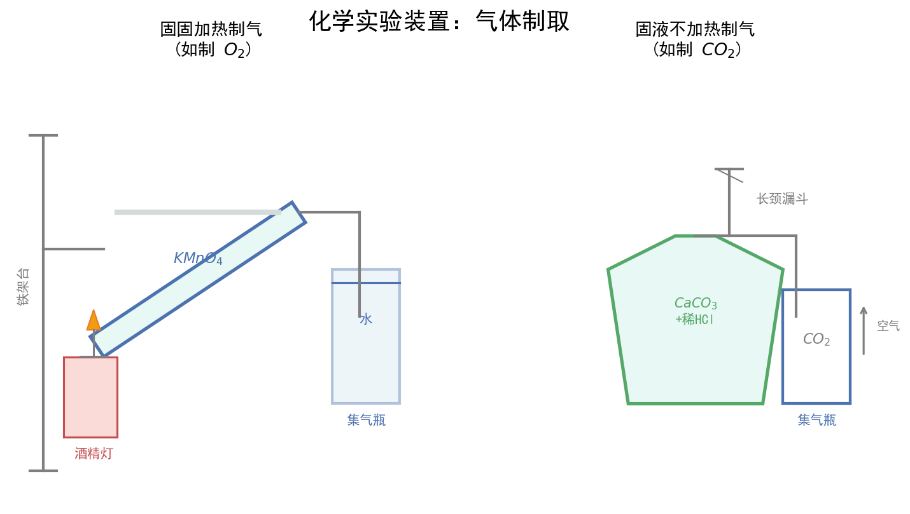

# 化学计量与物质的量

| 字段 | 内容 |
|------|------|
| **来源** | 人教版必修第一册 第二章 + 广东选择性考试 |
| **时间标签** | #高一筑基 |
| **难度** | ★★★☆☆ |
| **状态** | ⚠️待强化 |
| **试卷来源** | #广东选择性考试 |
| **广东考情** | 考查频率：高频（近5年广东卷每年必考，常作为计算基础渗透于工艺流程、实验题中）；难度定位：基础~中档（单独考查较基础，综合考查时计算量增大）；特色描述：广东卷常将物质的量计算融入工艺流程题（如矿石提纯中的产率计算）和实验探究题（如滴定分析），需熟练以物质的量为中心建立各物理量之间的联系；赋分提示：基础计算题是赋分"基本盘"，确保不丢分，阿伏伽德罗常数陷阱题是广东卷常设考点 |

---


## 配套图形



## 核心内容

### 关键概念
- **物质的量（n）**：表示含有一定数目粒子集合体的物理量，单位mol，是国际单位制7个基本物理量之一
- **阿伏伽德罗常数（Nₐ）**：1mol任何粒子所含的粒子数，Nₐ ≈ 6.02×10²³ mol⁻¹，注意Nₐ有单位，数值约等于6.02×10²³
- **摩尔质量（M）**：单位物质的量的物质所具有的质量，单位g/mol，数值上等于相对原子/分子质量
- **气体摩尔体积（Vₘ）**：标准状况（0℃、101kPa）下，Vₘ ≈ 22.4 L/mol，仅适用于气态纯物质或混合气体（不相互反应）
- **物质的量浓度（c）**：单位体积溶液里所含溶质的物质的量，c = n/V，单位mol/L，注意V是溶液体积而非溶剂体积

### 核心公式/定理

```
以物质的量为中心的计算关系：

n = N / Nₐ        n = m / M        n = V(气) / Vₘ        n = c·V(溶液)

                     ┌── N（粒子数）
                     │    n = N/Nₐ
                     │
   m（质量） ←── n（物质的量）──→ Vₘ（气体体积）
      n = m/M      │      n = V/Vₘ
                     │
                     └── c·V（溶液中溶质）
```
> 适用条件：Vₘ = 22.4 L/mol 仅适用于标准状况下的气体；溶液浓度计算时V必须是溶液体积
> 注意事项：① 标况下非气态物质：H₂O、SO₃、Br₂、CCl₄、苯、HF等；② 混合气体Vₘ仍适用；③ 溶液稀释/浓缩：c₁V₁ = c₂V₂（溶质物质的量守恒）

### 方法步骤
1. **审题明确**：确定已知量和待求量，判断物质状态（气/液/固）
2. **建桥梁**：统一以物质的量n为中心，选择合适公式进行转化
3. **列关系**：利用化学方程式中各物质的计量数之比 = 物质的量之比
4. **代数据**：注意单位统一，标况条件判断，溶液体积与溶剂体积区分
5. **验结果**：检查数量级是否合理，是否符合化学常识

### 阿伏伽德罗常数八大陷阱

| 陷阱 | 典型表述 | 正误辨析 |
|------|----------|----------|
| **陷阱1：标况状态** | 标况下22.4L H₂O含Nₐ个分子 | ❌ 标况下水为液态，不能用Vₘ |
| **陷阱2：物质组成** | 1mol Na₂O₂含2Nₐ个离子 | ❌ 含2Na⁺和1O₂²⁻，共3Nₐ个离子 |
| **陷阱3：水解/电离** | 1L 0.1mol/L CH₃COOH含0.1Nₐ个H⁺ | ❌ 弱酸部分电离，H⁺远小于0.1Nₐ |
| **陷阱4：可逆反应** | 1mol N₂与3mol H₂反应转移6Nₐ电子 | ❌ 合成氨可逆，实际转移小于6Nₐ |
| **陷阱5：共价键数** | 1mol SiO₂含4Nₐ个Si-O键 | ✅ 每个Si与4个O形成4个共价键 |
| **陷阱6：同位素** | 18g D₂O含Nₐ个分子 | ❌ D₂O摩尔质量20g/mol，应为0.9mol |
| **陷阱7：最简式** | 46g NO₂含Nₐ个分子 | ❌ 存在2NO₂⇌N₂O₄平衡，分子数小于Nₐ |
| **陷阱8：胶体/晶体** | 1mol FeCl₃水解生成Nₐ个Fe(OH)₃胶粒 | ❌ 一个胶粒由多个Fe(OH)₃聚集而成，胶粒数远小于Nₐ |

### 记忆口诀/技巧
> 阿伏伽德罗常数判断口诀："标况气态才用22.4，溶液是水不是剂，弱质水解要考虑，可逆反应不完全，结构组成数清楚，胶粒聚集多个算"

---

## 题型识别标志

> **看到什么条件 → 立刻想到什么方法/模型**

| 题干关键条件 | 识别为 | 首选方法 |
|-------------|--------|----------|
| "Nₐ为阿伏伽德罗常数，下列说法正确的是" | Nₐ 正误判断 | 三步法：算微粒数→查状态/水解/可逆→定正误 |
| "标准状况下 22.4 L 某物质" | 气体摩尔体积陷阱 | 先判标况是否气态(H₂O/SO₃/苯/溴否) |
| "1 L c mol/L 某弱电解质溶液含离子" | 水解/电离陷阱 | 弱酸弱碱部分电离，数目 < cNₐ |
| "1 mol 某物质含化学键/离子数" | 结构组成陷阱 | 数清结构单元(Na₂O₂含3离子、SiO₂含4 Si−O) |
| "可逆反应转移电子" | 可逆不完全陷阱 | 实际 < 理论值 |
| "质量/体积求物质的量" | 基本计算 | n=m/M、n=V/Vₘ(标况气体) |
| "同位素 D₂O/T₂O、最简式混合物" | 组成陷阱 | 用真实摩尔质量，非普通值 |

## 解题路径（阿伏伽德罗常数三步法）

### 第一步：将选项转化为"微粒数"计算
- 写出 n = m/M 或 n = V/Vₘ 或 n = cV，再乘单位微粒中的粒子个数

### 第二步：逐项排查八大陷阱
- 标况状态、物质组成、水解电离、可逆反应、共价键数、同位素、最简式、胶体聚集

### 第三步：定正误，回扣"是否含有该微粒"
- 注意 Nₐ 有单位 mol⁻¹；混合气体分子数 = 总物质的量 × Nₐ
- 易错：σ 键计数 = 单键数 + 每个多重键中的 1 个 σ 键

## 母题（2024 广东选择性考试·第10题，2分）

> 广东卷选择题高频"送分/送命题"，综合考查 σ 键、水解、气体状态与转移电子。

**题目**：设 Nₐ 为阿伏伽德罗常数的值。下列说法正确的是（  ）
A. 26 g H—C≡C—H 中含有 σ 键的数目为 3Nₐ
B. 1 L 1 mol·L⁻¹ NH₄NO₃ 溶液中含 NH₄⁺ 的数目为 Nₐ
C. 1 mol CO 和 H₂ 的混合气体含有的分子数目为 3Nₐ
D. Na 与 H₂O 反应生成 11.2 L H₂，转移电子数目为 Nₐ

**解**：
- A：26 g C₂H₂ 物质的量 = 26/26 = 1 mol；1 个 C₂H₂ 含 3 个 σ 键(2×C−H + C≡C 中的 1 个 σ)，故 σ 键数目 = 3Nₐ，**A 正确**
- B：NH₄⁺ 在水溶液中水解，1 L 1 mol·L⁻¹ 中 NH₄⁺ 数目 < Nₐ，**B 错**
- C：CO、H₂ 均由分子构成，1 mol 混合气体含分子数 = Nₐ（非 3Nₐ），**C 错**
- D：未指明气体所处状态(是否标况)，无法求 H₂ 物质的量及转移电子数，**D 错**

**答**：A

> 💡 关键技巧：A 选项易误以为 C≡C 只算 1 个 σ 而漏算；注意"σ 键总数 = 单键数 + 每个多重键中的 1 个 σ 键"，C≡C 贡献 1 个 σ + 2 个 π。

## 自测训练（3道·覆盖阿伏伽德罗常数与物质的量计算）

> 先独立完成，再展开卡片末尾「参考答案」核对。每题标注所检验的题型，方便对号查漏。

**第1题**（检验：阿伏伽德罗常数陷阱 + σ键计数）
设 $N_A$ 为阿伏伽德罗常数的值。判断下列说法是否正确：
① 标准状况下，22.4 L $\mathrm{H_2O}$ 含有 $N_A$ 个分子；
② 26 g 乙炔（$\mathrm{C_2H_2}$，结构 $\mathrm{H-C\equiv C-H}$）中含有 σ 键的数目为 $3N_A$。

**第2题**（检验：物质的量桥接 + 溶液稀释）
① 将 5.85 g $\mathrm{NaCl}$（$M=58.5$）溶于水配成 500 mL 溶液，求 $c(\mathrm{NaCl})$；② 从中取出 100 mL 并稀释至 250 mL，求稀释后 $\mathrm{NaCl}$ 的浓度。

**第3题**（检验：弱电解质陷阱 + 混合气体分子数）
判断下列说法是否正确：
① 1 L 1 mol/L $\mathrm{NH_4NO_3}$ 溶液中含 $\mathrm{NH_4^+}$ 的数目为 $N_A$；
② 1 mol CO 和 $\mathrm{H_2}$ 的混合气体含有的分子数目为 $N_A$。

---

## 关联卡片

- [氧化还原反应核心规律](高一筑基_化学_核心知识网络_氧化还原反应核心规律.md) — 氧化还原反应方程式中电子转移数与物质的量的关联计算
- [化学反应速率与化学平衡](高二深化_化学_核心知识网络_化学反应速率与化学平衡.md) — 三段式计算中物质的量的变化量计算
- [水溶液中的离子平衡](高二深化_化学_核心知识网络_水溶液中的离子平衡.md) — 溶液中离子浓度、水解平衡与物质的量浓度的综合

---


- [离子反应少量/过量问题（"少定多变"通法）](../易错警示与辨析/高一筑基_化学_易错警示与辨析_离子反应少量过量问题.md)

- [阿伏伽德罗常数（NA）八大陷阱逐条拆解](../易错警示与辨析/高一筑基_化学_易错警示与辨析_阿伏伽德罗常数八大陷阱.md)
## 备注

1. **广东卷特色**：广东卷常将阿伏伽德罗常数考查放在选择题第1-3题位置，作为"送分题"或"送命题"，必须准确判断物质状态、反应条件、水解电离等细节
2. **工艺流程中的计算**：广东工艺流程题常涉及"产率""纯度"计算，核心公式：产率 = (实际产量/理论产量) × 100%，理论产量需通过物质的量守恒计算
3. **实验滴定计算**：酸碱中和滴定中 n(酸)·V(酸)·a = n(碱)·V(碱)·b（a、b为酸、碱元数），注意待测液取用量与配制的总体积关系
4. **常见易错**：混淆"1mol物质的质量"与"相对分子质量"（数值相等，单位不同）；混淆"溶液体积"与"溶剂体积"
5. **等质量/等物质的量比较**：等质量时，摩尔质量越小物质的量越大；等物质的量时，质量与摩尔质量成正比

---

## 参考答案

> 答案与题目分板块呈现，便于"先做后对"。每题给出规范解答 + 易错提醒，做完一题对一题。

<details>
<summary>▶ 第1题详解（标况状态 + σ键计数）</summary>

① **错误**。标准状况下（0℃、101 kPa），$\mathrm{H_2O}$ 为 **液态**（非气态），不能用 $V_m = 22.4\ \mathrm{L/mol}$ 计算。22.4 L 液态水的物质的量远小于 1 mol（密度 ≈ 1 g/mL，22.4 L ≈ 22400 g，$n = 22400/18 \approx 1244$ mol，但题目陷阱是"误用气体摩尔体积"）。

正确判断：标况下 $\mathrm{H_2O}$ 不是气体，不能用 22.4 L/mol 换算。

② **正确**。26 g $\mathrm{C_2H_2}$（$M = 26$）的物质的量 $n = 1\ \mathrm{mol}$。

每个 $\mathrm{C_2H_2}$ 分子（$\mathrm{H-C\equiv C-H}$）含 σ 键：2 个 C−H 键 + 1 个 C≡C 中的 σ 键 = **3 个 σ 键**（C≡C 另有 2 个 π 键不计入 σ）。

故 1 mol $\mathrm{C_2H_2}$ 含 σ 键数目 = $3N_A$ ✓

> **易错提醒**：标况下水、$\mathrm{SO_3}$、苯、溴均为非气态；σ 键 = 单键数 + 每个多重键中 1 个 σ 键（C=C 贡献 1σ+1π，C≡C 贡献 1σ+2π）。

</details>

<details>
<summary>▶ 第2题详解（物质的量桥接 + 稀释定律）</summary>

① $n(\mathrm{NaCl}) = \dfrac{5.85}{58.5} = 0.100\ \mathrm{mol}$

$$c(\mathrm{NaCl}) = \frac{n}{V} = \frac{0.100}{0.500} = 0.200\ \mathrm{mol/L}$$

② 取出 100 mL，其中含 $n(\mathrm{NaCl}) = 0.200\times0.100 = 0.0200\ \mathrm{mol}$。

稀释至 250 mL：

$$c' = \frac{0.0200}{0.250} = 0.0800\ \mathrm{mol/L}$$

或用稀释定律 $c_1V_1 = c_2V_2$：$0.200\times100 = c_2\times250$，$c_2 = 0.0800\ \mathrm{mol/L}$。

**答**：原溶液浓度 $0.200\ \mathrm{mol/L}$；稀释后浓度 $0.0800\ \mathrm{mol/L}$。

> **易错提醒**：溶液稀释时溶质物质的量守恒（$c_1V_1 = c_2V_2$）；取出的溶液浓度等于原溶液浓度（均匀混合）。

</details>

<details>
<summary>▶ 第3题详解（水解陷阱 + 分子数判断）</summary>

① **错误**。$\mathrm{NH_4^+}$ 在水溶液中发生水解：$\mathrm{NH_4^+ + H_2O \rightleftharpoons NH_3\cdot H_2O + H^+}$，部分 $\mathrm{NH_4^+}$ 转化为 $\mathrm{NH_3\cdot H_2O}$。

1 L 1 mol/L $\mathrm{NH_4NO_3}$ 中初始 $\mathrm{NH_4^+}$ = 1 mol，水解后 $n(\mathrm{NH_4^+}) < 1\ \mathrm{mol}$，数目 **小于** $N_A$。

② **正确**。CO 和 $\mathrm{H_2}$ 均由分子构成（稀有气体单原子除外），1 mol 任何气体（或混合气体）含有的分子数目均为 $N_A$ 个（不是 $3N_A$ 或 $2N_A$）。

> **易错提醒**：弱电解质（弱酸/弱碱/盐水解的离子）部分电离/水解，实际数目小于理论值；混合气体的分子数只与总物质的量有关，与气体种类无关。

</details>
