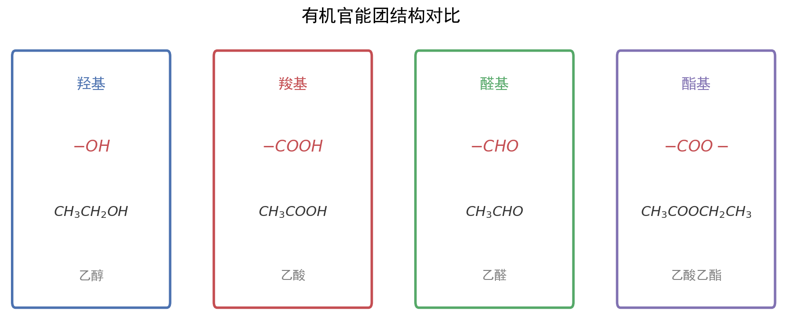

# 有机化学推断与合成

| 字段 | 内容 |
|------|------|
| **来源** | 人教版选择性必修第三册 + 广东选择性考试 |
| **时间标签** | #高二深化 |
| **难度** | ★★★★★ |
| **状态** | ⚠️待强化 |
| **试卷来源** | #广东选择性考试 |
| **广东考情** | 考查频率：高频（近5年广东卷每年必考，有机推断题通常位于第20-21题，分值约12-15分）；难度定位：中档~压轴（有机推断需综合运用官能团性质、反应条件、分子式信息，合成路线设计需逆向分析）；特色描述：广东卷有机题常结合医药合成、材料制备、天然产物提取等真实情境，注重绿色化学理念（原子经济性、催化剂选择）；赋分提示：有机推断是广东化学卷压轴题之一，官能团识别和反应类型判断是得分基础，合成路线设计是高分突破点 |

---




## 核心内容

### 关键概念
- **有机反应类型**：取代反应、加成反应、消去反应、氧化反应、还原反应、聚合反应（加聚/缩聚）
- **官能团**：决定有机物特殊性质的原子或原子团，是推断和合成的基础
- **同分异构体**：分子式相同、结构不同的化合物，包括碳链异构、位置异构、官能团异构、立体异构（顺反/对映）
- **有机推断**：根据分子式、官能团特征、反应条件、转化关系推断有机物结构
- **合成路线设计**：从目标产物逆向分析，选择合适原料和反应步骤，遵循"绿色化学"原则

### 核心公式/定理

```
1. 不饱和度（Ω）计算：
   Ω = (2C + 2 + N - H - X) / 2
   其中C、H、N、X分别为碳、氢、氮、卤素原子数
   每1个不饱和度 = 1个双键 或 1个环
   每2个不饱和度 = 1个三键 或 1个苯环（苯环Ω=4）

2. 有机推断突破口：
   - 分子式信息：结合不饱和度推断可能结构
   - 反应条件：浓H₂SO₄/△（酯化/消去）、NaOH/△（水解）、Cu/△（氧化）、H₂/催化剂（加成）
   - 特征现象：使溴水褪色（C=C或C≡C）、银镜反应（-CHO）、FeCl₃显色（酚）、Na产生H₂（-OH/-COOH）
   - 分子量变化：+16（氧化为醛/酮）、+32（氧化为酸）、+14（增加CH₂）
   - 碳骨架变化：碳链增长（增长2个C：醛与格氏试剂；增长1个C：CN水解）

3. 合成路线设计原则：
   - 正向分析：原料 → 中间体 → 目标产物
   - 逆向分析：目标产物 → 前体 → 原料（常用）
   - 保护基策略：引入保护基 → 目标反应 → 脱保护基
   - 绿色化学：原子经济性高、步骤少、副产物少、条件温和
```
> 适用条件：不饱和度公式适用于仅含C、H、O、N、X的有机物；逆向合成分析适用于复杂分子合成路线设计
> 注意事项：① 计算不饱和度时O不影响；② 立体异构需考虑手性碳和顺反结构；③ 合成路线中注意官能团兼容性

### 方法步骤

#### 有机推断题解题步骤
1. **读信息**：通读全题，标注已知条件（分子式、反应条件、特征现象）
2. **算不饱和度**：根据分子式计算不饱和度，初步推断是否含双键、三键、苯环
3. **找突破口**：
   - 特征反应条件：浓H₂SO₄/△→酯化或消去；NaOH/△→水解或卤代烃消去；Cu(OH)₂/△→醛基
   - 特征现象：银镜反应→醛基；使溴水褪色→C=C/C≡C/酚；FeCl₃显色→酚羟基
   - 分子量变化：M增加16→-CH₂OH→-CHO或-CHO→-COOH；M增加14→增加一个CH₂
4. **推中间体**：从已知物质向未知物质逐步推导，或从目标产物逆向推导
5. **验证结构**：将推断的结构代入所有条件，检验是否全部满足

#### 同分异构体书写策略
1. **碳链异构**：
   - 主链由长到短，支链由整到散，位置由心到边
   - 示例：C₅H₁₂有3种（正戊烷、异戊烷、新戊烷）

2. **位置异构**：
   - 官能团在碳链上位置不同
   - 示例：C₃H₇Cl有2种（1-氯丙烷、2-氯丙烷）

3. **官能团异构**：
   - 相同分子式，不同官能团类型
   - 常见对应：醇↔醚、醛↔酮、羧酸↔酯、氨基酸↔硝基化合物

4. **书写顺序**：
   - 步骤1：写碳链异构（主链由长到短）
   - 步骤2：标位置异构（官能团位置由心到边）
   - 步骤3：看官能团异构（换官能团类型）
   - 步骤4：检查立体异构（手性碳、顺反异构）

5. **限定条件同分异构**：
   - 能发生银镜反应→含-CHO或HCOO-
   - 能与NaHCO₃反应→含-COOH
   - 能与FeCl₃显色→含酚羟基
   - 能水解→含酯基或卤原子
   - 核磁共振氢谱峰数→等效氢种类

### 有机反应类型总结

| 反应类型 | 定义 | 典型试剂/条件 | 典型官能团变化 | 实例 |
|----------|------|---------------|----------------|------|
| **取代反应** | 原子/基团被其他原子/基团替代 | 卤素/Fe、浓硝酸/浓硫酸、NaOH/△ | -H→-X、-H→-NO₂、-X→-OH | 苯的溴代、酯化、水解 |
| **加成反应** | 不饱和键断裂，加其他原子/基团 | H₂/催化剂、X₂、HX、H₂O | C=C→C-C、C=O→C-OH | 乙烯加溴、醛加氢 |
| **消去反应** | 脱去小分子形成不饱和键 | 浓H₂SO₄/△、NaOH/醇/△ | -X或-OH→C=C | 乙醇制乙烯、卤代烃消去 |
| **氧化反应** | 加氧或去氢 | O₂/催化剂、Cu/△、KMnO₄ | -OH→-CHO、-CHO→-COOH | 乙醇氧化为乙醛 |
| **还原反应** | 加氢或去氧 | H₂/催化剂、NaBH₄、LiAlH₄ | -CHO→-CH₂OH、-NO₂→-NH₂ | 醛还原为醇 |
| **加聚反应** | 不饱和单体加成聚合 | 催化剂、加热加压 | C=C→链状高分子 | 乙烯→聚乙烯 |
| **缩聚反应** | 单体间脱去小分子聚合 | 催化剂、加热 | -OH+-COOH→酯键 | 对苯二甲酸+乙二醇→涤纶 |

### 官能团特征反应与检验速查

| 官能团 | 特征反应 | 检验方法 | 现象 |
|--------|----------|----------|------|
| -OH（醇） | 与Na反应、氧化为醛/酮 | 加入Na | 产生无色气体（H₂） |
| -OH（酚） | 与NaOH反应、FeCl₃显色 | 加入FeCl₃溶液 | 显紫色 |
| -CHO | 银镜反应、斐林反应 | 银氨溶液/△ | 产生银镜 |
| -COOH | 酸性、酯化反应 | 加入NaHCO₃ | 产生气泡（CO₂） |
| C=C / C≡C | 加成反应、氧化反应 | 溴水或KMnO₄ | 褪色 |
| -X（卤代烃） | 水解/消去反应 | NaOH/水/△后加HNO₃+AgNO₃ | 生成沉淀（AgCl白/AgBr浅黄/AgI黄） |
| -COOR（酯） | 水解反应 | NaOH/△后酸化 | 分层消失或产生羧酸气味 |
| -NH₂ | 碱性、与酸反应 | 加入HCl | 溶解 |

### 合成路线设计常用策略

```
1. 碳链增长：
   - 醛 + HCN → 氰醇 → 水解得α-羟基酸（增长1C）
   - 格氏试剂法：R-MgX + R'CHO → 增长R'基团（增长2C以上）
   - 羟醛缩合：2RCHO → β-羟基醛 → α,β-不饱和醛（增长2C）

2. 碳链缩短：
   - 烯烃臭氧氧化：RCH=CHR' → RCHO + R'CHO
   - 羧酸脱羧：R-COONa + NaOH/CaO → RH + Na₂CO₃
   - 卤仿反应：CH₃-CO-R + X₂/NaOH → RCOOH + CHX₃（缩短1C）

3. 官能团引入：
   - 引入-OH：烯烃水化、卤代烃水解、醛还原、酯水解
   - 引入-CHO：醇氧化、烯烃氧化（O₃/Zn）、端炔水化
   - 引入-COOH：醛氧化、酯水解、腈水解、苯同系物氧化
   - 引入C=C：卤代烃消去、醇消去、炔烃部分加氢

4. 官能团保护：
   - 酚-OH保护：与CH₃I/碱反应成醚，后用HI脱保护
   - 醛基保护：与醇反应成缩醛，后用酸水解脱保护
   - 氨基保护：与酸酐反应成酰胺，后水解

5. 逆向合成分析（ retrosynthesis ）：
   - 目标分子 → 前体（切断C-C键或C-杂键）
   - 常用切断：C-C键在官能团α位、β位或γ位切断
```

### 记忆口诀/技巧
> 有机推断突破口口诀："分子式算不饱和度，反应条件定类型，特征现象定官团，分子量变化定转化，前后联系定结构"
> 
> 同分异构书写口诀："碳链由长至短，支链由整到散，位置由心到边，官能团异构莫忘"
> 
> 合成路线设计口诀："目标产物倒着推，前体切断找对应，正向验证通不通，绿色化学记心中"

---

## 关联卡片

- [有机化学官能团性质](高一筑基_化学_核心知识网络_有机化学官能团性质.md) — 官能团性质是推断和合成的基础，需熟练掌握
- [结构化学基础](高二深化_化学_核心知识网络_结构化学基础.md) — 碳原子杂化类型（sp、sp²、sp³）与有机物空间构型、共面共线分析
- [化学反应速率与化学平衡](高二深化_化学_核心知识网络_化学反应速率与化学平衡.md) — 有机反应中的催化剂选择、温度控制等反应条件优化

---

## 备注

1. **广东卷有机题特色**：
   - 情境化：常以药物合成（如抗病毒药物、抗生素）、高分子材料（如可降解塑料）、天然产物提取为背景
   - 绿色化学：考查原子经济性、催化剂选择、副产物处理、循环利用
   - 结合实验：有时要求设计实验验证产物结构或纯度
2. **易错警示**：
   - 消去反应条件混淆：醇消去用浓H₂SO₄/△，卤代烃消去用NaOH/醇/△，水解用NaOH/水/△
   - 氧化程度混淆：醇→醛（氧化1步）→羧酸（再氧化1步），但伯醇和仲醇氧化产物不同
   - 苯环上的定位效应：活化基团（-OH、-NH₂、-R）使亲电取代在邻对位；钝化基团（-NO₂、-COOH）在间位
   - 同分异构体漏写：特别是酯类同分异构（R-COO-R'），需要考虑R和R'的不同组合
   - 手性碳判断：连接4个不同基团的碳原子为手性碳，存在对映异构
3. **核磁共振氢谱（¹H NMR）**：
   - 峰数 = 等效氢种类数
   - 峰面积比 = 等效氢原子数之比
   - 裂分情况：n+1规律（相邻碳上有n个氢则裂分为n+1重峰）
   - 广东卷常结合NMR信息推断有机物结构，需注意化学位移范围（如醛基H在9-10 ppm）
4. **与工艺流程关联**：广东工艺流程题中常涉及有机物的分离提纯（如萃取、蒸馏、结晶），需结合有机物物理性质（沸点、溶解性）分析
5. **等级赋分提示**：有机推断题是广东化学卷压轴题（12-15分），通常设5-6小问，前3问（官能团名称、反应类型、结构简式）是赋分"基本盘"，后几问（同分异构体、合成路线设计）是"拉分点"，确保基础分不丢是等级赋分B以上的关键
