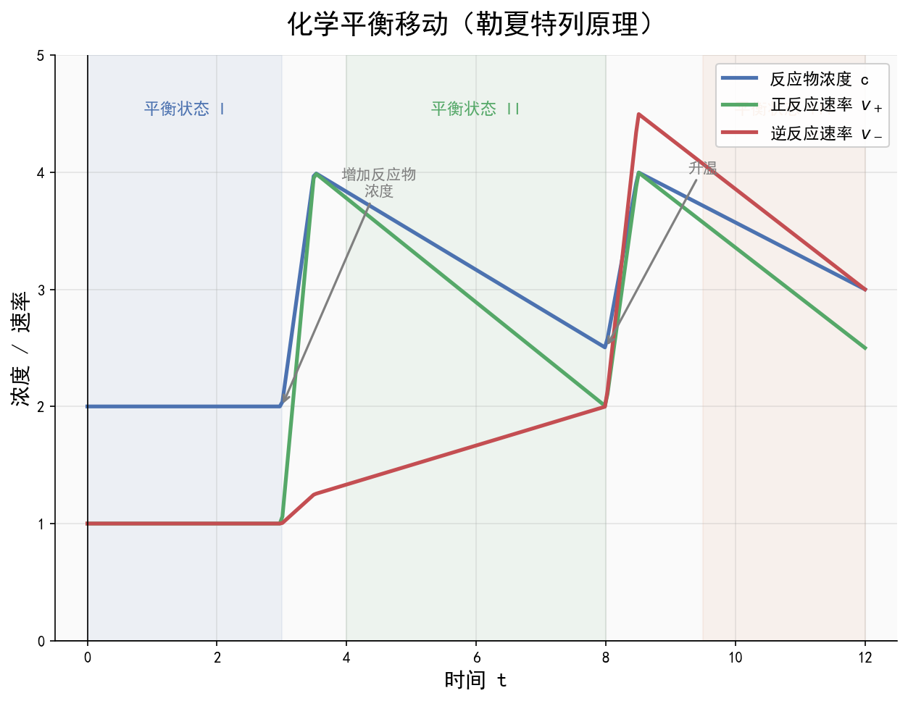
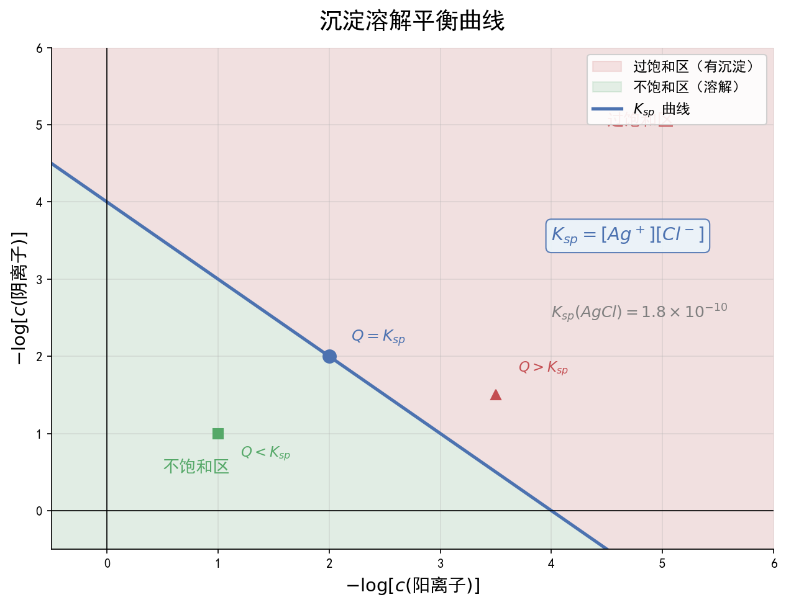

# 水溶液中的离子平衡

| 字段 | 内容 |
|------|------|
| **来源** | 人教版选择性必修第一册 第三章 + 广东选择性考试 |
| **时间标签** | #高二深化 |
| **难度** | ★★★★☆ |
| **状态** | ⚠️待强化 |
| **试卷来源** | #广东选择性考试 |
| **广东考情** | 考查频率：高频（近5年广东卷每年必考，常与沉淀溶解平衡、工业流程结合）；难度定位：中档~压轴（三大守恒书写、离子浓度比较需综合多平衡，沉淀溶解平衡常与Ksp计算结合）；特色描述：广东卷常将离子平衡与真实情境结合（如废水处理、矿物提纯、医药制备），溶液pH调控是工艺流程中的关键步骤；赋分提示：本专题是等级赋分"拉分点"，掌握三大守恒和Ksp计算是高分关键 |

---






## 核心内容

### 关键概念
- **弱电解质电离平衡**：弱酸/弱碱在水中部分电离，存在电离平衡。电离度α = 已电离分子数/总分子数，温度升高、稀释溶液促进电离
- **水的电离与离子积**：H₂O ⇌ H⁺ + OH⁻，K_w = c(H⁺)·c(OH⁻) = 1×10⁻¹⁴（25℃），K_w只与温度有关，温度升高K_w增大
- **盐类水解**：盐电离出的离子与水电离出的H⁺或OH⁻结合生成弱电解质的反应，"有弱才水解，越弱越水解，谁强显谁性"
- **沉淀溶解平衡**：难溶电解质在水中存在溶解平衡，如AgCl(s) ⇌ Ag⁺(aq) + Cl⁻(aq)，溶度积Ksp = c(Ag⁺)·c(Cl⁻)
- **三大守恒**：电荷守恒、物料守恒、质子守恒（可由电荷守恒-物料守恒推导）

### 核心公式/定理

```
1. 弱酸电离平衡常数：
   HA ⇌ H⁺ + A⁻，Kₐ = [c(H⁺)·c(A⁻)] / c(HA)
   对于弱酸：c(H⁺) ≈ √(Kₐ·c)（当c/Kₐ ≥ 500时）

2. 水的离子积：
   K_w = c(H⁺)·c(OH⁻) = 1×10⁻¹⁴（25℃）
   pH = -lg c(H⁺)，pOH = -lg c(OH⁻)，pH + pOH = 14（25℃）

3. 盐类水解平衡常数：
   A⁻ + H₂O ⇌ HA + OH⁻，K_h = K_w / Kₐ
   水解程度：K_h越大，水解程度越大

4. 溶度积：
   AₘBₙ(s) ⇌ mAⁿ⁺(aq) + nBᵐ⁻(aq)
   Ksp = cᵐ(Aⁿ⁺)·cⁿ(Bᵐ⁻)
   沉淀生成条件：Q > Ksp；沉淀溶解条件：Q < Ksp
   沉淀转化：Ksp小的沉淀更容易生成，但需考虑离子浓度

5. 三大守恒通式：
   电荷守恒：Σ(正电荷) = Σ(负电荷)（系数×电荷数）
   物料守恒：某元素所有存在形式浓度之和 = 原始投入浓度（考虑系数比）
   质子守恒：得质子产物 = 失质子产物（参考水准法）
```
> 适用条件：Kₐ近似公式适用于弱酸且电离度小的情况；三大守恒适用于任何电解质溶液
> 注意事项：① 温度影响K_w和Ksp，计算时注意温度条件；② 混合溶液中需考虑多重平衡的竞争；③ 沉淀转化需同时考虑Ksp和离子浓度

### 方法步骤

#### 三大守恒书写方法
1. **电荷守恒**：
   - 步骤：列出溶液中所有阳离子和阴离子
   - 原则：正电荷总数 = 负电荷总数，离子浓度前乘其所带电荷数
   - 示例：Na₂CO₃溶液中：c(Na⁺) + c(H⁺) = c(OH⁻) + c(HCO₃⁻) + 2c(CO₃²⁻)

2. **物料守恒**：
   - 步骤：确定原始溶质的组成比
   - 原则：某原子/基团的所有存在形式浓度之和保持原始比例
   - 示例：Na₂CO₃溶液中：c(Na⁺) = 2[c(CO₃²⁻) + c(HCO₃⁻) + c(H₂CO₃)]

3. **质子守恒**：
   - 方法一：电荷守恒 - 物料守恒（消去不参与质子转移的离子）
   - 方法二：参考水准法——选H₂O和溶质为参考水准，得质子产物浓度之和 = 失质子产物浓度之和
   - 示例：Na₂CO₃溶液中：c(OH⁻) = c(H⁺) + c(HCO₃⁻) + 2c(H₂CO₃)

#### 离子浓度大小比较步骤
1. **定溶质**：确定溶液中的溶质种类和浓度
2. **判水解/电离**：判断溶质电离、水解程度，确定溶液酸碱性
3. **列所有离子**：列出溶液中所有存在的离子和分子
4. **用守恒辅助**：利用电荷守恒、物料守恒辅助判断
5. **定大小顺序**：
   - 不水解离子 > 水解/电离产生的主要离子 > 次要离子 > 极微量离子
   - 示例：Na₂CO₃溶液中：c(Na⁺) > c(CO₃²⁻) > c(OH⁻) > c(HCO₃⁻) > c(H⁺)

### 盐类水解规律速查

| 盐的类型 | 实例 | 水解离子 | 溶液酸碱性 | 离子浓度特点 |
|----------|------|----------|------------|-------------|
| 强酸强碱盐 | NaCl、KNO₃ | 无 | 中性 | c(H⁺) = c(OH⁻) |
| 强酸弱碱盐 | NH₄Cl、FeCl₃ | 阳离子 | 酸性 | c(H⁺) > c(OH⁻) |
| 弱酸强碱盐 | CH₃COONa、Na₂CO₃ | 阴离子 | 碱性 | c(OH⁻) > c(H⁺) |
| 弱酸弱碱盐 | CH₃COONH₄ | 双水解 | 看Kₐ与K_b相对大小 | 复杂，需具体分析 |

### Ksp计算与沉淀转化

```
1. 溶度积与溶解度换算（AB型，如AgCl）：
   Ksp = s²，s = √Ksp

2. 同离子效应：
   在AgCl饱和溶液中加入NaCl，[Cl⁻]增大，AgCl溶解度降低

3. 沉淀转化：
   AgCl(s) + I⁻(aq) ⇌ AgI(s) + Cl⁻(aq)
   K = Ksp(AgCl)/Ksp(AgI) >> 1，转化趋势大

4. 分步沉淀：
   当溶液中同时存在多种可被沉淀的离子时，Ksp小的先沉淀
   但需考虑离子浓度：若浓度差异大，Ksp大的也可能先沉淀
```

### 记忆口诀/技巧
> 水解规律口诀："有弱才水解，无弱不水解，越弱越水解，谁强显谁性，双弱双水解，双强不水解"
> 
> 守恒书写口诀："电荷守恒看电荷，物料守恒看元素，质子守恒得与失，两式相减也能出"
> 
> pH判断口诀："强酸强碱看浓度，弱酸弱碱看Kₐ和K_b，盐水解看谁强，缓冲溶液用Kₐ"

---

## 题型识别标志

> **看到什么条件 → 立刻想到什么方法/模型**

| 题干关键条件 | 识别为 | 首选方法 |
|-------------|--------|----------|
| "溶液中存在多个平衡，求某物种浓度" | 多重平衡联立 | 用 K₁、K₂ 联立 + 物料守恒 |
| "pH=9 时各型体浓度" | 分布分数/平衡计算 | c(H⁺)代入 K 表达式求比值 |
| "三大守恒书写" | 电荷/物料/质子守恒 | 列所有离子，按系数乘电荷 |
| "调节 pH 使离子分步沉淀" | 沉淀溶解平衡 | Q>Ksp 沉淀；<10⁻⁵ 视为完全 |
| "酸性/碱性/中性溶液判断" | 水解规律 | 谁强显谁性；弱弱看 Kₐ/K_b |
| "缓冲溶液 pH" | Henderson-Hasselbalch | pH=pKₐ+lg(盐/酸) |

## 解题路径（多重平衡联立计算法）

### 第一步：写出所有平衡及 K 表达式
- 如 Cr₂O₇²⁻+H₂O⇌2HCrO₄⁻ (K₁)，HCrO₄⁻⇌CrO₄²⁻+H⁺ (K₂)

### 第二步：代入已知 pH 求比值
- c(H⁺)=10⁻ᵖᴴ；由 K₂ 得 z/y = K₂/c(H⁺)

### 第三步：物料/元素守恒列式
- 总浓度约束（如 2x+y+z=0.20）联立求 x,y,z

### 第四步：验证与守恒检查
- 检查各浓度非负、加和等于总浓度

## 母题（2022 广东选择性考试·第19题，14分）

> 广东卷原理综合题（节选），以 K₂Cr₂O₇ 溶液中多重电离平衡考查离子平衡计算。

**题目**：K₂Cr₂O₇ 溶液中存在多个平衡，本题条件下仅需考虑：
(i) Cr₂O₇²⁻(aq)+H₂O(l)⇌2HCrO₄⁻(aq)  K₁=3.0×10⁻² (25℃)
(ii) HCrO₄⁻(aq)⇌CrO₄²⁻(aq)+H⁺(aq)  K₂=3.3×10⁻⁷ (25℃)
① 下列有关 K₂Cr₂O₇ 溶液的说法正确的有（  ）
A. 加入少量硫酸，溶液的 pH 不变
B. 加入少量水稀释，溶液中离子总数增加
C. 加入少量 NaOH 溶液，反应(i)的平衡逆向移动
D. 加入少量 K₂Cr₂O₇ 固体，平衡时 c²(HCrO₄⁻) 与 c(Cr₂O₇²⁻) 的比值保持不变
② 25℃ 时，0.10 mol/L K₂Cr₂O₇ 溶液中，当 pH=9.00 时，设 Cr₂O₇²⁻、HCrO₄⁻ 与 CrO₄²⁻ 的平衡浓度分别为 x、y、z mol/L，求 y 的值。

**解**：
- ①：A 加硫酸提供 H⁺，直接改变 pH，错；B 稀释促进(i)(ii)电离，离子总数增加，对；C 加 NaOH 消耗 H⁺，(ii)右移使 HCrO₄⁻ 减少、Cr₂O₇²⁻ 增多，即(i)左移，对；D 由 K₁=[HCrO₄⁻]²/[Cr₂O₇²⁻]，温度不变 K₁ 不变，故比值不变，对。→ **BCD**
- ②：pH=9.00 → c(H⁺)=10⁻⁹；由 K₂：10⁻⁹·z/y = 3.3×10⁻⁷ → z/y = 330
  由 K₁：y²/x = 3.0×10⁻² → x = y²/0.03
  Cr 物料守恒：2x+y+z = 0.20
  代入得 2·(y²/0.03)+y+330y = 0.20。因 y 很小，近似 331y ≈ 0.20 → **y ≈ 6.0×10⁻⁴ mol/L**（与官方答案一致）；代回 x≈1.2×10⁻⁵，z≈0.198，满足 2x+y+z≈0.20。

**答**：① BCD；② y = 6.0×10⁻⁴ mol/L

> 💡 关键技巧：多重平衡"比值代入法"——先用 K₂ 由 pH 定 z/y，再用 K₁ 与物料守恒联立；"稀释促进电离"是高频正确选项。

## 关联卡片

- [化学反应速率与化学平衡](高二深化_化学_核心知识网络_化学反应速率与化学平衡.md) — 电离平衡、水解平衡、沉淀溶解平衡均属于化学平衡，适用勒夏特列原理
- [电化学体系](高二深化_化学_核心知识网络_电化学体系.md) — 电解池中离子放电顺序与溶液中离子浓度、酸碱性密切相关
- [化学计量与物质的量](高一筑基_化学_核心知识网络_化学计量与物质的量.md) — 溶液浓度计算、物质的量守恒在物料守恒中的应用

---


- [【卡片标题】实验探究题之性质验证与探究](../典型题型与方法/高二深化_化学_典型题型与方法_实验探究题之性质验证与探究.md)

- [【卡片标题】工艺流程题之回收利用](../典型题型与方法/高二深化_化学_典型题型与方法_工艺流程题之回收利用.md)

- [【卡片标题】工艺流程题之循环物质与除杂](../典型题型与方法/高二深化_化学_典型题型与方法_工艺流程题之循环物质与除杂.md)

- [【卡片标题】工艺流程题之矿石提取](../典型题型与方法/高二深化_化学_典型题型与方法_工艺流程题之矿石提取.md)

- [【卡片标题】广东特色工艺专项（海水与稀土）](../典型题型与方法/高二深化_化学_典型题型与方法_广东特色工艺专项（海水与稀土）.md)

- [阿伏伽德罗常数（NA）八大陷阱逐条拆解](../易错警示与辨析/高一筑基_化学_易错警示与辨析_阿伏伽德罗常数八大陷阱.md)

- [化学平衡等效平衡（三种情形 + 极端假设法）](../易错警示与辨析/高二深化_化学_易错警示与辨析_化学平衡等效平衡.md)

- [【卡片标题】电解质溶液图像题易错](../易错警示与辨析/高二深化_化学_易错警示与辨析_电解质溶液图像题易错.md)

- [结构化学基础](高二深化_化学_核心知识网络_结构化学基础.md)

- [广东工业素材（粤北稀土与锂电池回收）](../素材与拓展/高一筑基_化学_素材与拓展_广东工业素材（粤北稀土与锂电池回收）.md)
## 备注

1. **广东卷高频考法**：
   - 工艺流程中的pH调控：通过调节pH使金属离子分步沉淀（如Fe³⁺在pH≈3-4时完全沉淀，Cu²⁺在pH≈5-6时开始沉淀），需结合Ksp计算
   - 废水处理：利用沉淀法去除重金属离子，需判断沉淀完全性（一般认为离子浓度<10⁻⁵mol/L为沉淀完全）
   - 图像题：酸碱中和滴定曲线、沉淀量-pH曲线、溶解度-温度曲线等
2. **易错警示**：
   - 混淆电离度和电离常数：电离度α与浓度有关，电离常数Kₐ只与温度有关
   - 水的电离被忽略：酸或碱溶液中水电离出的c(H⁺)或c(OH⁻)可能很小但不为零，水电离的c(H⁺) = c(OH⁻)
   - 缓冲溶液：弱酸及其盐、弱碱及其盐组成的混合溶液，pH可用Henderson-Hasselbalch方程近似计算
   - 沉淀完全判断：当c(离子) < 1×10⁻⁵ mol/L时认为沉淀完全
3. **温度影响**：
   - 升温促进电离（电离吸热）、促进水解（水解吸热）、K_w增大
   - 但Ksp变化需具体看溶解过程吸热还是放热
4. **与有机化学关联**：有机反应中的酸碱催化（如酯的水解在碱性条件下更彻底）也涉及离子平衡
5. **等级赋分提示**：本专题是广东化学卷"中高档题"集中区，确保三大守恒书写准确、Ksp计算熟练，是赋分从B到A的关键突破点
