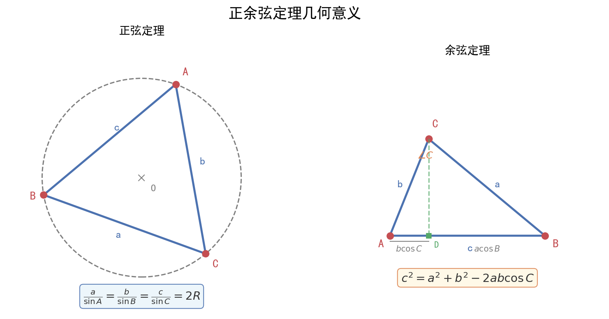

# 解三角形通法（正弦定理·余弦定理·面积公式综合应用）

| 字段 | 内容 |
|------|------|
| **来源** | 人教A版必修第二册（或必修第一册第五章） / 2024~2025学年广州各区高一下期末试卷（单选第4-6题、填空第13-14题、解答第18题） |
| **时间标签** | #高一筑基 |
| **难度** | ★★★☆☆ |
| **状态** | ⚠️待强化 |
| **试卷来源** | #广东名校模拟（广州各区期末、三校/五校联考） |
| **广东考情** | 高频（高一期末核心解答题）· 中档 · 正余弦定理综合与范围/多解讨论 · [待补真题] |

---

## 核心内容

> **本质理解**：解三角形就是"知三求其他"——已知三角形的某些边和角，利用正弦定理、余弦定理、面积公式求未知量。核心是**边角互化**和**方程思想**。

---

### 一、三大定理公式体系

#### 1. 正弦定理（"边化角"首选）

$$\frac{a}{\sin A} = \frac{b}{\sin B} = \frac{c}{\sin C} = 2R$$

其中$R$为$\triangle ABC$外接圆半径。

**变形公式**：
- $a = 2R\sin A$, $b = 2R\sin B$, $c = 2R\sin C$（边化角）
- $\sin A = \frac{a}{2R}$, $\sin B = \frac{b}{2R}$, $\sin C = \frac{c}{2R}$（角化边）
- $a : b : c = \sin A : \sin B : \sin C$

> **适用场景**：已知两角一边、两边一对角、求外接圆半径。

#### 2. 余弦定理（"角化边"首选，含平方关系）

$$a^2 = b^2 + c^2 - 2bc\cos A$$
$$b^2 = a^2 + c^2 - 2ac\cos B$$
$$c^2 = a^2 + b^2 - 2ab\cos C$$

**求角公式**：
$$\cos A = \frac{b^2 + c^2 - a^2}{2bc}$$

> **适用场景**：已知三边、两边夹一角、两边一对角（求第三边）。

#### 3. 面积公式（多版本，灵活选择）

$$S = \frac{1}{2}ab\sin C = \frac{1}{2}bc\sin A = \frac{1}{2}ca\sin B$$

$$S = \frac{1}{2}ah_a = \frac{1}{2}bh_b = \frac{1}{2}ch_c$$（底×高）

$$S = \frac{abc}{4R}$$（与外接圆半径关系）

$$S = \frac{1}{2}(a+b+c)r$$（与内切圆半径关系，$r$为内切圆半径）

> **海伦公式**：$S = \sqrt{p(p-a)(p-b)(p-c)}$，其中$p = \frac{a+b+c}{2}$（三边已知时用）。

---

### 二、解题通法：已知条件 → 选择定理 → 求解目标

#### 条件-定理匹配表

| 已知条件 | 选用定理 | 可求量 | 注意点 |
|----------|----------|--------|--------|
| 两角一边（AAS/ASA） | 正弦定理 | 所有边和角 | 先用内角和求第三角 |
| 两边夹一角（SAS） | 余弦定理求第三边 → 正弦定理求角 | 所有边和角 | 先用余弦定理 |
| 三边（SSS） | 余弦定理求角 | 所有角 | 可能有多解，需判断 |
| 两边一对角（SSA） | **正弦定理或余弦定理** | 需讨论 | **高频陷阱！可能多解** |

#### 详细解题流程（SSA多解讨论）

**已知**：$a$, $b$, $A$（两边及其中一边的对角）

**步骤**：
1. 用正弦定理：$\sin B = \frac{b\sin A}{a}$
2. 判断$\sin B$的值：
   - 若$\sin B > 1$：**无解**（不存在这样的三角形）
   - 若$\sin B = 1$：**一解**，$B = 90°$
   - 若$0 < \sin B < 1$：**可能两解**（$B$为锐角或钝角）
     - 当$a > b$时：$A > B$，$B$只能为锐角，**一解**
     - 当$a = b$时：$A = B$，**一解**（等腰三角形）
     - 当$a < b$时：$B$可能为锐角或钝角，**两解**（需验证$A+B < 180°$）

> **口诀**："大边对大角，小边对小角；sinB大于1无解，等于1唯一，小于1看大小"

---

### 三、高频题型与通法

#### 题型1：求面积/周长最值（广东卷解答题第2问核心！）

**已知**：一角（如$A$）及对边（如$a$）
**目标**：求面积$S$或周长$L = a+b+c$的最大值

**通法1：余弦定理+基本不等式**
- 由$a^2 = b^2 + c^2 - 2bc\cos A$，结合$b^2 + c^2 \geq 2bc$
- 得$bc \leq \frac{a^2}{2(1-\cos A)}$（当$b=c$时取等）
- $S = \frac{1}{2}bc\sin A \leq \frac{a^2\sin A}{4(1-\cos A)}$

**通法2：正弦定理+三角函数有界性**
- $a = 2R\sin A$ → $R = \frac{a}{2\sin A}$（定值）
- $b = 2R\sin B$, $c = 2R\sin C = 2R\sin(A+B)$
- $S = \frac{1}{2}bc\sin A = 2R^2\sin A\sin B\sin(A+B)$
- 用三角恒等变换求最值

> **广东卷特色**：广州名校联考常在第2问考查面积最值，要求用两种方法之一。基本不等式法更简洁，三角函数法更通用。

#### 题型2：三角形形状判定

**方法**：将条件统一化为边或统一化为角

| 条件特征 | 转化方向 | 判定结果 |
|----------|----------|----------|
| 含$a^2 + b^2$与$c^2$比较 | 统一为边（余弦定理） | $a^2+b^2>c^2$ → 锐角；$=c^2$ → 直角；$<c^2$ → 钝角 |
| 含$\sin A$, $\sin B$, $\sin C$关系 | 统一为角（正弦定理） | 利用三角恒等变换 |
| 含$\cos A$, $\cos B$, $\cos C$ | 直接判断角 | $\cos A > 0$ → $A$为锐角 |

> **典型结论**：
> - 若$\sin 2A = \sin 2B$，则$A = B$（等腰）或$A + B = 90°$（直角）
> - 若$a\cos A = b\cos B$，则$A = B$（等腰）或$A + B = 90°$（直角）

#### 题型3：多三角形问题（连解题）

**特征**：图中多个三角形共享边或角
**通法**：
1. 在$\triangle ABD$中用正弦/余弦定理求某量
2. 在$\triangle BCD$中利用上一步结果继续求解
3. 逐步递推，注意公共边和公共角的关系

---

### 四、向量法辅助解三角形

#### 1. 中线向量公式

$\vec{AD} = \frac{1}{2}(\vec{AB} + \vec{AC})$（$D$为$BC$中点）

**推论**：$AD^2 = \frac{1}{4}(AB^2 + AC^2 + 2\vec{AB} \cdot \vec{AC}) = \frac{1}{4}(b^2 + c^2 + 2bc\cos A)$

> **中线长公式**：$m_a = \frac{1}{2}\sqrt{2b^2 + 2c^2 - a^2}$

#### 2. 角平分线向量公式

$\vec{AD} = \frac{b\vec{AB} + c\vec{AC}}{b+c}$（$D$在$BC$上，$AD$平分$\angle A$）

#### 3. 面积向量公式

$S = \frac{1}{2}|\vec{AB} \times \vec{AC}| = \frac{1}{2}|x_1y_2 - x_2y_1|$（坐标法）

---

### 五、记忆口诀

> **正余弦定理口诀**：
> - "两角一边用正弦，两边夹角用余弦"
> - "三边求角余弦好，边角互化正弦妙"
> - "SSA多解要小心，大边对大角来判"
> - "面积公式有多种，两边夹角最常用"
> - "求最值用不等式，或化三角有界性"

---

## 关联卡片

- [高一筑基_数学_核心知识网络_平面向量体系](../核心知识网络/高一筑基_数学_核心知识网络_平面向量体系.md) — 向量法辅助解三角形（中线、角平分线、面积）
- [高一筑基_数学_易错警示与辨析_平面向量与解三角形常见陷阱](../易错警示与辨析/高一筑基_数学_易错警示与辨析_平面向量与解三角形常见陷阱.md) — SSA多解、角的范围、内角和约束等易错点
- [高一筑基_数学_核心知识网络_空间几何体表面积与体积](../核心知识网络/高一筑基_数学_核心知识网络_空间几何体表面积与体积.md) — 解三角形与立体几何的衔接（如三棱锥的高计算）

---

- [频率分布直方图与概率计算（统计大题标准模板）](高一筑基_数学_典型题型与方法_频率分布直方图与概率计算.md)
## 备注

- **广东高一下期末命题规律**：解答题第18题固定为解三角形，12-14分，三问结构。第1问基础（5-6分），第2问中档（4-6分），第3问（名校联考）拔高（2-4分）。广州名校联考（五校、三校）第3问常考查多解讨论或最值问题。
- **2024-2025学年广州越秀区期末第18题**：第1问正弦定理求角；第2问余弦定理+面积公式；第3问面积最值（用基本不等式）。这是广东卷"层层递进"的典型结构。
- **书写规范**：写正弦定理时必须写$\frac{a}{\sin A} = \frac{b}{\sin B} = \frac{c}{\sin C} = 2R$的完整形式，不能只写比例式。
- **训练建议**：先练基础"知三求其他"（15题），再练面积/周长最值（10题），最后练多解讨论（5题）。
- **高考衔接**：新高考Ⅰ卷中解三角形是解答题第15-16题的常客（10-12分），高一下打好基础，高二深化最值与范围问题。

---

> 🏷️ 标签：`#数学` `#典型题型与方法` `#高一筑基` `#难度3` `#解三角形` `#正弦定理` `#余弦定理` `#面积公式` `#SSA多解` `#最值` `#基本不等式` `#广东名校模拟`
