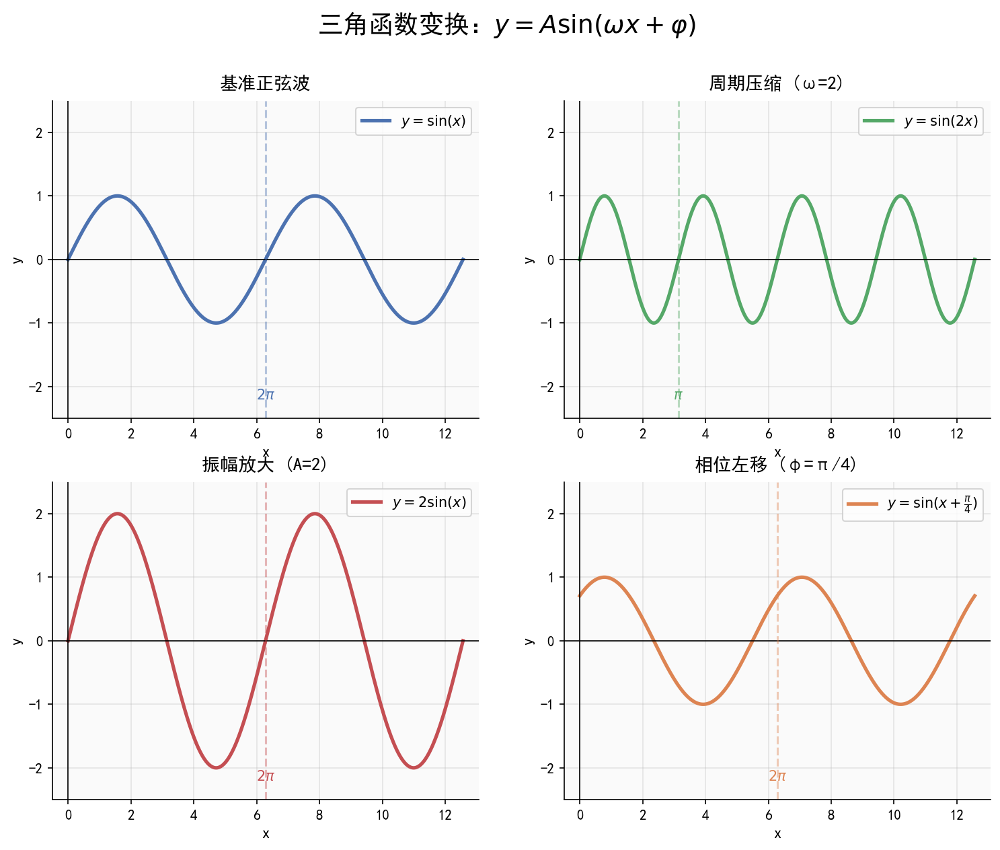

# 三角恒等变换与 $y = A\sin(\omega x + \varphi)$

| 字段 | 内容 |
|------|------|
| **来源** | 53科学备考《高中知识清单》数学知识图谱 / 人教A版必修第一册第五章 |
| **时间标签** | #高一筑基 |
| **难度** | ★★★★☆ |
| **状态** | ⚠️待强化 |
| **试卷来源** | #新高考Ⅰ卷·广东 |
| **广东考情** | 考查频率：高频；难度：中档~中高档；三角恒等变换是三角大题第一问的标配，辅助角公式是化简的核心工具 |

---

## 核心内容

### 一、两角和与差的三角函数公式
- $\sin(\alpha + \beta) = \sin\alpha\cos\beta + \cos\alpha\sin\beta$（$S_{(\alpha+\beta)}$）
- $\sin(\alpha - \beta) = \sin\alpha\cos\beta - \cos\alpha\sin\beta$（$S_{(\alpha-\beta)}$）
- $\cos(\alpha + \beta) = \cos\alpha\cos\beta - \sin\alpha\sin\beta$（$C_{(\alpha+\beta)}$）
- $\cos(\alpha - \beta) = \cos\alpha\cos\beta + \sin\alpha\sin\beta$（$C_{(\alpha-\beta)}$）
- $\tan(\alpha + \beta) = \frac{\tan\alpha + \tan\beta}{1 - \tan\alpha\tan\beta}$（$T_{(\alpha+\beta)}$）
- $\tan(\alpha - \beta) = \frac{\tan\alpha - \tan\beta}{1 + \tan\alpha\tan\beta}$（$T_{(\alpha-\beta)}$）

### 二、二倍角公式
- $\sin 2\alpha = 2\sin\alpha\cos\alpha = \frac{2\tan\alpha}{1 + \tan^2\alpha}$
- $\cos 2\alpha = \cos^2\alpha - \sin^2\alpha = 2\cos^2\alpha - 1 = 1 - 2\sin^2\alpha$
- $\tan 2\alpha = \frac{2\tan\alpha}{1 - \tan^2\alpha}$

### 三、降幂公式（升角公式）
- $\sin^2\alpha = \frac{1 - \cos 2\alpha}{2}$
- $\cos^2\alpha = \frac{1 + \cos 2\alpha}{2}$

### 四、辅助角公式
$$a\sin x + b\cos x = \sqrt{a^2 + b^2}\sin(x + \varphi)$$
其中 $\tan\varphi = \frac{b}{a}$（注意 $a, b$ 符号决定 $\varphi$ 所在象限）

**常见形式**：
- $\sin x \pm \cos x = \sqrt{2}\sin(x \pm \frac{\pi}{4})$
- $\sqrt{3}\sin x \pm \cos x = 2\sin(x \pm \frac{\pi}{6})$
- $\sin x \pm \sqrt{3}\cos x = 2\sin(x \pm \frac{\pi}{3})$

### 五、三角恒等变换策略
1. **角的关系**：拆角、凑角、倍角、半角
2. **名的关系**：弦化切、切化弦（齐次式）
3. **式的关系**：降幂、升幂、辅助角公式统一
4. **"1"的代换**：$1 = \sin^2\alpha + \cos^2\alpha = \tan\frac{\pi}{4}$

---

## 题型识别标志

> **看到什么条件 → 立刻想到什么方法**

| 题干关键条件 | 识别为 | 首选方法 |
|-------------|--------|----------|
| "已知 $\sin(\alpha-\beta)$、$\cos\alpha\sin\beta$，求 $\cos(2\alpha+2\beta)$" | 和差角+倍角 | 先求 $\sin(\alpha+\beta)$，再用 $\cos2x=1-2\sin^2x$ |
| "化简三角式求值" | 恒等变换 | 和差、倍角、降幂、辅助角依次使用 |
| "出现 $\sin A\cos B\pm\cos A\sin B$" | 和差公式 | 逆用 $\sin(A\pm B)$ |
| "已知两角和与差的正弦/余弦" | 配角 | 用 $\alpha=(\alpha-\beta)+\beta$ 等关系配角 |
| "化简到 $A\sin(\omega x+\varphi)$" | 辅助角 | $\sqrt{a^2+b^2}\sin(x+\varphi)$ |
| "求周期/单调区间/最值" | 图象性质 | 先化简成标准型，再整体代入 |

## 解题路径（三角恒等变换求值四步法）

> 650分导向：给值求值的核心是"变角"——把所求角用已知角表示，避免硬算。

### 第一步：看所求
明确目标角与已知角的关系，确定配角路线（如 $\alpha+\beta=(\alpha-\beta)+2\beta$ 等）。

### 第二步：选公式
和差角、倍角、降幂、辅助角按需组合。

### 第三步：代已知
将已知数值代入，求出中间量（如 $\sin(\alpha+\beta)$）。

### 第四步：得结论
用二倍角等收口，注意符号与取值范围。

## 母题（2023 新课标Ⅰ卷·第8题，5分）

> 广东考生真题。由和差角求中间量、再用二倍角收口，是三角恒等变换的标准流程。

**题目**：已知 $\sin(\alpha-\beta)=\dfrac{1}{3}$，$\cos\alpha\sin\beta=\dfrac{1}{6}$，则 $\cos(2\alpha+2\beta)=$（ ）

A. $\dfrac{7}{9}$　B. $\dfrac{1}{9}$　C. $-\dfrac{1}{9}$　D. $-\dfrac{7}{9}$

**解**：
由 $\sin(\alpha-\beta)=\sin\alpha\cos\beta-\cos\alpha\sin\beta=\frac{1}{3}$，且 $\cos\alpha\sin\beta=\frac{1}{6}$，得
$$\sin\alpha\cos\beta=\frac{1}{3}+\frac{1}{6}=\frac{1}{2}$$

于是
$$\sin(\alpha+\beta)=\sin\alpha\cos\beta+\cos\alpha\sin\beta=\frac{1}{2}+\frac{1}{6}=\frac{2}{3}$$

故
$$\cos(2\alpha+2\beta)=1-2\sin^2(\alpha+\beta)=1-2\times\frac{4}{9}=\frac{1}{9}$$

**答**：选 B。

---

## 关联卡片

- [三角函数的概念与诱导公式](高一筑基_数学_核心知识网络_三角函数的概念与诱导公式.md) — 恒等变换的基础工具
- [三角函数的图象与性质](高一筑基_数学_核心知识网络_三角函数的图象与性质.md) — 化简后分析图象性质

---

## 备注
- 易错点：辅助角公式中 $\tan\varphi = \frac{b}{a}$，注意 $\varphi$ 的象限由 $a, b$ 共同决定，不是仅由 $\frac{b}{a}$ 决定
- 三角大题化简的标准路径：诱导公式 $\rightarrow$ 和差/倍角展开 $\rightarrow$ 降幂 $\rightarrow$ 辅助角公式 $\rightarrow$ $y = A\sin(\omega x + \varphi)$ 形式
- 广东卷常考：给定三角函数式化简后求周期、单调区间、最值
