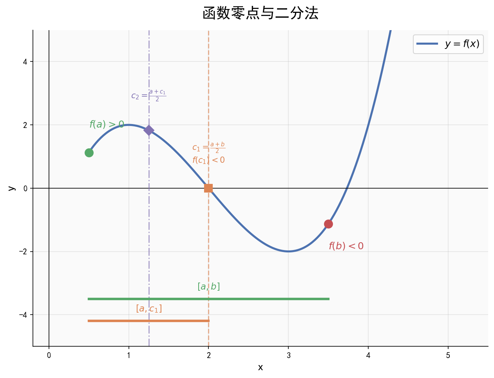

# 函数零点与函数模型

| 字段 | 内容 |
|------|------|
| **来源** | 53科学备考《高中知识清单》数学知识图谱 / 人教A版必修第一册第三章、第四章 |
| **时间标签** | #高一筑基 |
| **难度** | ★★★☆☆ |
| **状态** | ⚠️待强化 |
| **试卷来源** | #新高考Ⅰ卷·广东 |
| **广东考情** | 考查频率：中频；难度：中档；函数零点问题是选填压轴的常见方向，数形结合是关键 |

---

## 核心内容

### 一、函数的零点
- **定义**：$f(x)$ 的零点 $\Leftrightarrow$ 方程 $f(x) = 0$ 的根 $\Leftrightarrow$ 函数 $y = f(x)$ 图象与 $x$ 轴交点的横坐标
- **三者等价**：零点、方程根、图象交点横坐标

### 二、函数零点存在定理
若函数 $f(x)$ 在 $[a, b]$ 上的图象是连续不间断的曲线，且 $f(a) \cdot f(b) < 0$，则 $f(x)$ 在 $(a, b)$ 内至少有一个零点，即存在 $c \in (a, b)$，使 $f(c) = 0$。

> **注意**：定理只能判断存在性，不能判断个数；$f(a) \cdot f(b) > 0$ 时也可能有零点

### 三、二分法求近似解
**步骤口诀**：定区间，找中点，中值计算两边看；同号去，异号算，零点落在异号间；周而复始怎么办，精确度上来判断。

### 四、常见函数模型
| 模型 | 解析式 | 适用场景 |
|------|--------|---------|
| 一次函数 | $y = kx + b$ | 匀速变化 |
| 二次函数 | $y = ax^2 + bx + c$ | 最优化问题 |
| 指数函数 | $y = a^x$（$a > 0, a \neq 1$） | 增长率、衰减率 |
| 对数函数 | $y = \log_a x$ | 增长缓慢 |
| 幂函数 | $y = x^\alpha$ | 特定比例关系 |
| 对勾函数 | $y = x + \frac{k}{x}$（$k > 0$） | 均值不等式应用场景 |
| 分段函数 | 不同区间不同表达式 | 实际生活中的分段计费 |

### 五、解决实际问题的步骤
实际问题 $\rightarrow$ 审题 $\rightarrow$ 建模 $\rightarrow$ 解模 $\rightarrow$ 还原 $\rightarrow$ 检验

---

## 题型识别标志

> **看到什么条件 → 立刻想到什么方法**

| 题干关键条件 | 识别为 | 首选方法 |
|-------------|--------|----------|
| "判断 $f(x)$ 零点个数" | 零点 | 数形结合：$y=f(x)$ 与 $x$ 轴交点，或 $g=h$ 两图象交点 |
| "判断有几个极值点" | 导数 | 看 $f'(x)=0$ 的变号根个数 |
| "判断点 $(x_0,y_0)$ 是否对称中心" | 对称性 | 验 $f(x_0+t)+f(x_0-t)=2y_0$ |
| "直线 $y=kx$ 是否为切线" | 切线 | 联立：导数相等且函数值相等 |
| "方程 $f(x)=0$ 根的分布" | 含参 | 分离参数或画单调性表 |
| "比较 $f(a),f(b)$ 大小" | 单调性 | 先判单调区间 |

## 解题路径（函数零点/图象特征分析三步法）

> 650分导向：多选中的函数性质题（极值点、零点、对称中心、切线）是广东卷中档题，靠"求导+数形结合"通吃。

### 第一步：求导定单调
求 $f'(x)$，列表看增减区间与极值。

### 第二步：算关键值
算端点极限、极值点函数值、特殊点值。

### 第三步：数形结合
据单调性与函数值符号判断零点、对称性、切线是否成立。

## 母题（2022 新课标Ⅰ卷·第10题，5分）

> 广东考生真题。一道题综合考查极值点、零点、对称中心、切线，是函数性质题的标杆。

**题目**：已知函数 $f(x)=x^3-x+1$，则（ ）

A. $f(x)$ 有两个极值点
B. $f(x)$ 有三个零点
C. 点 $(0,1)$ 是曲线 $y=f(x)$ 的对称中心
D. 直线 $y=2x$ 是曲线 $y=f(x)$ 的切线

**解**：
$f'(x)=3x^2-1$，令 $f'(x)=0$ 得 $x=\pm\frac{\sqrt3}{3}$，两侧导数变号，故有两个极值点，A 对。

又 $f(-\frac{\sqrt3}{3})=1+\frac{2\sqrt3}{9}>0$，$f(\frac{\sqrt3}{3})=1-\frac{2\sqrt3}{9}>0$，且 $x\to-\infty$ 时 $f(x)\to-\infty$，故只有一个零点，B 错。

令 $h(x)=f(x)-1=x^3-x$，则 $h(-x)=-h(x)$ 为奇函数，故 $(0,1)$ 为曲线对称中心，C 对。

令 $f'(x)=2$ 得 $3x^2-1=2\Rightarrow x=\pm1$；切点 $(1,1)$ 处切线为 $y-1=2(x-1)$ 即 $y=2x-1$，切点 $(-1,1)$ 处切线为 $y=2x+3$，均非 $y=2x$，D 错。

**答**：选 AC。

---

## 关联卡片

- [函数的定义与三要素](高一筑基_数学_核心知识网络_函数的定义与三要素.md) — 函数基础
- [幂函数与指数函数](高一筑基_数学_核心知识网络_幂函数与指数函数.md) — 常见函数模型
- [对数函数](高一筑基_数学_核心知识网络_对数函数.md) — 常见函数模型

---

## 备注
- 零点问题核心方法：数形结合，将 $f(x) = 0$ 转化为 $y = f(x)$ 与 $x$ 轴交点，或 $g(x) = h(x)$ 转化为两个函数图象交点
- 广东卷常考：含参函数零点个数讨论，利用导数分析单调性和极值
- 易错点：零点存在定理要求函数在闭区间上连续，且 $f(a) \cdot f(b) < 0$
