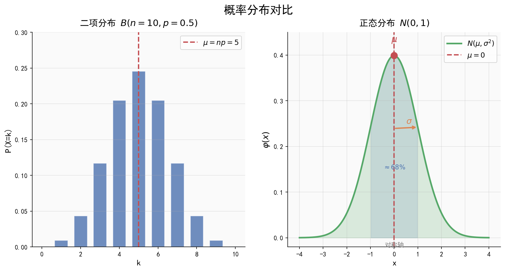

# 二项分布、超几何分布与正态分布

| 字段 | 内容 |
|------|------|
| **来源** | 53科学备考《高中知识清单》数学知识图谱 / 人教A版选择性必修第三册第七章 |
| **时间标签** | #高二深化 |
| **难度** | ★★★★☆ |
| **状态** | ⚠️待强化 |
| **试卷来源** | #新高考Ⅰ卷·广东 |
| **广东考情** | 考查频率：高频；难度：中档~中高档；二项分布和正态分布是概率统计大题的核心，正态分布的3\sigma原则常用于实际应用题 |

---

## 核心内容

### 一、二项分布 $X \sim B(n, p)$
- **模型**：$n$ 次独立重复试验，每次成功概率为 $p$
- **分布列**：$P(X = k) = C_n^k p^k (1-p)^{n-k}$（$k = 0, 1, 2, \dots, n$）
- **均值**：$E(X) = np$
- **方差**：$D(X) = np(1-p)$

### 二、超几何分布
- **模型**：从 $N$ 件产品（含 $M$ 件次品）中不放回抽取 $n$ 件，恰有 $k$ 件次品
- **分布列**：$P(X = k) = \frac{C_M^k C_{N-M}^{n-k}}{C_N^n}$
- **参数范围**：$k = m, m+1, \dots, r$，其中 $m = \max\{0, n - N + M\}$，$r = \min\{n, M\}$
- **均值**：$E(X) = \frac{nM}{N} = np$（$p = \frac{M}{N}$）

### 三、正态分布
- **密度函数**：$f(x) = \frac{1}{\sigma\sqrt{2\pi}} e^{-\frac{(x-\mu)^2}{2\sigma^2}}$（$x \in \mathbb{R}, \mu \in \mathbb{R}, \sigma > 0$）
- **记法**：$X \sim N(\mu, \sigma^2)$
- **图象特征**：钟形曲线，关于 $x = \mu$ 对称，$\sigma$ 越小图象越瘦高

#### 3\sigma 原则
| 区间 | 概率 |
|------|------|
| $P(\mu - \sigma \leq X \leq \mu + \sigma)$ | $\approx 0.6827$ |
| $P(\mu - 2\sigma \leq X \leq \mu + 2\sigma)$ | $\approx 0.9545$ |
| $P(\mu - 3\sigma \leq X \leq \mu + 3\sigma)$ | $\approx 0.9973$ |

---

## 关联卡片

- [条件概率与离散型随机变量](高二深化_数学_核心知识网络_条件概率与离散型随机变量.md) — 期望方差基础
- [统计与概率基础](高一筑基_数学_核心知识网络_统计与概率基础.md) — 概率基础概念

---

## 备注
- 二项分布 vs 超几何分布：关键区别在"有放回"（二项）还是"无放回"（超几何）
- 当 $N$ 很大时，超几何分布近似于二项分布
- 正态分布实际应用题：注意对称性 $P(X > \mu) = P(X < \mu) = 0.5$
- 广东卷概率大题：常将二项分布与决策问题、最优化问题结合
