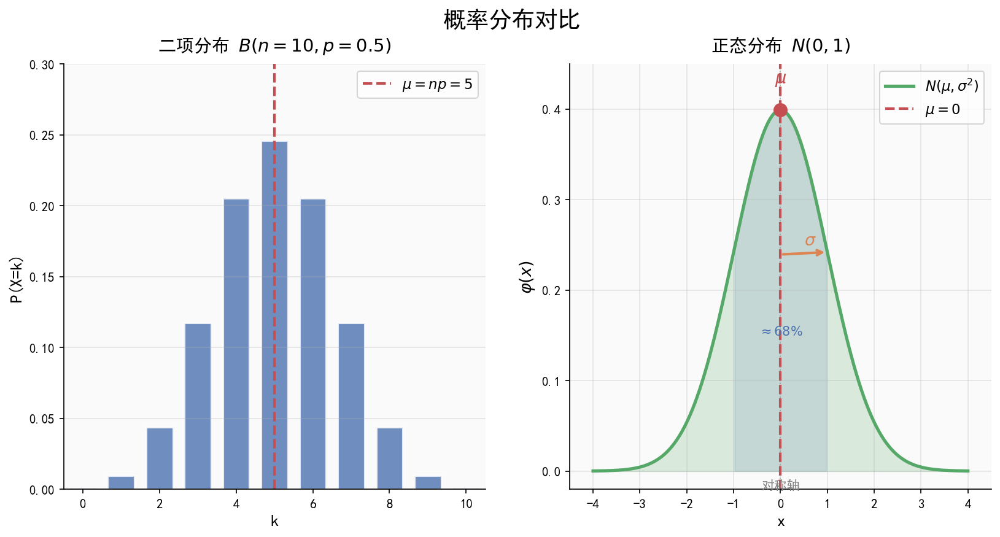

# 二项分布、超几何分布与正态分布

| 字段 | 内容 |
|------|------|
| **来源** | 53科学备考《高中知识清单》数学知识图谱 / 人教A版选择性必修第三册第七章 |
| **时间标签** | #高二深化 |
| **难度** | ★★★★☆ |
| **状态** | ⚠️待强化 |
| **试卷来源** | #新高考Ⅰ卷·广东 |
| **广东考情** | 考查频率：高频；难度：中档~中高档；二项分布和正态分布是概率统计大题的核心，正态分布的3\sigma原则常用于实际应用题 |

---

## 核心内容

### 一、二项分布 $X \sim B(n, p)$
- **模型**：$n$ 次独立重复试验，每次成功概率为 $p$
- **分布列**：$P(X = k) = C_n^k p^k (1-p)^{n-k}$（$k = 0, 1, 2, \dots, n$）
- **均值**：$E(X) = np$
- **方差**：$D(X) = np(1-p)$

### 二、超几何分布
- **模型**：从 $N$ 件产品（含 $M$ 件次品）中不放回抽取 $n$ 件，恰有 $k$ 件次品
- **分布列**：$P(X = k) = \frac{C_M^k C_{N-M}^{n-k}}{C_N^n}$
- **参数范围**：$k = m, m+1, \dots, r$，其中 $m = \max\{0, n - N + M\}$，$r = \min\{n, M\}$
- **均值**：$E(X) = \frac{nM}{N} = np$（$p = \frac{M}{N}$）

### 三、正态分布
- **密度函数**：$f(x) = \frac{1}{\sigma\sqrt{2\pi}} e^{-\frac{(x-\mu)^2}{2\sigma^2}}$（$x \in \mathbb{R}, \mu \in \mathbb{R}, \sigma > 0$）
- **记法**：$X \sim N(\mu, \sigma^2)$
- **图象特征**：钟形曲线，关于 $x = \mu$ 对称，$\sigma$ 越小图象越瘦高

#### 3\sigma 原则
| 区间 | 概率 |
|------|------|
| $P(\mu - \sigma \leq X \leq \mu + \sigma)$ | $\approx 0.6827$ |
| $P(\mu - 2\sigma \leq X \leq \mu + 2\sigma)$ | $\approx 0.9545$ |
| $P(\mu - 3\sigma \leq X \leq \mu + 3\sigma)$ | $\approx 0.9973$ |

---

## 自测训练（3道·覆盖二项分布、超几何分布、正态分布对称性）

> 先独立完成，再展开卡片末尾「参考答案」核对。每题标注所检验的知识点，方便对号查漏。

**第1题**（检验 二项分布）

设随机变量 $X\sim B\left(4,\dfrac{1}{2}\right)$，求 $P(X=2)$ 和 $E(X)$。

**第2题**（检验 超几何分布）

一批产品共 $10$ 件，其中有 $3$ 件次品。从中不放回地抽取 $4$ 件，求恰有 $1$ 件次品的概率。

**第3题**（检验 正态分布对称性）

设随机变量 $X\sim N(2,\sigma^2)$，已知 $P(X<4)=0.8$，求 $P(X<0)$。

---
## 关联卡片

- [条件概率与离散型随机变量](高二深化_数学_核心知识网络_条件概率与离散型随机变量.md) — 期望方差基础
- [统计与概率基础](高一筑基_数学_核心知识网络_统计与概率基础.md) — 概率基础概念

---

## 备注
- 二项分布 vs 超几何分布：关键区别在"有放回"（二项）还是"无放回"（超几何）
- 当 $N$ 很大时，超几何分布近似于二项分布
- 正态分布实际应用题：注意对称性 $P(X > \mu) = P(X < \mu) = 0.5$
- 广东卷概率大题：常将二项分布与决策问题、最优化问题结合
---

## 参考答案

> 答案与题目分板块呈现，便于"先做后对"。每题给出规范解答 + 易错提醒，做完一题对一题。

▶ 第1题详解（二项分布）

$$P(X=2)=C_4^2\left(\dfrac{1}{2}\right)^2\left(\dfrac{1}{2}\right)^2=6\times\dfrac{1}{16}=\dfrac{3}{8}.$$

期望
$$E(X)=np=4\times\dfrac{1}{2}=2.$$

**答**：$P(X=2)=\dfrac{3}{8}$，$E(X)=2$。

> **易错提醒**：二项分布 $B(n,p)$ 的分布列是 $C_n^k p^k(1-p)^{n-k}$；期望 $E(X)=np$，不要记成 $np(1-p)$（那是方差）。

▶ 第2题详解（超几何分布）

$$P(X=1)=\dfrac{C_3^1C_7^3}{C_{10}^4}=\dfrac{3\times35}{210}=\dfrac{105}{210}=\dfrac{1}{2}.$$

**答**：$\dfrac{1}{2}$。

> **易错提醒**：超几何分布是"不放回"抽样，分母是组合数 $C_N^n$；注意 $C_7^3=35$，$C_{10}^4=210$。

▶ 第3题详解（正态分布对称性）

因为 $X\sim N(2,\sigma^2)$，正态曲线关于 $x=2$ 对称。

$0$ 与 $4$ 关于 $2$ 对称，所以
$$P(X<0)=P(X>4)=1-P(X<4)=1-0.8=0.2.$$

**答**：$0.2$。

> **易错提醒**：正态分布的对称中心是均值 $\mu$，不是 $0$；求一侧概率时常用 $P(X<\mu-a)=P(X>\mu+a)$。

