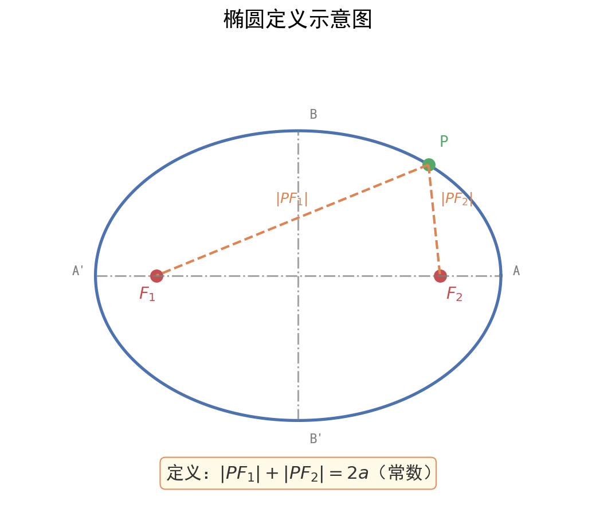

# 椭圆、双曲线与抛物线

| 字段 | 内容 |
|------|------|
| **来源** | 53科学备考《高中知识清单》数学知识图谱 / 人教A版选择性必修第一册第三章 |
| **时间标签** | #高二深化 |
| **难度** | ★★★★☆ |
| **状态** | ⚠️待强化 |
| **试卷来源** | #新高考Ⅰ卷·广东 |
| **广东考情** | 考查频率：高频；难度：中高档~压轴；解析几何是广东卷大题压轴位置的重要候选，椭圆综合题计算量大，对运算能力要求极高 |

---

## 核心内容

### 一、椭圆（以焦点在 $x$ 轴上为例）
- **定义**：$|MF_1| + |MF_2| = 2a$（$2a > |F_1 F_2|$）
- **标准方程**：$\frac{x^2}{a^2} + \frac{y^2}{b^2} = 1$（$a > b > 0$）
- **几何性质**：
  - 范围：$x \in [-a, a]$，$y \in [-b, b]$
  - 对称性：关于 $x$ 轴、$y$ 轴、原点对称
  - 顶点：$(\pm a, 0)$，$(0, \pm b)$
  - 焦点：$(\pm c, 0)$，其中 $c^2 = a^2 - b^2$
  - 离心率：$e = \frac{c}{a}$，$e \in (0, 1)$

### 二、双曲线（以焦点在 $x$ 轴上为例）
- **定义**：$||MF_1| - |MF_2|| = 2a$（$0 < 2a < |F_1 F_2|$）
- **标准方程**：$\frac{x^2}{a^2} - \frac{y^2}{b^2} = 1$（$a > 0, b > 0$）
- **几何性质**：
  - 范围：$x \leq -a$ 或 $x \geq a$，$y \in \mathbb{R}$
  - 对称性：关于 $x$ 轴、$y$ 轴、原点对称
  - 顶点：$(\pm a, 0)$
  - 焦点：$(\pm c, 0)$，其中 $c^2 = a^2 + b^2$
  - 渐近线：$y = \pm \frac{b}{a}x$
  - 离心率：$e = \frac{c}{a}$，$e \in (1, +\infty)$

### 三、抛物线（以焦点在 $x$ 轴上，开口向右为例）
- **定义**：$|MF| = d$（到定点距离等于到定直线距离）
- **标准方程**：$y^2 = 2px$（$p > 0$）
- **几何性质**：
  - 范围：$x \geq 0$，$y \in \mathbb{R}$
  - 对称轴：$x$ 轴
  - 顶点：$(0, 0)$
  - 焦点：$(\frac{p}{2}, 0)$
  - 准线：$x = -\frac{p}{2}$
  - 离心率：$e = 1$

### 四、圆锥曲线弦长公式
设直线 $AB$ 斜率为 $k$，与圆锥曲线交于 $A(x_1, y_1), B(x_2, y_2)$：
$$|AB| = \sqrt{1 + k^2} |x_1 - x_2| = \sqrt{1 + \frac{1}{k^2}} |y_1 - y_2|\quad(k \neq 0)$$

### 五、点差法结论（弦中点问题）
设 $AB$ 为圆锥曲线的弦，$M$ 为弦 $AB$ 中点：
- 椭圆（焦点在 $x$ 轴）：$k_{AB} \cdot k_{OM} = -\frac{b^2}{a^2}$
- 双曲线（焦点在 $x$ 轴）：$k_{AB} \cdot k_{OM} = \frac{b^2}{a^2}$
- 抛物线（焦点在 $x$ 轴）：$k_{AB} = \frac{p}{y_0}$（$y_0$ 为中点 $M$ 的纵坐标）

---

## 题型识别标志

> **看到什么条件 → 立刻想到什么方法**

| 题干关键条件 | 识别为 | 首选方法 |
|-------------|--------|----------|
| "椭圆上两点A、B，过定点P的直线" | 弦长/面积/定点定值 | **韦达联立五步法**（见下方） |
| "弦AB的中点M" | 弦中点问题 | **点差法**（回避联立，直接得斜率关系） |
| "椭圆上动点P，求某量的范围" | 范围/最值 | 设参→建立目标函数→导数/不等式求最值 |
| "求椭圆的离心率" | 离心率问题 | 构造 $a,b,c$ 齐次方程 → 解 $e = c/a$ |
| "过焦点的弦AB" | 焦点弦 | 用椭圆第二定义 $\frac{PF}{d}=e$，或焦半径公式 |
| "椭圆与直线相切" | 切线 | $\Delta = 0$（联立后判别式为零） |

## 解题路径（大题五步法）

> 广东卷解析几何大题的**标准操作路径**，按此顺序走，不跳步。

### 第一步：设
- 设直线方程 $l: y = kx + m$（或 $x = ty + n$，视情况而定）
- ⚠️ **斜率不存在时先单独讨论**（k=0 或 k→∞ 的分情况是高频扣分点）
- 设交点 $A(x_1, y_1), B(x_2, y_2)$

### 第二步：联
- 将直线方程代入椭圆方程 $\frac{x^2}{a^2} + \frac{y^2}{b^2} = 1$，消元得一元二次方程
- 标准形式：$(b^2 + a^2k^2)x^2 + 2a^2kmx + a^2(m^2 - b^2) = 0$

### 第三步：韦
- 写韦达定理：$x_1 + x_2 = -\frac{2a^2km}{b^2 + a^2k^2}$，$x_1x_2 = \frac{a^2(m^2 - b^2)}{b^2 + a^2k^2}$
- ⚠️ **必须验证** $\Delta > 0$（确保直线与椭圆交于两点）

### 第四步：算
- 弦长：$|AB| = \sqrt{1+k^2}|x_1 - x_2| = \sqrt{1+k^2}\frac{\sqrt{\Delta}}{b^2 + a^2k^2}$
- 面积：$S = \frac{1}{2}|AB| \cdot d$（$d$ 为点到直线的距离）
- 中点：$M\left(\frac{x_1+x_2}{2}, \frac{y_1+y_2}{2}\right)$

### 第五步：解
- 将几何条件代数化（如"面积为9"→ 列面积方程）
- 解出参数 $k$ 或 $m$ → 回代得直线方程
- ⚠️ **最后验证**：解出的参数是否使 $\Delta > 0$？若否，舍去

## 母题（2024 新课标Ⅰ卷·第16题，15分）

> 广东考生做的是同一张新课标Ⅰ卷，此题是解析几何第一道大题。

**题目**：已知 $A(0, 3)$ 和 $P\left(3, \dfrac{3}{2}\right)$ 为椭圆 $C: \dfrac{x^2}{a^2} + \dfrac{y^2}{b^2} = 1$（$a > b > 0$）上两点。
- (1) 求 $C$ 的离心率；
- (2) 若过 $P$ 的直线 $l$ 交 $C$ 于另一点 $B$，且 $\triangle ABP$ 的面积为 $9$，求 $l$ 的方程。

**解（走五步法）**：

**(1)** 代入两点 → 解方程组：
- $A(0,3)$ 在椭圆上 $\Rightarrow$ $\frac{0}{a^2} + \frac{9}{b^2} = 1$ $\Rightarrow$ $b^2 = 9$
- $P\left(3, \frac{3}{2}\right)$ 代入 $\Rightarrow$ $\frac{9}{a^2} + \frac{9/4}{9} = 1$ $\Rightarrow$ $a^2 = 12$
- $e = \sqrt{1 - \frac{b^2}{a^2}} = \sqrt{1 - \frac{9}{12}} = \frac{1}{2}$

**(2)** 椭圆方程：$\frac{x^2}{12} + \frac{y^2}{9} = 1$

**第一步（设）**：设 $l: y - \frac{3}{2} = k(x - 3)$，即 $y = kx + \frac{3}{2} - 3k$
- 先验斜率不存在：$x = 3$ 时，$B\left(3, -\frac{3}{2}\right)$，$S = \frac{9}{2} \neq 9$，舍去。

**第二/三步（联立+韦达）**：代入椭圆得
$$(4k^2 + 3)x^2 - (24k^2 - 12k)x + (36k^2 - 36k - 27) = 0$$

已知 $x_P = 3$ 是一根，由韦达 $x_1 + x_2$ 公式直接得另一根：
$$x_B = \frac{24k^2 - 12k}{4k^2 + 3} - 3$$

> 💡 **关键技巧**：已知椭圆上一点坐标，韦达定理中该点是二次方程的一根，另一根可直接由 $x_1+x_2$ 求出，无需解完整二次方程——省至少2分钟。

**第四步（算）**：$|PB| = \sqrt{1+k^2} \cdot \frac{\sqrt{\Delta}}{4k^2 + 3}$，点 $A$ 到 $l$ 的距离 $d = \frac{|\frac{3}{2} - 3k|}{\sqrt{1+k^2}}$

**第五步（解）**：$S = \frac{1}{2}|PB| \cdot d = 9$ → 解得 $k = \frac{1}{2}$ 或 $k = \frac{3}{2}$

**答案**：$l: y = \frac{1}{2}x$ 或 $l: y = \frac{3}{2}x - 3$

---

## 自测训练（3道·覆盖标准方程与几何性质）

> 先独立完成，再展开卡片末尾「参考答案」核对。每题标注所检验的知识点，方便对号查漏。

**第1题**（检验 椭圆标准方程与离心率）

已知椭圆 $\dfrac{x^2}{a^2} + \dfrac{y^2}{b^2} = 1$（$a > b > 0$）的一个焦点为 $F(3, 0)$，且过点 $P\left(4, \dfrac{9}{5}\right)$。求椭圆的标准方程和离心率。

**第2题**（检验 双曲线方程与渐近线）

已知双曲线 $C: \dfrac{x^2}{a^2} - \dfrac{y^2}{b^2} = 1$（$a > 0, b > 0$）的离心率 $e = \dfrac{\sqrt{5}}{2}$，焦点为 $F_1(-\sqrt{5}, 0)$、$F_2(\sqrt{5}, 0)$。
(1) 求双曲线方程；
(2) 求渐近线方程。

**第3题**（检验 抛物线定义与焦点弦）

已知抛物线 $C: y^2 = 4x$ 的焦点为 $F$，准线为 $l$。点 $P$ 在 $C$ 上且 $|PF| = 5$，求点 $P$ 的坐标。

---

## 关联卡片

- [直线与圆的方程](高二深化_数学_核心知识网络_直线与圆的方程.md) — 解析几何基础
- [恒成立与存在性问题通法](../典型题型与方法/高二深化_数学_典型题型与方法_恒成立与存在性问题通法.md) — 圆锥曲线中的范围问题

---

- [【卡片标题】解析几何大题之定点定值问题](../典型题型与方法/高二深化_数学_典型题型与方法_解析几何大题之定点定值问题.md)

- [【卡片标题】解析几何大题之弦长与面积最值](../典型题型与方法/高二深化_数学_典型题型与方法_解析几何大题之弦长与面积最值.md)

- [解析几何焦点位置与导数定义域端点易错警示（焦点轴讨论·离心率公式混用·定义域优先·端点取舍）](../易错警示与辨析/高二深化_数学_易错警示与辨析_解析几何焦点位置与导数定义域端点.md)
## 备注
- 易错点：椭圆中 $a > b$，双曲线中 $a, b$ 大小不确定；焦点位置不确定时要分类讨论
- 抛物线标准方程有四种形式：$y^2 = 2px, y^2 = -2px, x^2 = 2py, x^2 = -2py$，注意开口方向
- 广东卷解析几何大题：韦达定理联立是标准路径，注意计算准确性和分类讨论完备性
- 离心率求法：构造 $a, b, c$ 的齐次方程，转化为关于 $e$ 的方程

---

## 参考答案

> 答案与题目分板块呈现，便于"先做后对"。每题给出规范解答 + 易错提醒，做完一题对一题。

▶ 第1题详解（待定系数法求椭圆方程）

由焦点 $F(3, 0)$ 得 $c = 3$，$c^2 = a^2 - b^2 = 9$。

点 $P\left(4, \dfrac{9}{5}\right)$ 在椭圆上：
$$\dfrac{16}{a^2} + \dfrac{81/25}{b^2} = 1 \Rightarrow \dfrac{16}{a^2} + \dfrac{81}{25b^2} = 1$$

代入 $b^2 = a^2 - 9$：
$$\dfrac{16}{a^2} + \dfrac{81}{25(a^2-9)} = 1$$

通分，令 $t = a^2$：
$$25(t-9)\cdot 16 + 81t = 25t(t-9)$$
$$400t - 3600 + 81t = 25t^2 - 225t$$
$$25t^2 - 706t + 3600 = 0$$

解得 $t = 25$ 或 $t = \dfrac{144}{25}$（舍，因 $t = a^2 > c^2 = 9$ 须 $t > 9$，$\dfrac{144}{25} < 9$ 舍去）。

故 $a^2 = 25$，$b^2 = 25 - 9 = 16$。

- 标准方程：$\dfrac{x^2}{25} + \dfrac{y^2}{16} = 1$
- 离心率：$e = \dfrac{c}{a} = \dfrac{3}{5}$

> **易错提醒**：椭圆中 $a > b > 0$，$c^2 = a^2 - b^2$（注意是减号），$a$ 是半长轴。解出 $a^2$ 后要检验 $a^2 > c^2$，舍去不合理的根。

▶ 第2题详解（双曲线 $a,b,c$ 关系与渐近线）

**(1)** 由焦点 $F_2(\sqrt{5}, 0)$ 得 $c = \sqrt{5}$，$c^2 = a^2 + b^2 = 5$。

离心率 $e = \dfrac{c}{a} = \dfrac{\sqrt{5}}{2}$，故 $a = \dfrac{c}{e} = \dfrac{\sqrt{5}}{\sqrt{5}/2} = 2$，$a^2 = 4$。

$b^2 = c^2 - a^2 = 5 - 4 = 1$。

双曲线方程：$\dfrac{x^2}{4} - y^2 = 1$。

**(2)** 渐近线方程：$y = \pm\dfrac{b}{a}x = \pm\dfrac{1}{2}x$。

> **易错提醒**：双曲线中 $c^2 = a^2 + b^2$（加号！），与椭圆 $c^2 = a^2 - b^2$ 不同。渐近线斜率 $\pm\dfrac{b}{a}$，焦点在 $x$ 轴的双曲线渐近线过原点。

▶ 第3题详解（抛物线定义：到焦点距离=到准线距离）

$y^2 = 4x$，$2p = 4$，$p = 2$。焦点 $F(1, 0)$，准线 $l: x = -1$。

设 $P(x_0, y_0)$，由抛物线定义 $|PF| = $ 点 $P$ 到准线距离 $= x_0 - (-1) = x_0 + 1$。

由 $|PF| = 5$：$x_0 + 1 = 5 \Rightarrow x_0 = 4$。

代入抛物线方程：$y_0^2 = 4\cdot 4 = 16 \Rightarrow y_0 = \pm 4$。

**答**：$P(4, 4)$ 或 $P(4, -4)$。

> **易错提醒**：抛物线定义是"到焦点距离 = 到准线距离"，**不是**两点距离公式硬算。$y^2 = 2px$ 中焦点在 $\left(\dfrac{p}{2}, 0\right)$、准线 $x = -\dfrac{p}{2}$，$p$ 的几何意义是焦点到准线的距离。

