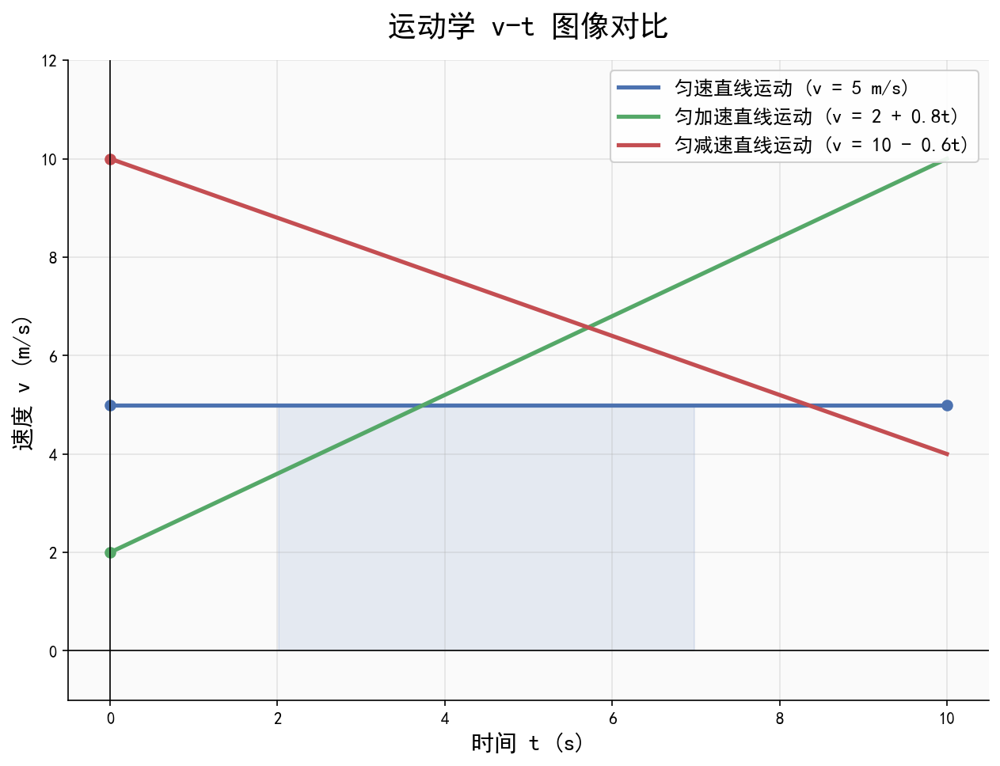

# 匀变速直线运动公式体系

| 字段 | 内容 |
|------|------|
| **来源** | 人教版必修第一册第二章 / 广东选择性考试高频考点 |
| **时间标签** | #高一筑基 |
| **难度** | ★★☆☆☆ |
| **状态** | ⚠️待强化 |
| **试卷来源** | #广东选择性考试 |
| **广东考情** | 高频（近5年广东卷均考查）。基础题为主，常以"广东交通""大湾区基建"为情境（如港珠澳大桥上的汽车运动、高铁加速度）。考查频率：选择题中1-2道+计算题第一问。难度定位：基础，但需注意刹车陷阱和往返运动的边界条件。赋分提示：基础题必须满分，原始分差距在赋分后会被放大。 |

---




## 核心内容

### 关键概念
- **匀变速直线运动**：加速度恒定的直线运动，a = 常量，方向与速度同向（加速）或反向（减速）
- **v-t图**：斜率=加速度，面积=位移，纵截距=初速度
- **x-t图**：斜率=速度，抛物线表示匀变速
- **追及相遇**：两物体位移关系决定相遇条件；临界条件：速度相等时距离最大/最小
- **刹车陷阱**：刹车至停止后不再反向运动，需判断刹车时间是否超出给定时间

### 核心公式/定理

#### 五大基本公式
```
① v = v₀ + at                          （速度公式）
② x = v₀t + ½at²                       （位移公式）
③ v² - v₀² = 2ax                       （不含时公式）
④ x = (v₀ + v)t / 2 = v̄t              （平均速度公式）
⑤ Δx = aT²                              （位移差公式，连续相等时间间隔）
```
> **适用条件**：匀变速直线运动（a恒定）
> **注意事项**：公式为矢量式，需先规定正方向；减速时a取负值；刹车问题需检验速度是否已减为零

#### 中间时刻速度公式
```
v_(t/2) = v̄ = (v₀ + v) / 2
```
> 适用：匀变速直线运动中，某段时间内的平均速度等于该段时间中间时刻的瞬时速度

#### 初速度为零的特殊比例（自由落体/静止起加速）
```
① 1T末、2T末、3T末…速度之比：v₁:v₂:v₃… = 1:2:3…
② 1T内、2T内、3T内…位移之比：x₁:x₂:x₃… = 1:4:9…
③ 第1T内、第2T内、第3T内…位移之比：xⅠ:xⅡ:xⅢ… = 1:3:5…
④ 通过连续相等位移所用时间之比：t₁:t₂:t₃… = 1:(√2-1):(√3-√2)…
```

### 方法步骤

#### v-t图分析四步法
1. **看轴**：确认横纵轴物理量及单位
2. **看线**：直线→匀变速；斜率→加速度（正负表示方向）
3. **看面积**：面积→位移（横轴上方面积为正，下方为负）
4. **看交点**：交点表示速度相同，往往是追及问题的临界条件

#### 追及相遇问题分析步骤
1. **画运动示意图**：标出两物体初始位置、运动方向
2. **列位移方程**：分别写出两物体的位移表达式 x₁(t) 和 x₂(t)
3. **找临界条件**：速度相等时距离最大或最小
4. **列相遇方程**：x₁ = x₂ + x₀（x₀为初始距离），解出时间t
5. **检验合理性**：判断是否在有效时间范围内（如刹车是否已停止）

#### 刹车陷阱判断法
1. 先用 v = v₀ + at 求刹车停止时间 t₀ = -v₀/a（取正值）
2. 比较给定时间 t 与 t₀：若 t ≤ t₀，直接用公式；若 t > t₀，位移按 t₀ 计算
3. 常见错误：不判断直接代入大时间，导致位移为负或速度反向的错误结果

### 记忆口诀/技巧
> **"速位速方差，平均位移差，五式记心间，矢量方向先定好"**
> 
> **刹车口诀**："先求停时，再比大小，超时按停，不超时正常算"
> 
> **v-t图面积口诀**："上正下负，斜率加减，面积位移，交点临界"

---

## 关联卡片

- [高一筑基_物理_核心知识网络_牛顿三定律与受力分析](高一筑基_物理_核心知识网络_牛顿三定律与受力分析.md) — 运动学与力学的桥梁，牛顿第二定律决定加速度
- [高一筑基_物理_核心知识网络_功和能与功能关系](高一筑基_物理_核心知识网络_功和能与功能关系.md) — 运动学公式可结合动能定理求解变力问题
- [高二深化_物理_核心知识网络_电磁感应定律](高二深化_物理_核心知识网络_电磁感应定律.md) — 电磁感应中的导轨问题需结合运动学分析

---

## 备注

（补充说明、个人理解、易错点提示、广东卷特殊考法等）

- **广东情境化命题常见素材**：高铁运动（加速度恒定）、港珠澳大桥上的车辆、广州地铁的启动与制动、无人机升降运动
- **易错点**：
  1. 自由落体/竖直上抛：注意g的方向，通常取向上为正则g = -9.8m/s²
  2. 往返运动：竖直上抛到最高点后自由落体，可用全程法（注意位移方向）
  3. 纸带实验：Δx = aT² 用于求加速度，注意区分计数点和计时点
- **实验联系**：打点计时器纸带分析、光电门测速度、频闪照片分析均需用本节公式
- **等级赋分提示**：本节为基础章节，选择题和计算题第一问几乎必考，务必确保不丢分
