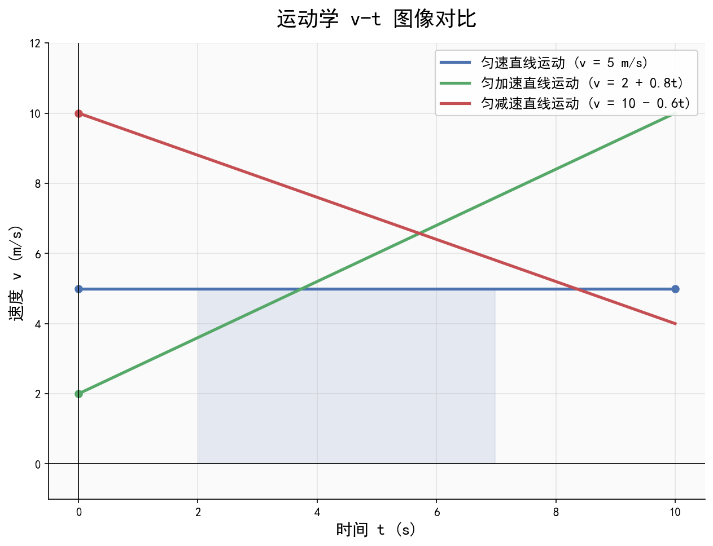

# 匀变速直线运动公式体系

| 字段 | 内容 |
|------|------|
| **来源** | 人教版必修第一册第二章 / 广东选择性考试高频考点 |
| **时间标签** | #高一筑基 |
| **难度** | ★★☆☆☆ |
| **状态** | ⚠️待强化 |
| **试卷来源** | #广东选择性考试 |
| **广东考情** | 高频（近5年广东卷均考查）。基础题为主，常以"广东交通""大湾区基建"为情境（如港珠澳大桥上的汽车运动、高铁加速度）。考查频率：选择题中1-2道+计算题第一问。难度定位：基础，但需注意刹车陷阱和往返运动的边界条件。赋分提示：基础题必须满分，原始分差距在赋分后会被放大。 |

---




## 核心内容

### 关键概念
- **匀变速直线运动**：加速度恒定的直线运动，a = 常量，方向与速度同向（加速）或反向（减速）
- **v-t图**：斜率=加速度，面积=位移，纵截距=初速度
- **x-t图**：斜率=速度，抛物线表示匀变速
- **追及相遇**：两物体位移关系决定相遇条件；临界条件：速度相等时距离最大/最小
- **刹车陷阱**：刹车至停止后不再反向运动，需判断刹车时间是否超出给定时间

### 核心公式/定理

#### 五大基本公式
```
① v = v₀ + at                          （速度公式）
② x = v₀t + ½at²                       （位移公式）
③ v² - v₀² = 2ax                       （不含时公式）
④ x = (v₀ + v)t / 2 = v̄t              （平均速度公式）
⑤ Δx = aT²                              （位移差公式，连续相等时间间隔）
```
> **适用条件**：匀变速直线运动（a恒定）
> **注意事项**：公式为矢量式，需先规定正方向；减速时a取负值；刹车问题需检验速度是否已减为零

#### 中间时刻速度公式
```
v_(t/2) = v̄ = (v₀ + v) / 2
```
> 适用：匀变速直线运动中，某段时间内的平均速度等于该段时间中间时刻的瞬时速度

#### 初速度为零的特殊比例（自由落体/静止起加速）
```
① 1T末、2T末、3T末…速度之比：v₁:v₂:v₃… = 1:2:3…
② 1T内、2T内、3T内…位移之比：x₁:x₂:x₃… = 1:4:9…
③ 第1T内、第2T内、第3T内…位移之比：xⅠ:xⅡ:xⅢ… = 1:3:5…
④ 通过连续相等位移所用时间之比：t₁:t₂:t₃… = 1:(√2-1):(√3-√2)…
```

### 方法步骤

#### v-t图分析四步法
1. **看轴**：确认横纵轴物理量及单位
2. **看线**：直线→匀变速；斜率→加速度（正负表示方向）
3. **看面积**：面积→位移（横轴上方面积为正，下方为负）
4. **看交点**：交点表示速度相同，往往是追及问题的临界条件

#### 追及相遇问题分析步骤
1. **画运动示意图**：标出两物体初始位置、运动方向
2. **列位移方程**：分别写出两物体的位移表达式 x₁(t) 和 x₂(t)
3. **找临界条件**：速度相等时距离最大或最小
4. **列相遇方程**：x₁ = x₂ + x₀（x₀为初始距离），解出时间t
5. **检验合理性**：判断是否在有效时间范围内（如刹车是否已停止）

#### 刹车陷阱判断法
1. 先用 v = v₀ + at 求刹车停止时间 t₀ = -v₀/a（取正值）
2. 比较给定时间 t 与 t₀：若 t ≤ t₀，直接用公式；若 t > t₀，位移按 t₀ 计算
3. 常见错误：不判断直接代入大时间，导致位移为负或速度反向的错误结果

### 记忆口诀/技巧
> **"速位速方差，平均位移差，五式记心间，矢量方向先定好"**
> 
> **刹车口诀**："先求停时，再比大小，超时按停，不超时正常算"
> 
> **v-t图面积口诀**："上正下负，斜率加减，面积位移，交点临界"

---

## 题型识别标志

> **看到什么条件 → 立刻想到什么方法/模型**

| 题干关键条件 | 识别为 | 首选方法 |
|-------------|--------|----------|
| "竖直上抛""喷泉钟激光关闭后仅受重力" | 匀变速直线运动（竖直方向） | 规定正方向，$v_t=v_0-gt$、$h=v_0t-\frac12gt^2$ |
| "v-t图像/加速度图像""图像可能表示" | 运动学图像题 | 斜率=加速度，面积=位移；加速度恒定则 $v$-$t$ 为斜直线 |
| "刹车至停止""减速运动给定时间" | 刹车陷阱 | 先求停止时间 $t_0=-v_0/a$，再比大小 |
| "两车追及""相距 $x_0$ 相遇" | 追及相遇 | 位移关系 $x_1=x_2+x_0$，临界在速度相等时 |
| "纸带/光电门/频闪照片" | 实验测速求加速度 | 逐差法 $a=\dfrac{(x_4+x_5+x_6)-(x_1+x_2+x_3)}{9T^2}$、$v_n=\dfrac{x_n+x_{n+1}}{2T}$ |
| "初速为零的匀加速""自由落体" | 特殊比例 | $x_\mathrm{I}:x_\mathrm{II}:x_\mathrm{III}=1:3:5$ 等 |

## 解题路径（匀变速直线运动五步法）

> 广东卷基础题必考，常以"高铁加速度""港珠澳大桥车辆制动"为情境，核心是"先定方向，再选公式"。

### 第一步：规定正方向，判运动性质
- 取初速度方向（或竖直向上）为正，减速时 $a$ 取负。
- 确认是否匀变速（$a$ 恒定）。

### 第二步：选公式（五大基本公式）
- 知 $v_0,a,t$ 求 $v$ → $v=v_0+at$
- 知 $v_0,a,t$ 求 $x$ → $x=v_0t+\frac12at^2$
- 不知 $t$ → $v^2-v_0^2=2ax$
- 求平均速度/中间时刻 → $\bar v=\dfrac{v_0+v}{2}=v_{t/2}$

### 第三步：刹车陷阱必检验
- 求停止时间 $t_0=\dfrac{-v_0}{a}$（取正），与给定时间 $t$ 比较。
- 若 $t>t_0$，位移按 $t_0$ 算，速度已为 0，不可代入大时间。

### 第四步：追及相遇找临界
- 列两物体位移 $x_1(t),x_2(t)$，相遇方程 $x_1=x_2+x_0$。
- 临界条件：速度相等时距离最大/最小，先判是否相遇再解 $t$。

### 第五步：图像辅助验证
- 画 $v$-$t$ 图：斜率=加速度，横轴上方面积=正位移，交点=速度相同（临界）。

## 母题（2023 广东选择性考试·第3题，4分）

> 广东卷直线运动基础题：以"铯原子喷泉钟"为情境考查竖直上抛的 $v$-$t$、$a$-$t$ 图像识别。

**题目**：铯原子喷泉钟是定标"秒"的装置。在喷泉钟的真空系统中，可视为质点的铯原子团在激光的推动下，获得一定的初速度。随后激光关闭，铯原子团仅在重力的作用下做竖直上抛运动，到达最高点后再做一段自由落体运动。取竖直向上为正方向。下列可能表示激光关闭后铯原子团速度 $v$ 或加速度 $a$ 随时间 $t$ 变化的图像是（  ）

**解**：
- 激光关闭后原子团仅受重力，加速度恒为 $g$，方向竖直向下，故 $a=-g$（负值、恒定）。
- $v$-$t$ 图像斜率即加速度，应为一条倾斜直线；因取向上为正，初速度 $v_0>0$，斜率负，图象从左上向右下倾斜。
- 选项 A、B：$v$-$t$ 若为曲线则错；C：$a$ 为正值错；D：$a$ 为负且恒定、$v$-$t$ 为斜直线，正确。

**答**：选 **D**。

> 💡 关键：匀变速直线运动 $a$ 恒定 → $v$-$t$ 必为斜直线，加速度方向决定图线斜率正负；看到"竖直上抛+取向上为正"立刻判定 $a=-g$。

---

## 自测训练（3道·覆盖五大公式·刹车陷阱·追及相遇）

> 先独立完成，再展开卡片末尾「参考答案」核对。每题标注所检验的题型，方便对号查漏。

**第1题**（检验：五大公式基本应用——速度与位移）
汽车以 $v_0=20\,\mathrm{m/s}$ 匀速行驶，刹车后做匀减速直线运动，加速度大小 $a=5\,\mathrm{m/s^2}$。求：
(1) 刹车后 $3\,\mathrm{s}$ 末汽车的速度 $v$；
(2) 刹车后 $3\,\mathrm{s}$ 内汽车的位移 $x$。

**第2题**（检验：刹车陷阱——停止时间判断）
汽车以 $v_0=15\,\mathrm{m/s}$ 行驶，刹车后做匀减速运动，加速度大小 $a=5\,\mathrm{m/s^2}$。求刹车后 $4\,\mathrm{s}$ 内汽车的位移 $x$。

**第3题**（检验：追及相遇——速度相等为临界）
甲车以 $v_1=10\,\mathrm{m/s}$ 匀速行驶，前方 $x_0=30\,\mathrm{m}$ 处乙车由静止开始以 $a=2\,\mathrm{m/s^2}$ 匀加速同向运动。求：
(1) 甲车追上乙车前，两车何时相距最远？最远距离为多少？
(2) 甲车追上乙车所需时间 $t$。

---

## 关联卡片

- [高一筑基_物理_核心知识网络_牛顿三定律与受力分析](高一筑基_物理_核心知识网络_牛顿三定律与受力分析.md) — 运动学与力学的桥梁，牛顿第二定律决定加速度
- [高一筑基_物理_核心知识网络_功和能与功能关系](高一筑基_物理_核心知识网络_功和能与功能关系.md) — 运动学公式可结合动能定理求解变力问题
- [高二深化_物理_核心知识网络_电磁感应定律](高二深化_物理_核心知识网络_电磁感应定律.md) — 电磁感应中的导轨问题需结合运动学分析

---


- [物理实验体系](高二深化_物理_核心知识网络_物理实验体系.md)

- [广东科技素材（华为5G与比亚迪）](../素材与拓展/高一筑基_物理_素材与拓展_广东科技素材（华为5G与比亚迪）.md)

- [广东科技素材（大疆与港珠澳大桥）](../素材与拓展/高一筑基_物理_素材与拓展_广东科技素材（大疆与港珠澳大桥）.md)

- [【力学实验专题】纸带·光电门·逐差法与图像法](../典型题型与方法/高二深化_物理_典型题型与方法_力学实验专题.md)
## 备注

（补充说明、个人理解、易错点提示、广东卷特殊考法等）

- **广东情境化命题常见素材**：高铁运动（加速度恒定）、港珠澳大桥上的车辆、广州地铁的启动与制动、无人机升降运动
- **易错点**：
  1. 自由落体/竖直上抛：注意g的方向，通常取向上为正则g = -9.8m/s²
  2. 往返运动：竖直上抛到最高点后自由落体，可用全程法（注意位移方向）
  3. 纸带实验：Δx = aT² 用于求加速度，注意区分计数点和计时点
- **实验联系**：打点计时器纸带分析、光电门测速度、频闪照片分析均需用本节公式
- **等级赋分提示**：本节为基础章节，选择题和计算题第一问几乎必考，务必确保不丢分

---

## 参考答案（请先独立完成自测训练，再展开核对）

> 答案与题目分板块呈现，便于"先做后对"。每题给出规范解答 + 易错提醒，做完一题对一题。

<details>
<summary>▶ 第1题详解（五大公式基本应用）</summary>

**(1)** 由 $v=v_0-at$（取初速度方向为正，减速取负）：
$$v=20-5\times3=5\,\mathrm{m/s}$$

**(2)** 由 $x=v_0t+\dfrac12at^2$（$a$ 取 $-5\,\mathrm{m/s^2}$）：
$$x=20\times3+\frac12\times(-5)\times3^2=60-22.5=37.5\,\mathrm{m}$$

（也可用 $x=\dfrac{v_0+v}{2}\cdot t=\dfrac{20+5}{2}\times3=37.5\,\mathrm{m}$ 验证。）

**答**：(1) $v=5\,\mathrm{m/s}$；(2) $x=37.5\,\mathrm{m}$。

> **易错提醒**：匀变速公式是矢量式，必须规定正方向；减速时 $a$ 取负值。

</details>

<details>
<summary>▶ 第2题详解（刹车陷阱——停止时间判断）</summary>

**先判断停止时间**
$$t_0=\frac{v_0}{a}=\frac{15}{5}=3\,\mathrm{s}$$

题给 $t=4\,\mathrm{s}>t_0=3\,\mathrm{s}$，汽车在第 $3\,\mathrm{s}$ 末已停下，第 $4\,\mathrm{s}$ 不再运动。

**实际位移按 $t_0=3\,\mathrm{s}$ 计算**
$$x=\frac{v_0^2}{2a}=\frac{15^2}{2\times5}=\frac{225}{10}=22.5\,\mathrm{m}$$

**答**：$x=22.5\,\mathrm{m}$。

> **易错提醒**：刹车问题必须先求停止时间 $t_0=v_0/a$，若题给时间超过 $t_0$，按 $t_0$ 计算位移；若直接代入 $4\,\mathrm{s}$ 用公式会得到 $30\,\mathrm{m}$，但物理上汽车已停止，这是典型陷阱。

</details>

<details>
<summary>▶ 第3题详解（追及相遇——速度相等临界）</summary>

**(1) 速度相等时距离最远**

设经过时间 $t_1$ 两车速度相等：
$$v_1=at_1\Rightarrow 10=2t_1\Rightarrow t_1=5\,\mathrm{s}$$

此时甲车位移：$x_1=v_1t_1=10\times5=50\,\mathrm{m}$

乙车位移：$x_2=\dfrac12at_1^2=\dfrac12\times2\times25=25\,\mathrm{m}$

最远距离：$\Delta x=x_0+x_2-x_1=30+25-50=5\,\mathrm{m}$

**(2) 追上时位移关系**

设经 $t$ 追上：$x_1=x_0+x_2$
$$v_1t=x_0+\frac12at^2\Rightarrow 10t=30+t^2\Rightarrow t^2-10t+30=0$$

判别式 $\Delta=100-120=-20<0$，方程无实数解——说明**甲车永远追不上乙车**。

**实际验证**：当乙车加速到 $v=10\,\mathrm{m/s}$（$t=5\,\mathrm{s}$）时，两者距离最大为 $5\,\mathrm{m}$；此后乙车速度超过甲车，距离只会增大，甲车确实追不上乙车。

**答**：(1) $t_1=5\,\mathrm{s}$，最远距离 $5\,\mathrm{m}$；(2) 本题参数下甲车追不上乙车（判别式小于零）。

> **易错提醒**：追及相遇临界条件是"速度相等"——此时两者距离最大或最小；解方程前先判断是否有实数解。

</details>
