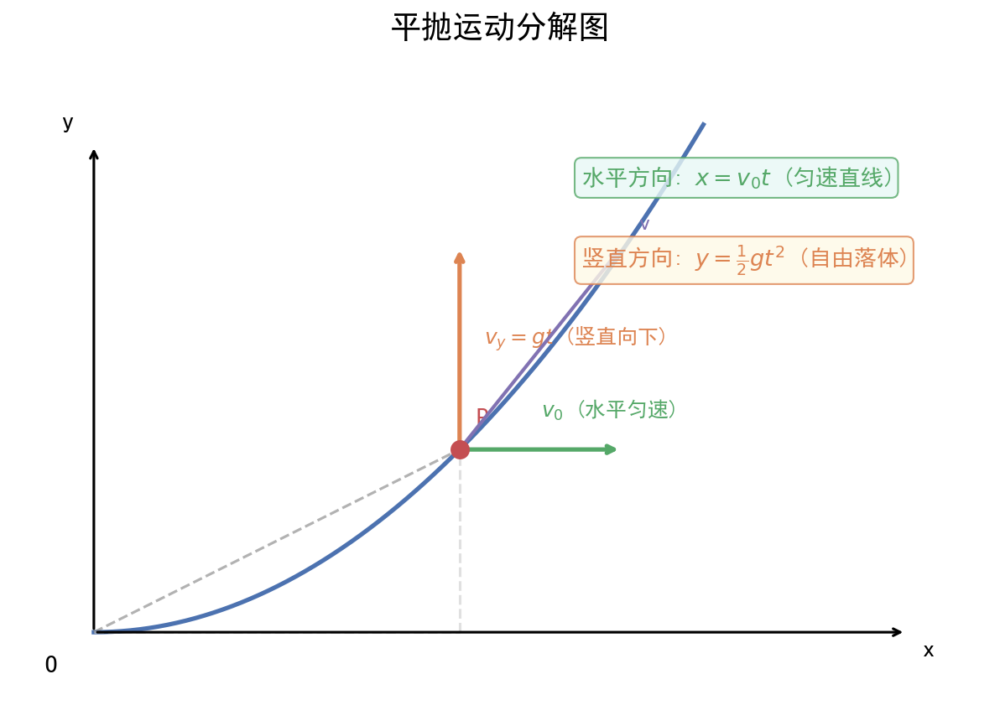
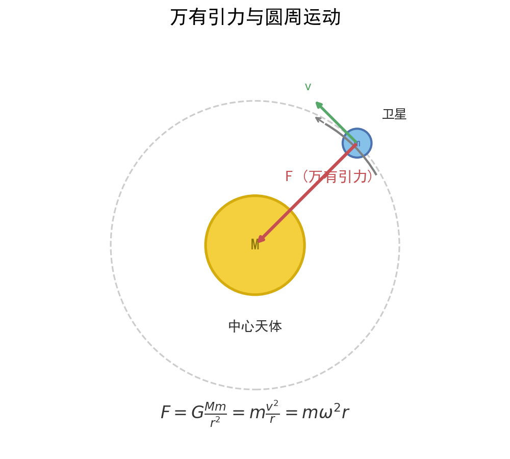

# 曲线运动与万有引力

| 字段 | 内容 |
|------|------|
| **来源** | 人教版必修第二册第五、六章 / 广东选择性考试高频考点 |
| **时间标签** | #高一筑基 |
| **难度** | ★★★☆☆ |
| **状态** | ⚠️待强化 |
| **试卷来源** | #广东选择性考试 |
| **广东考情** | 高频（近5年广东卷均考查，万有引力部分常以选择题出现，平抛/圆周运动常出现在计算题）。广东卷特色：以"航天科技""大湾区卫星"为情境（如北斗导航、嫦娥探月、空间站）。难度定位：中档。圆周运动临界条件是高频难点。赋分提示：万有引力选择题属于中档题，应确保得分；圆周运动临界条件分析需重点突破。 |

---






## 核心内容

### 关键概念
- **曲线运动条件**：速度方向与合力方向不在同一直线上（加速度与速度不共线）
- **平抛运动**：水平方向匀速直线运动，竖直方向自由落体运动，两个分运动独立进行
- **圆周运动**：向心力 F向 = mv²/r = mω²r = m(2π/T)²r，方向始终指向圆心
- **万有引力**：任何两个有质量的物体之间的吸引力，F = Gm₁m₂/r²
- **第一宇宙速度**：7.9 km/s，最小发射速度、最大环绕速度
- **第二宇宙速度**：11.2 km/s，脱离地球引力束缚
- **第三宇宙速度**：16.7 km/s，脱离太阳引力束缚
- **同步卫星**：周期T = 24h，轨道在赤道平面，高度约36000km，线速度约3.1km/s
- **双星问题**：两颗星绕共同质心做圆周运动，角速度相等，向心力由彼此引力提供

### 核心公式/定理

#### 平抛运动公式（分解法）
```
水平方向：x = v₀t，v_x = v₀（匀速）
竖直方向：y = ½gt²，v_y = gt（自由落体）
合速度：v = √(v₀² + v_y²)，方向 tanθ = v_y/v₀ = gt/v₀
合位移：s = √(x² + y²)，方向 tanα = y/x = gt/(2v₀)
重要推论：tanθ = 2tanα（速度偏角正切是位移偏角正切的2倍）
```
> **适用条件**：只受重力，初速度水平，空气阻力可忽略
> **注意事项**：平抛运动时间只由高度决定 t = √(2h/g)，与初速度无关；水平射程 x = v₀√(2h/g)

#### 圆周运动公式体系
```
线速度：v = ωr = 2πr/T = 2πrf
向心加速度：a = v²/r = ω²r = ωv = (2π/T)²r
向心力：F向 = mv²/r = mω²r = mωv = m(2π/T)²r
```
> **适用条件**：匀速圆周运动（速率不变，方向时刻变化）
> **注意事项**：向心力是效果力，由某个或某几个实际力提供（如重力、弹力、摩擦力、万有引力等），不能说"物体受到向心力"

#### 圆周运动临界条件
| 模型 | 最高点临界条件 | 最低点 |
|------|---------------|--------|
| **轻绳模型**（绳/轨道内侧） | v_min = √(gr)，T = 0（仅重力提供向心力） | T - mg = mv²/r |
| **轻杆模型**（杆/管道） | v_min = 0，杆可提供向上或向下支持力 | T - mg = mv²/r |
| **圆锥摆** | 水平面内圆周运动，T sinθ = mω²(L sinθ) | — |
| **汽车过拱桥** | v_max = √(gr)，N = 0（飞离桥面） | N - mg = mv²/r |
| **汽车过凹桥** | — | N - mg = mv²/r（超重） |

#### 万有引力定律与天体运动
```
万有引力：F = Gm₁m₂/r²
黄金代换：GM = gR²（近地表面，忽略自转）
卫星线速度：v = √(GM/r) = √(gR²/r)  ∝ 1/√r
卫星角速度：ω = √(GM/r³)  ∝ 1/√r³
卫星周期：T = 2π√(r³/GM)  ∝ √r³（开普勒第三定律）
卫星加速度：a = GM/r²  ∝ 1/r²
```
> **适用条件**：中心天体模型（卫星绕行星、行星绕恒星）
> **注意事项**：r为轨道半径（到中心天体球心的距离），不是天体表面半径；同步卫星轨道必须在赤道平面

#### 双星问题公式
```
两颗星：m₁ω²r₁ = m₂ω²r₂ = Gm₁m₂/L²
且 r₁ + r₂ = L（两星间距）
质量比：m₁/m₂ = r₂/r₁（质心关系）
共同角速度：ω = √[G(m₁+m₂)/L³]
```
> **关键**：双星角速度相等，向心力大小相等，轨道半径与质量成反比

#### 宇宙速度
```
第一宇宙速度：v₁ = √(gR) = √(GM/R) ≈ 7.9 km/s
第二宇宙速度：v₂ = √2·v₁ ≈ 11.2 km/s
第三宇宙速度：v₃ ≈ 16.7 km/s
```

### 方法步骤

#### 平抛运动"分解法"解题步骤
1. **建立坐标**：水平向右为x轴，竖直向下为y轴（或向上为y轴，此时g取负）
2. **分方向列方程**：水平匀速，竖直匀加速（自由落体）
3. **找关联**：两个方向的时间t相同，是联系两个分运动的桥梁
4. **求合量**：速度或位移的合成用勾股定理和三角函数
5. **常用技巧**：从速度偏角或位移偏角切入，利用 tanθ = 2tanα 快速求关系

#### 圆周运动"供需分析"法
1. **确定圆心**：找到圆周运动的圆心位置
2. **分析供力**：分析物体受到的所有力，找出指向圆心方向的合力（"供"）
3. **写需求**：F供 = F需 = mv²/r = mω²r（"需"）
4. **列方程**：指向圆心为正方向，列牛顿第二定律方程
5. **找临界**：最高点/最低点/水平位置的特殊临界条件

#### 天体运动"一绕二表三比较"法
1. **判断模型**：是绕行星转（卫星）还是表面问题（求g）
2. **列方程**：
   - 绕行：GMm/r² = mv²/r = mω²r = m(2π/T)²r = ma
   - 表面：GMm/R² = mg（忽略自转）→ GM = gR²
3. **比大小**：利用 v ∝ 1/√r、ω ∝ 1/√r³、T ∝ √r³、a ∝ 1/r² 快速比较不同轨道卫星的物理量
4. **注意**：同一中心天体，比较时GM为定值；不同中心天体需用 GM = gR² 代换

### 记忆口诀/技巧
> **"平抛分两头，水平匀速竖直落，时间看高度，射程看初速"**
> 
> **"绳球最高点根号下gr，杆球最高点可以为零"** — 临界条件
> 
> **"高轨低速长周期，大机大势小动能"** — 卫星轨道规律（轨道越高，v、ω、a越小，T越大；机械能、引力势能越大，动能越小）
> 
> **"GM=gR²，黄金代换要牢记，表面忽略自转才成立"**

---

## 题型识别标志

> **看到什么条件 → 立刻想到什么方法/模型**

| 题干关键条件 | 识别为 | 首选方法 |
|-------------|--------|----------|
| "水平抛出""高度差 $h$、初速度 $v_0$""平抛" | 平抛运动 | 分解：水平 $x=v_0t$，竖直 $y=\frac12gt^2$；时间 $t=\sqrt{2h/g}$ |
| "圆周运动最高点/最低点""绳/杆模型" | 圆周运动临界 | 轻绳 $v_{\min}=\sqrt{gr}$，轻杆 $v_{\min}=0$；牛顿第二定律 $F_{\text{向}}=mv^2/r$ |
| "卫星绕行星""周期 $T$、半径 $r$""同步卫星" | 万有引力天体 | $GMm/r^2=mv^2/r=m\omega^2r=m(2\pi/T)^2r$；黄金代换 $GM=gR^2$ |
| "探测器亮度周期性变化（行星遮挡）" | 天体公转周期/半径 | 由遮挡时长推周期 $T$，再 $r=\sqrt[3]{GMT^2/4\pi^2}$ |
| "圆锥摆""水平面内圆周" | 匀速圆周（供需分析） | 竖直方向平衡 + 水平方向 $T\sin\theta=m\omega^2r$ |
| "斜抛最高点""速度反向延长线过水平位移中点" | 斜抛/平抛几何 | 平抛 $\tan\theta=2\tan\alpha$；反向延长线过中点 |

## 解题路径（曲线运动三步法 + 万有引力"一绕二表三比较"）

> 广东卷常以"北斗导航、嫦娥探月、空间站、无人机抛投"为情境，平抛与圆周临界是高频难点。

### 第一步：判定运动模型
- 平抛/类平抛 → 分解为匀速 + 匀加速，时间 $t$ 是两方向桥梁。
- 圆周 → 找圆心、定半径，判临界（绳/杆/拱桥模型）。
- 天体 → 判断是绕行（卫星）还是表面（求 $g$）。

### 第二步：列核心方程
- 平抛：$x=v_0t,\ y=\frac12gt^2,\ v_y=gt,\ \tan\theta=\dfrac{v_y}{v_0}=2\tan\alpha$
- 圆周：$F_{\text{供}}=F_{\text{需}}=m\dfrac{v^2}{r}=m\omega^2r$
- 天体：$G\dfrac{Mm}{r^2}=m\dfrac{v^2}{r}=m\omega^2r=m\dfrac{4\pi^2}{T^2}r$

### 第三步：临界与比较
- 圆周临界：最高点 $v_{\min}=\sqrt{gr}$（绳），或 $v_{\min}=0$（杆）。
- 天体比较：同中心天体时 $v\propto1/\sqrt r,\ \omega\propto1/\sqrt{r^3},\ T\propto\sqrt{r^3},\ a\propto1/r^2$。

## 母题（2021 广东选择性考试·第4题，6分）

> 广东卷平抛运动典型题：以"长征途中投手榴弹"为情境，综合考查平抛时间、重力功率与机械能守恒（多选题）。

**题目**：长征途中，为了突破敌方关隘，战士爬上陡峭的山头，居高临下向敌方工事内投掷手榴弹。战士在同一位置先后投出甲、乙两颗质量均为 $m$ 的手榴弹，手榴弹从投出位置到落地点的高度差为 $h$，在空中的运动可视为平抛运动，轨迹如图所示，重力加速度为 $g$。下列说法正确的有（  ）
A. 甲在空中的运动时间比乙的长
B. 两手榴弹在落地前瞬间，重力的功率相等
C. 从投出到落地，每颗手榴弹的重力势能减少 $mgh$
D. 从投出到落地，每颗手榴弹的机械能变化量为 $\frac12mv^2$（动能增量）

**解**：
- 平抛运动时间由高度决定：$t=\sqrt{2h/g}$，两弹高度差相同 → 时间相等，A 错。
- 落地前瞬间重力功率 $P=mg\cdot v_y=mg\cdot gt=mg^2t$，与时间成正比、与质量成正比，两弹 $m,h$ 相同 → 功率相等，B 对。
- 重力做功 $W_G=mgh$ → 重力势能减少 $mgh$，C 对。
- 平抛过程只有重力做功，机械能守恒，变化量为 0，D 错。

**答**：选 **BC**。

> 💡 关键：平抛"时间看高度"是首要结论；重力瞬时功率用 $P=mgv_y$（竖直分量），不是 $mgv$；机械能守恒前提是"只有重力做功"。

---

## 关联卡片

- [高一筑基_物理_核心知识网络_牛顿三定律与受力分析](高一筑基_物理_核心知识网络_牛顿三定律与受力分析.md) — 圆周运动向心力由牛顿定律分析，万有引力提供天体向心力
- [高一筑基_物理_核心知识网络_功和能与功能关系](高一筑基_物理_核心知识网络_功和能与功能关系.md) — 天体运动中的机械能守恒（只受万有引力）
- [高二深化_物理_核心知识网络_电场公式体系](高二深化_物理_核心知识网络_电场公式体系.md) — 带电粒子在电场中的类平抛运动
- [高二深化_物理_核心知识网络_磁场公式体系](高二深化_物理_核心知识网络_磁场公式体系.md) — 带电粒子在磁场中的圆周运动

---


- [广东科技素材（大疆与港珠澳大桥）](../素材与拓展/高一筑基_物理_素材与拓展_广东科技素材（大疆与港珠澳大桥）.md)

- [【圆弧轨道与平抛综合】曲线轨道下滑·碰撞·平抛落点](../典型题型与方法/高二深化_物理_典型题型与方法_圆弧轨道与平抛综合.md)

- [【圆周运动与万有引力易错】向心力·竖直面临界·天体轨道](../易错警示与辨析/高二深化_物理_易错警示与辨析_圆周运动与万有引力易错.md)
## 备注

- **广东情境化命题常见素材**：
  - 北斗导航系统（卫星轨道、周期、速度比较）
  - 嫦娥探月工程（月球表面重力加速度、月球卫星轨道）
  - 中国空间站（轨道高度、运行周期、航天员失重）
  - 大湾区卫星通信（同步卫星、轨道参数）
  - 广东沿海过山车/摩天轮（圆周运动临界条件）
  - 无人机抛投物资（平抛运动）
- **易错点**：
  1. 同步卫星高度约36000km，轨道半径约42000km（不是36000km）
  2. 第一宇宙速度是最大环绕速度、最小发射速度；轨道越高卫星速度越小
  3. 黄金代换 GM = gR² 仅适用于忽略自转的天体表面
  4. 双星问题中，两星轨道半径之和等于间距，且与质量成反比
  5. 平抛运动的速度反向延长线过水平位移中点（重要几何结论）
  6. 斜抛运动最高点速度不为零，等于水平初速度分量
- **开普勒三定律**：
  1. 第一定律：行星轨道为椭圆，太阳在椭圆焦点上
  2. 第二定律：行星与太阳连线在相等时间内扫过相等面积（近快远慢）
  3. 第三定律：T²/r³ = k（k与中心天体质量有关）
- **等级赋分提示**：万有引力选择题常考"轨道比较"，掌握"高轨低速长周期"口诀可快速解题；圆周运动临界条件需结合能量守恒分析，注意绳/杆模型的区别
