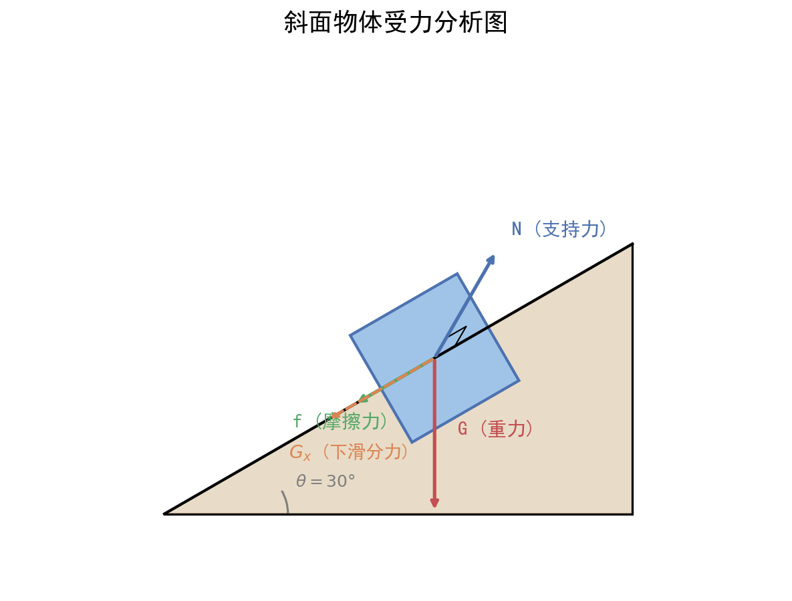

# 牛顿三定律与受力分析

| 字段 | 内容 |
|------|------|
| **来源** | 人教版必修第一册第三、四章 / 广东选择性考试高频考点 |
| **时间标签** | #高一筑基 |
| **难度** | ★★★☆☆ |
| **状态** | ⚠️待强化 |
| **试卷来源** | #广东选择性考试 |
| **广东考情** | 高频（近5年广东卷均考查，覆盖选择、实验、计算题）。常以"生活科技情境"命题，如比亚迪新能源汽车制动、大疆无人机悬停、广东电梯超重失重。难度定位：中档。受力分析是后续所有力学综合题的基础，必须熟练掌握。赋分提示：受力分析错误会导致整题连环失分，务必保证准确性。 |

---




## 核心内容

### 关键概念
- **牛顿第一定律（惯性定律）**：惯性只与质量有关；力不是维持运动的原因，而是改变运动状态的原因
- **牛顿第二定律**：F合 = ma，加速度方向与合外力方向相同
- **牛顿第三定律**：作用力与反作用力，大小相等、方向相反、作用在不同物体上
- **超重**：视重 > 实重，加速度向上（加速上升或减速下降）
- **失重**：视重 < 实重，加速度向下（加速下降或减速上升）；完全失重时 a = g，视重为零
- **整体法**：将多个物体看作一个整体，只分析外力
- **隔离法**：将某个物体单独隔离，分析其受到的所有力
- **摩擦力突变**：静摩擦→滑动摩擦的临界条件；弹簧弹力不能突变，绳/杆弹力可以突变

### 核心公式/定理

#### 牛顿第二定律
```
F合 = ma
或分解式：
Fx合 = max
Fy合 = may
```
> **适用条件**：宏观、低速（远小于光速）的惯性参考系
> **注意事项**：
> 1. F合 为物体所受所有外力的矢量和
> 2. a 与 F合 方向相同，与速度方向无必然关系
> 3. 加速度可以瞬间变化（力变则加速度立即变），但速度不能突变

#### 滑动摩擦力与静摩擦力
```
f滑 = μN（μ为动摩擦因数，N为正压力）
f静 ≤ f静max（通常认为 f静max = μ₀N）
```
> **注意**：滑动摩擦力大小与相对速度无关；静摩擦力大小由平衡条件或牛顿定律求解，不是定值

#### 胡克定律
```
F = kx（k为劲度系数，x为形变量）
```
> **注意**：弹簧弹力不能突变（形变需要时间），但剪断弹簧时弹力可瞬间消失

### 方法步骤

#### 受力分析"一重二弹三摩擦四其他"步骤
1. **重力**：任何物体必受重力，方向竖直向下，G = mg
2. **弹力**：找接触面/接触点，看是否有挤压形变；方向垂直接触面（指向被支持物体）
3. **摩擦力**：有弹力不一定有摩擦，需有相对运动或相对运动趋势；方向与相对运动（趋势）方向相反
4. **其他力**：电场力、磁场力、浮力、拉力等按题意添加
5. **检查**：每个力都能找到施力物体；力不能多也不能少

#### 整体法与隔离法选择原则
| 方法 | 适用场景 | 分析对象 | 优势 |
|------|----------|----------|------|
| **整体法** | 求系统所受外力（如地面支持力、摩擦力） | 整个系统 | 不分析内力，简化计算 |
| **隔离法** | 求系统内部相互作用力（如A对B的弹力） | 单个物体 | 能分析内力，细节清晰 |
| **先整体后隔离** | 连接体问题求加速度+内力 | 先整体后单个 | 先求加速度，再求内力 |

#### 摩擦力突变分析
1. **判断运动状态**：是静止、匀速、还是加速？
2. **区分摩擦类型**：静摩擦（无相对滑动）vs 滑动摩擦（有相对滑动）
3. **找临界条件**：推力增大到 f静max 时开始滑动，此后变为滑动摩擦
4. **注意**：斜面上物体静止时，静摩擦力 f = mg sinθ；滑动后 f = μmg cosθ

#### 超重失重判断法
```
加速度向上 → 超重 → N = m(g + a) > mg
加速度向下 → 失重 → N = m(g - a) < mg
a = g 向下 → 完全失重 → N = 0
```
> **关键**：看加速度方向，不是看速度方向！

### 记忆口诀/技巧
> **"一重二弹三摩擦，四看其他别落啦"** — 受力分析顺序
> 
> **"整体求外，隔离求内，先整后隔，事半功倍"** — 整体法隔离法选择
> 
> **"超重上加速，失重下加速，完全失重a=g"** — 超重失重判断
> 
> **"静摩看平衡，滑摩用μN，弹簧不突变，绳杆可突变"** — 力的特点

### 题型识别标志

> **看到什么条件 → 立刻想到什么方法**

| 题干关键条件 | 识别为 | 首选方法 |
|-------------|--------|----------|
| "物体静止/匀速" + 多个力 | 静力平衡 | **正交分解**：$\sum F_x = 0, \sum F_y = 0$ |
| "物体在斜面上刚好不下滑" | 摩擦力临界 | $mg\sin\theta = \mu mg\cos\theta$ → $\mu = \tan\theta$ |
| "连接体（A叠B/绳连AB）求加速度" | 连接体 | **先整体求 $a$，再隔离求内力** |
| "物体速度为零但加速度不为零" | 瞬时分析 | 速度与加速度无关！分析此刻受力→$F_{合}=ma$ |
| "弹簧/绳剪断瞬间" | 力突变 | 弹簧弹力不突变，绳/杆弹力可突变 |
| "传送带上的物体从静止开始" | 传送带 | $a = \mu g$（水平）/ $a = \mu g\cos\theta \pm g\sin\theta$（倾斜），先判断能否共速 |

### 母题（2023 广东选择性考试·第8题，6分）

> 广东物理多选题，静力平衡 + 斜面分解，典型的广东情境化命题。

**题目**：如图所示，可视为质点的机器人通过磁铁吸附在船舷外壁面检测船体。壁面可视为斜面，与竖直方向夹角为 $\theta$。船和机器人保持静止时，机器人仅受重力 $G$、支持力 $N$、摩擦力 $f$ 和磁力 $F$ 的作用，磁力垂直壁面。下列关系式正确的是：

A. $f = G$
B. $N = F$
C. $f = G\cos\theta$
D. $f = G\sin\theta$

**解**：以机器人为研究对象，受力分析：
- 重力 $G$：竖直向下
- 磁力 $F$：垂直壁面向里
- 支持力 $N$：垂直壁面向外
- 摩擦力 $f$：沿壁面向上（阻止下滑）

**建系 + 正交分解**：取沿斜面方向和垂直斜面方向。

重力分解：
- 沿斜面分量：$G\sin\theta$（方向：沿斜面向下）
- 垂直斜面分量：$G\cos\theta$（方向：指向壁面）

列平衡方程：
- 沿斜面：$f = G\sin\theta$
- 垂直斜面：$N = F + G\cos\theta$

**答案：D**

> 💡 **关键技巧**：广东卷斜面题中，$\theta$ 是"壁面与竖直方向"的夹角而非"与水平方向"——这和常规斜面不同，需要**在草稿纸上画出 $\theta$ 的位置**确认分量是 $\sin\theta$ 还是 $\cos\theta$，不能套公式。

---

## 关联卡片

- [高一筑基_物理_核心知识网络_匀变速直线运动公式体系](高一筑基_物理_核心知识网络_匀变速直线运动公式体系.md) — 牛顿第二定律产生加速度，运动学公式描述运动
- [高一筑基_物理_核心知识网络_曲线运动与万有引力](高一筑基_物理_核心知识网络_曲线运动与万有引力.md) — 圆周运动向心力由牛顿第二定律分析
- [高二深化_物理_典型题型与方法_力学三大模型通法](高二深化_物理_典型题型与方法_力学三大模型通法.md) — 板块、传送带、弹簧模型均以受力分析为基础
- [高一筑基_物理_核心知识网络_功和能与功能关系](高一筑基_物理_核心知识网络_功和能与功能关系.md) — 功是力在空间上的积累，需先会分析力

---

## 备注

- **广东情境化命题常见素材**：
  - 比亚迪新能源汽车的加速/制动（求牵引力、摩擦力）
  - 大疆无人机悬停与升降（受力平衡与牛顿第二定律）
  - 广东电梯中的超重失重体验
  - 港珠澳大桥斜拉桥受力分析（简化模型）
- **易错点**：
  1. 误认为"运动物体一定受摩擦力"——光滑面上匀速运动的物体不受摩擦力
  2. 误认为"摩擦力方向与运动方向相反"——摩擦力方向与相对运动方向相反，可以与运动方向相同（如传送带带动物体）
  3. 斜面上正压力 N ≠ mg，而是 N = mg cosθ
  4. 弹簧串联：1/k总 = 1/k₁ + 1/k₂；并联：k总 = k₁ + k₂
- **摩擦力突变典型场景**：
  - 木块在木板上：外力达到 f静max 时开始滑动，摩擦力从静摩擦突变为滑动摩擦（数值通常变小）
  - 撤去外力瞬间：静摩擦力瞬间调整以维持平衡，但滑动摩擦力不变（除非正压力变）
- **等级赋分提示**：受力分析是力学综合题的第一步，一旦出错后续全错，务必通过大量练习确保准确
