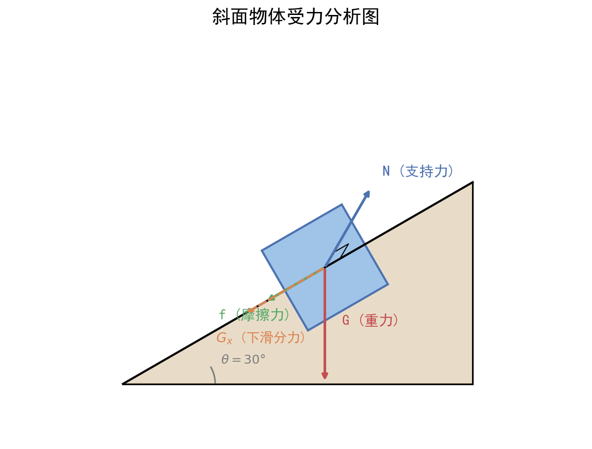

# 牛顿三定律与受力分析

| 字段 | 内容 |
|------|------|
| **来源** | 人教版必修第一册第三、四章 / 广东选择性考试高频考点 |
| **时间标签** | #高一筑基 |
| **难度** | ★★★☆☆ |
| **状态** | ⚠️待强化 |
| **试卷来源** | #广东选择性考试 |
| **广东考情** | 高频（近5年广东卷均考查，覆盖选择、实验、计算题）。常以"生活科技情境"命题，如比亚迪新能源汽车制动、大疆无人机悬停、广东电梯超重失重。难度定位：中档。受力分析是后续所有力学综合题的基础，必须熟练掌握。赋分提示：受力分析错误会导致整题连环失分，务必保证准确性。 |

---




## 核心内容

### 关键概念
- **牛顿第一定律（惯性定律）**：惯性只与质量有关；力不是维持运动的原因，而是改变运动状态的原因
- **牛顿第二定律**：F合 = ma，加速度方向与合外力方向相同
- **牛顿第三定律**：作用力与反作用力，大小相等、方向相反、作用在不同物体上
- **超重**：视重 > 实重，加速度向上（加速上升或减速下降）
- **失重**：视重 < 实重，加速度向下（加速下降或减速上升）；完全失重时 a = g，视重为零
- **整体法**：将多个物体看作一个整体，只分析外力
- **隔离法**：将某个物体单独隔离，分析其受到的所有力
- **摩擦力突变**：静摩擦→滑动摩擦的临界条件；弹簧弹力不能突变，绳/杆弹力可以突变

### 核心公式/定理

#### 牛顿第二定律
```
F合 = ma
或分解式：
Fx合 = max
Fy合 = may
```
> **适用条件**：宏观、低速（远小于光速）的惯性参考系
> **注意事项**：
> 1. F合 为物体所受所有外力的矢量和
> 2. a 与 F合 方向相同，与速度方向无必然关系
> 3. 加速度可以瞬间变化（力变则加速度立即变），但速度不能突变

#### 滑动摩擦力与静摩擦力
```
f滑 = μN（μ为动摩擦因数，N为正压力）
f静 ≤ f静max（通常认为 f静max = μ₀N）
```
> **注意**：滑动摩擦力大小与相对速度无关；静摩擦力大小由平衡条件或牛顿定律求解，不是定值

#### 胡克定律
```
F = kx（k为劲度系数，x为形变量）
```
> **注意**：弹簧弹力不能突变（形变需要时间），但剪断弹簧时弹力可瞬间消失

### 方法步骤

#### 受力分析"一重二弹三摩擦四其他"步骤
1. **重力**：任何物体必受重力，方向竖直向下，G = mg
2. **弹力**：找接触面/接触点，看是否有挤压形变；方向垂直接触面（指向被支持物体）
3. **摩擦力**：有弹力不一定有摩擦，需有相对运动或相对运动趋势；方向与相对运动（趋势）方向相反
4. **其他力**：电场力、磁场力、浮力、拉力等按题意添加
5. **检查**：每个力都能找到施力物体；力不能多也不能少

#### 整体法与隔离法选择原则
| 方法 | 适用场景 | 分析对象 | 优势 |
|------|----------|----------|------|
| **整体法** | 求系统所受外力（如地面支持力、摩擦力） | 整个系统 | 不分析内力，简化计算 |
| **隔离法** | 求系统内部相互作用力（如A对B的弹力） | 单个物体 | 能分析内力，细节清晰 |
| **先整体后隔离** | 连接体问题求加速度+内力 | 先整体后单个 | 先求加速度，再求内力 |

#### 摩擦力突变分析
1. **判断运动状态**：是静止、匀速、还是加速？
2. **区分摩擦类型**：静摩擦（无相对滑动）vs 滑动摩擦（有相对滑动）
3. **找临界条件**：推力增大到 f静max 时开始滑动，此后变为滑动摩擦
4. **注意**：斜面上物体静止时，静摩擦力 f = mg sinθ；滑动后 f = μmg cosθ

#### 超重失重判断法
```
加速度向上 → 超重 → N = m(g + a) > mg
加速度向下 → 失重 → N = m(g - a) < mg
a = g 向下 → 完全失重 → N = 0
```
> **关键**：看加速度方向，不是看速度方向！

### 记忆口诀/技巧
> **"一重二弹三摩擦，四看其他别落啦"** — 受力分析顺序
> 
> **"整体求外，隔离求内，先整后隔，事半功倍"** — 整体法隔离法选择
> 
> **"超重上加速，失重下加速，完全失重a=g"** — 超重失重判断
> 
> **"静摩看平衡，滑摩用μN，弹簧不突变，绳杆可突变"** — 力的特点

### 题型识别标志

> **看到什么条件 → 立刻想到什么方法**

| 题干关键条件 | 识别为 | 首选方法 |
|-------------|--------|----------|
| "物体静止/匀速" + 多个力 | 静力平衡 | **正交分解**：$\sum F_x = 0, \sum F_y = 0$ |
| "物体在斜面上刚好不下滑" | 摩擦力临界 | $mg\sin\theta = \mu mg\cos\theta$ → $\mu = \tan\theta$ |
| "连接体（A叠B/绳连AB）求加速度" | 连接体 | **先整体求 $a$，再隔离求内力** |
| "物体速度为零但加速度不为零" | 瞬时分析 | 速度与加速度无关！分析此刻受力→$F_{合}=ma$ |
| "弹簧/绳剪断瞬间" | 力突变 | 弹簧弹力不突变，绳/杆弹力可突变 |
| "传送带上的物体从静止开始" | 传送带 | $a = \mu g$（水平）/ $a = \mu g\cos\theta \pm g\sin\theta$（倾斜），先判断能否共速 |

### 母题（2023 广东选择性考试·第8题，6分）

> 广东物理多选题，静力平衡 + 斜面分解，典型的广东情境化命题。

**题目**：如图所示，可视为质点的机器人通过磁铁吸附在船舷外壁面检测船体。壁面可视为斜面，与竖直方向夹角为 $\theta$。船和机器人保持静止时，机器人仅受重力 $G$、支持力 $N$、摩擦力 $f$ 和磁力 $F$ 的作用，磁力垂直壁面。下列关系式正确的是：

A. $f = G$
B. $N = F$
C. $f = G\cos\theta$
D. $f = G\sin\theta$

**解**：以机器人为研究对象，受力分析：
- 重力 $G$：竖直向下
- 磁力 $F$：垂直壁面向里
- 支持力 $N$：垂直壁面向外
- 摩擦力 $f$：沿壁面向上（阻止下滑）

**建系 + 正交分解**：取沿斜面方向和垂直斜面方向。

重力分解：
- 沿斜面分量：$G\sin\theta$（方向：沿斜面向下）
- 垂直斜面分量：$G\cos\theta$（方向：指向壁面）

列平衡方程：
- 沿斜面：$f = G\sin\theta$
- 垂直斜面：$N = F + G\cos\theta$

**答案：D**

> 💡 **关键技巧**：广东卷斜面题中，$\theta$ 是"壁面与竖直方向"的夹角而非"与水平方向"——这和常规斜面不同，需要**在草稿纸上画出 $\theta$ 的位置**确认分量是 $\sin\theta$ 还是 $\cos\theta$，不能套公式。

---

## 自测训练（3道·覆盖受力分析·斜面·整体隔离·超重失重）

> 先独立完成，再展开卡片末尾「参考答案」核对。每题标注所检验的题型，方便对号查漏。

**第1题**（检验：斜面平衡——正交分解与摩擦力方向）
质量 $m=5\,\mathrm{kg}$ 的物块静止在倾角 $\theta=37°$ 的斜面上（$\sin37°=0.6$，$\cos37°=0.8$），$g$ 取 $10\,\mathrm{m/s^2}$。求：
(1) 斜面对物块的支持力 $N$；
(2) 斜面对物块的摩擦力 $f$ 的大小和方向。

**第2题**（检验：牛顿第二定律——连接体整体隔离）
质量 $m_A=2\,\mathrm{kg}$ 和 $m_B=3\,\mathrm{kg}$ 的两物块用轻绳连接，$A$ 在前 $B$ 在后，沿光滑水平面用 $F=15\,\mathrm{N}$ 的水平力拉 $A$。求：
(1) 两物块的共同加速度 $a$；
(2) 绳的拉力 $T$。

**第3题**（检验：超重失重——电梯情境）
质量 $m=60\,\mathrm{kg}$ 的人站在电梯中的体重计上，$g$ 取 $10\,\mathrm{m/s^2}$。求：
(1) 电梯以 $a=2\,\mathrm{m/s^2}$ 匀加速上升时，体重计示数 $N_1$；
(2) 电梯以 $a=2\,\mathrm{m/s^2}$ 匀加速下降时，体重计示数 $N_2$；
(3) 电梯自由下落时，体重计示数 $N_3$。

---

## 关联卡片

- [高一筑基_物理_核心知识网络_匀变速直线运动公式体系](高一筑基_物理_核心知识网络_匀变速直线运动公式体系.md) — 牛顿第二定律产生加速度，运动学公式描述运动
- [高一筑基_物理_核心知识网络_曲线运动与万有引力](高一筑基_物理_核心知识网络_曲线运动与万有引力.md) — 圆周运动向心力由牛顿第二定律分析
- [高二深化_物理_典型题型与方法_力学三大模型通法](../典型题型与方法/高二深化_物理_典型题型与方法_力学三大模型通法.md) — 板块、传送带、弹簧模型均以受力分析为基础
- [高一筑基_物理_核心知识网络_功和能与功能关系](高一筑基_物理_核心知识网络_功和能与功能关系.md) — 功是力在空间上的积累，需先会分析力

---


- [物理实验体系](高二深化_物理_核心知识网络_物理实验体系.md)

- [广东科技素材（大疆与港珠澳大桥）](../素材与拓展/高一筑基_物理_素材与拓展_广东科技素材（大疆与港珠澳大桥）.md)

- [【力学实验专题】纸带·光电门·逐差法与图像法](../典型题型与方法/高二深化_物理_典型题型与方法_力学实验专题.md)

- [【滑块木板模型综合】相对滑动·共速·分离·叠加场讨论](../典型题型与方法/高二深化_物理_典型题型与方法_滑块木板模型综合.md)

- [【圆周运动与万有引力易错】向心力·竖直面临界·天体轨道](../易错警示与辨析/高二深化_物理_易错警示与辨析_圆周运动与万有引力易错.md)

- [牛顿定律连接体通法（整体法·隔离法·结点法）](../典型题型与方法/高二深化_物理_典型题型与方法_牛顿定律连接体通法.md)
## 备注

- **广东情境化命题常见素材**：
  - 比亚迪新能源汽车的加速/制动（求牵引力、摩擦力）
  - 大疆无人机悬停与升降（受力平衡与牛顿第二定律）
  - 广东电梯中的超重失重体验
  - 港珠澳大桥斜拉桥受力分析（简化模型）
- **易错点**：
  1. 误认为"运动物体一定受摩擦力"——光滑面上匀速运动的物体不受摩擦力
  2. 误认为"摩擦力方向与运动方向相反"——摩擦力方向与相对运动方向相反，可以与运动方向相同（如传送带带动物体）
  3. 斜面上正压力 N ≠ mg，而是 N = mg cosθ
  4. 弹簧串联：1/k总 = 1/k₁ + 1/k₂；并联：k总 = k₁ + k₂
- **摩擦力突变典型场景**：
  - 木块在木板上：外力达到 f静max 时开始滑动，摩擦力从静摩擦突变为滑动摩擦（数值通常变小）
  - 撤去外力瞬间：静摩擦力瞬间调整以维持平衡，但滑动摩擦力不变（除非正压力变）
- **等级赋分提示**：受力分析是力学综合题的第一步，一旦出错后续全错，务必通过大量练习确保准确

---

## 参考答案（请先独立完成自测训练，再展开核对）

> 答案与题目分板块呈现，便于"先做后对"。每题给出规范解答 + 易错提醒，做完一题对一题。

<details>
<summary>▶ 第1题详解（斜面平衡——正交分解）</summary>

以物块为研究对象，受力分析：重力 $mg=50\,\mathrm{N}$（竖直向下）、支持力 $N$（垂直斜面向外）、静摩擦力 $f$（沿斜面向上，阻止下滑）。

取沿斜面向上为 $x$ 轴正方向，垂直斜面向外为 $y$ 轴正方向。重力分解：
- 沿斜面分量：$mg\sin\theta$（沿斜面向下）
- 垂直斜面分量：$mg\cos\theta$（压向斜面）

**(1) 垂直斜面方向平衡**
$$N=mg\cos\theta=50\times0.8=40\,\mathrm{N}$$

**(2) 沿斜面方向平衡**
$$f=mg\sin\theta=50\times0.6=30\,\mathrm{N}$$

方向：沿斜面向上（阻止物块下滑）。

**答**：(1) $N=40\,\mathrm{N}$；(2) $f=30\,\mathrm{N}$，沿斜面向上。

> **易错提醒**：斜面支持力 $N=mg\cos\theta$，不等于 $mg$；静摩擦力方向沿斜面，大小由平衡条件决定（非 $\mu N$）。

</details>

<details>
<summary>▶ 第2题详解（连接体整体隔离法）</summary>

**(1) 整体法求共同加速度**
$$F=(m_A+m_B)a\Rightarrow a=\frac{F}{m_A+m_B}=\frac{15}{2+3}=3\,\mathrm{m/s^2}$$

**(2) 隔离 $B$ 求绳拉力**

$B$ 水平方向仅受绳拉力 $T$（向右）：
$$T=m_Ba=3\times3=9\,\mathrm{N}$$

**答**：(1) $a=3\,\mathrm{m/s^2}$；(2) $T=9\,\mathrm{N}$。

> **易错提醒**：求加速度用整体法，求绳拉力（内力）必须隔离某一物体；两物体加速度相同是连接体前提。

</details>

<details>
<summary>▶ 第3题详解（超重失重——电梯情境）</summary>

**(1) 匀加速上升（$a$ 向上，超重）**
$$N_1-mg=ma\Rightarrow N_1=m(g+a)=60\times(10+2)=720\,\mathrm{N}$$

**(2) 匀加速下降（$a$ 向下，失重）**
$$mg-N_2=ma\Rightarrow N_2=m(g-a)=60\times(10-2)=480\,\mathrm{N}$$

**(3) 自由下落（$a=g$，完全失重）**
$$N_3=m(g-g)=0\,\mathrm{N}$$

**答**：(1) $N_1=720\,\mathrm{N}$（超重）；(2) $N_2=480\,\mathrm{N}$（失重）；(3) $N_3=0$（完全失重）。

> **易错提醒**：超重失重看**加速度方向**而非速度方向；完全失重时 $a=g$，视重为零；体重计示数即人对体重计的压力（支持力的反作用力）。

</details>
