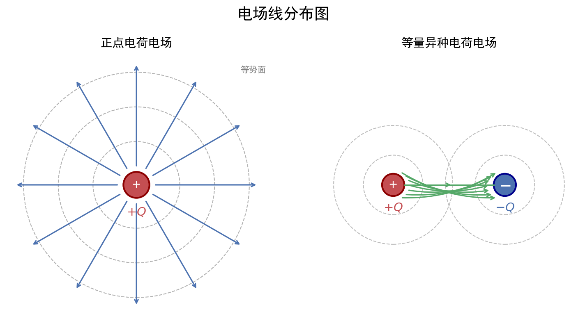

# 电场公式体系

| 字段 | 内容 |
|------|------|
| **来源** | 人教版选择性必修第二册 / 2023-2025广东选择性考试·物理电场专题 |
| **时间标签** | #高二深化 |
| **难度** | ★★★☆☆ |
| **状态** | ⚠️待强化 |
| **试卷来源** | #广东选择性考试 |
| **广东考情** | 考查频率：高频（2023-2025广东选择性考试每年必考，常以电场线、等势面、带电粒子偏转为素材的选择题，亦见于计算题）；难度定位：基础~中档；特色描述：广东卷常结合静电除尘、示波器、电容式传感器等科技情境，考查 E=F/q、W=qU、电场线与等势面关系等核心公式的灵活选用；赋分提示：电场题是电学部分的赋分基础，电势正负、电场力做功正负、负电荷受力方向是常设陷阱，需稳拿不丢分 |


---




## 核心内容

### 关键概念
- **电场强度 $E$**：描述电场力的性质的物理量，单位正电荷所受电场力
- **电势 $\varphi$**：描述电场能的性质的物理量，单位正电荷具有的电势能
- **电势差 $U$**：两点间电势之差，又称电压
- **电场线**：形象地描述电场分布的曲线，切线方向表场强方向，疏密表场强大小
- **等势面**：电势相等的点构成的面，与电场线垂直

### 核心公式/定理

#### 1. 电场强度的三种求法
```
定义式：E = F/q（适用于任何电场，q为试探电荷）
点电荷场强：E = kQ/r²（仅适用于真空中的点电荷）
匀强电场：E = U/d（d为沿电场线方向的距离）
```
> 适用条件：定义式普适；点电荷式要求真空；匀强电场式仅适用于匀强电场
> 注意事项：E = F/q 中 q 是试探电荷，E 与 q 无关；E = kQ/r² 中 Q 是场源电荷

#### 2. 电势与电势能
```
电势定义：φ = Ep/q（单位：V）
电势能：Ep = qφ
电势差：U_AB = φ_A - φ_B = W_AB/q
```
> 适用条件：任何静电场
> 注意事项：电势、电势能是标量，但有正负；正电荷在电势高处电势能大，负电荷相反

#### 3. 电场力做功与电势能变化
```
电场力做功：W_AB = qU_AB = q(φ_A - φ_B)
功能关系：W_电 = -ΔEp = Ep_A - Ep_B
```
> 适用条件：任何静电场
> 注意事项：电场力做正功，电势能减小；电场力做负功，电势能增大

#### 4. 电场线与等势面关系
```
电场线 ⊥ 等势面
沿电场线方向电势降低
电场线密处场强大，等势面密处场强大
```

#### 5. 常见电场模型
| 电场类型 | 场强特点 | 电势特点 |
|----------|----------|----------|
| 点电荷 | E = kQ/r²，径向分布 | 正电荷：φ>0，近大远小；负电荷相反 |
| 等量异种电荷 | 连线：中点最小；中垂线：中点最大，向外减小 | 中垂线为零势面 |
| 等量同种电荷 | 连线：中点为零；中垂线：中点最大，先增后减 | 中垂线从中心向两侧先降后升（正电荷） |
| 匀强电场 | 处处相等 | 沿场强方向均匀降低 |

### 方法步骤

#### 电场中粒子运动分析三步法
1. **判断受力**：$F = qE$，注意电荷正负决定力的方向
2. **分析运动**：直线运动（匀变速）或曲线运动（类平抛）
3. **能量分析**：只有电场力做功时，$Ek + Ep = 常数$

#### 匀强电场中电势计算技巧
1. 找等势点：线段中点电势 = (两端点电势和)/2
2. 等分法：等长线段电势差相等
3. 作图法：连接等势点 → 作垂线得电场线方向

### 记忆口诀/技巧
> **场强方向口诀**：正电荷受力方向为场强方向，负电荷相反。
> **电势高低口诀**：沿电场线方向电势降低，正电荷在高电势处电势能大。
> **广东情境提示**：广东卷常考带电粒子在电场中的偏转（示波器、喷墨打印、静电除尘等科技情境），注意从情境中提取 $E$ 的方向和 $d$ 的取值。

---

## 题型识别标志

> **看到什么条件 → 立刻想到什么方法/模型**

| 题干关键条件 | 识别为 | 首选方法 |
|-------------|--------|----------|
| "两点电荷""场强 $E=kQ/r^2$" | 点电荷电场叠加 | 矢量合成（平行四边形定则），$E=kQ/r^2$ |
| "等势面""电势高低""电场线方向" | 电势/等势面 | 沿电场线电势降低；$\varphi_A-\varphi_B=U_{AB}=W_{AB}/q$ |
| "电场力做功""电势能变化" | 功能关系（电场） | $W_{电}=qU=-ΔE_{p电}$ |
| "带电粒子在电场中偏转""示波器/喷墨" | 类平抛（匀强电场） | 分解：垂直于场强方向匀速，沿场强方向匀加速 |
| "电子墨水""胶囊电极变色" | 电场力方向/做功正负 | 正电荷受力沿 $E$，电场力做功看电势升降 |
| "密立根油滴""匀速下落加电压" | 电场中的平衡/运动 | 受力平衡 $qE=mg$（或含空气阻力 $kv$） |

## 解题路径（带电粒子在电场中运动通法）

> 广东卷常以静电除尘、电子墨水、密立根油滴等科技情境命题，核心是"受力→运动→能量"三线分析法。

### 第一步：判电场性质
- 匀强电场：$E=U/d$；点电荷电场：$E=kQ/r^2$。
- 由电场线/等势面确定 $E$ 方向与电势高低。

### 第二步：分析受力与运动
- 带电粒子：$F=qE$，正负电荷决定 $F$ 方向。
- 类平抛：垂直场强方向匀速 $x=v_0t$，沿场强方向匀加速 $y=\frac12at^2$，$a=qE/m$。

### 第三步：能量/功分析
- 只有电场力做功：$E_k+E_p=\text{常量}$，或 $qU=\Delta E_k$。
- 电场力做功 $W=qU_{AB}$，与路径无关。

### 第四步：平衡与临界（油滴/电容类）
- 匀速 → 合力为零：$qE=mg$（或其他力平衡）。
- 变速 → 列牛顿第二定律或动能定理。

## 母题（2022 广东选择性考试·第14题，16分）

> 广东卷电场综合题：以"密立根油滴实验"为情境，考查受力平衡、电场力做功与电势能、以及两油滴合并后的运动。

**题目**：密立根通过观测油滴的运动规律证明了电荷的量子性。如图是密立根油滴实验原理示意图，两个水平放置、相距为 $d$ 的足够大金属极板，上极板中央有一小孔。通过小孔喷入一些小油滴，部分油滴带上了电荷。有两个质量均为 $m$、位于同一竖直线上的球形小油滴 $A$ 和 $B$，在时间 $t$ 内都匀速下落了距离 $h_1$。此时给两极板加上电压 $U$（上极板接正极），$A$ 继续以原速度下落，$B$ 经过一段时间后向上匀速运动。$B$ 在匀速运动时间 $t$ 内上升了距离 $h_2$（$h_2\neq h_1$），随后与 $A$ 合并，形成一个球形新油滴，继续在两极板间运动直至匀速。已知球形油滴受到的空气阻力大小为 $f=kmv$，其中 $k$ 为比例系数，$v$ 为油滴运动速率。不计空气浮力，重力加速度为 $g$。求：
(1) 比例系数 $k$；
(2) 油滴 $A$、$B$ 的带电量和电性；$B$ 上升距离 $h_2$ 电势能的变化量；
(3) 新油滴匀速运动速度的大小和方向。

**解**：

**(1)** 未加电压时油滴匀速下落，速度 $v_1=h_1/t$，受力平衡：
$$mg=f_1=kmv_1\quad\Rightarrow\quad k=\frac{mg}{mv_1}=\frac{g}{v_1}=\frac{gt}{h_1}$$

**(2)** 加电压后 $A$ 速度不变 → $A$ 不带电（$q_A=0$）。
$B$ 向上匀速，速度 $v_2=h_2/t$，受力平衡（向上电场力、向下重力与阻力）：
$$q_BE=mg+kmv_2,\quad E=\frac{U}{d}$$
$$\Rightarrow q_B=\frac{d}{U}\left(mg+kmv_2\right)=\frac{d}{U}\left(mg+\frac{mg}{h_1}\cdot h_2\right)=\frac{mgd}{U}\left(1+\frac{h_2}{h_1}\right)$$
因 $B$ 向上运动受向上电场力，而极板间电场方向向下（上板正），故 $B$ 带**负电**。
$B$ 上升 $h_2$ 过程中，电场力做功 $W_{电}=q_BEh_2=(mg+kmv_2)h_2$，电势能变化：
$$\Delta E_p=-W_{电}=-(mg+kmv_2)h_2=-\frac{mgd}{U}\left(1+\frac{h_2}{h_1}\right)\frac{U}{d}h_2=-mg h_2\left(1+\frac{h_2}{h_1}\right)$$
（即电势能减少该值）。

**(3)** $B$ 与 $A$ 合并后新油滴质量 $2m$。若 $h_2>h_1$（即 $v_2>v_1$），电场力 $F'=q_BE>2mg$，新油滴向上加速，最终匀速时：
$$q_BE=2mg+k(2m)v\quad\Rightarrow\quad v=\frac{q_BE-2mg}{2km}=\frac{mg(1+h_2/h_1)-2mg}{2mg/v_1}=\frac{v_1}{2}\left(\frac{h_2}{h_1}-1\right)$$
方向向上。

**答**：(1) $k=\dfrac{gt}{h_1}$；(2) $A$ 不带电，$B$ 带负电 $q_B=\dfrac{mgd}{U}\left(1+\dfrac{h_2}{h_1}\right)$，电势能减少 $mg h_2\left(1+\dfrac{h_2}{h_1}\right)$；(3) 速度大小 $\dfrac{v_1}{2}\left(\dfrac{h_2}{h_1}-1\right)$，方向向上（$h_2>h_1$ 时）。

> 💡 关键：油滴"匀速"即合力为零，是列平衡式的突破口；电场力做功与电势能变化互为相反数；合并后质量加倍，重新列平衡求末速。

---

## 关联卡片

- [磁场公式体系](高二深化_物理_核心知识网络_磁场公式体系.md) — 电磁场综合时联合使用
- [电磁感应定律](高二深化_物理_核心知识网络_电磁感应定律.md) — 电场与感应电场关联
- [广东物理情境化命题专题](../典型题型与方法/高二深化_物理_典型题型与方法_广东物理情境化命题专题.md) — 广东卷电场情境题提取方法

---

## 备注

- 广东卷电场题常结合科技情境（如电容式传感器、静电纺丝），审题时注意提取物理模型
- 等势面与电场线垂直关系是作图题关键
- 电势正负取决于零势点选取，但电势差与零势点无关
- 电场叠加遵循矢量合成法则（平行四边形定则）
