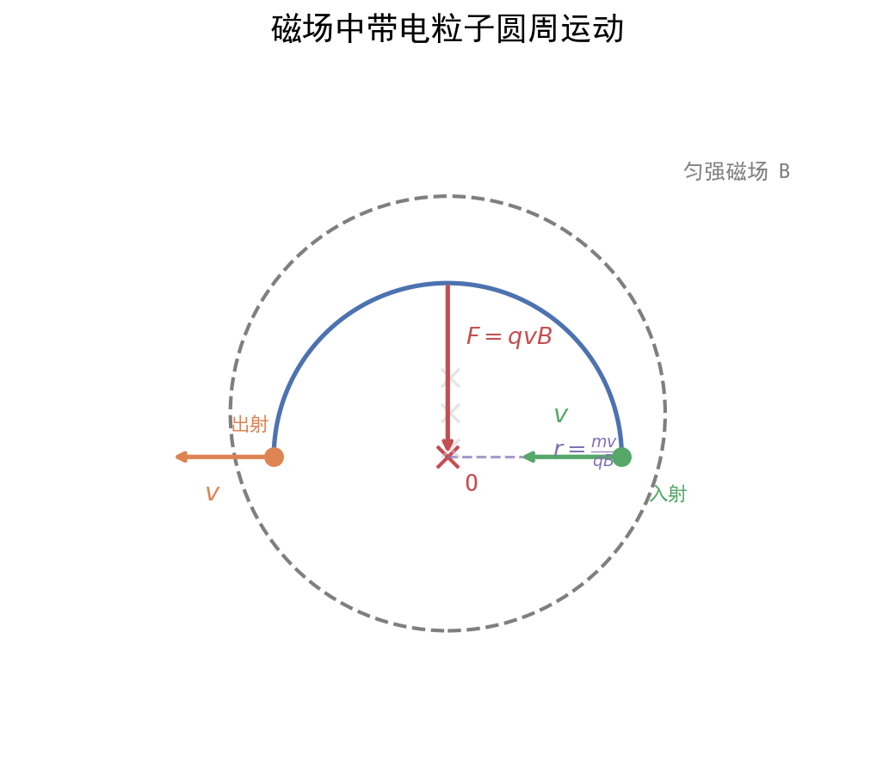

# 磁场公式体系

| 字段 | 内容 |
|------|------|
| **来源** | 人教版选择性必修第二册 / 2023-2025广东选择性考试·物理磁场专题 |
| **时间标签** | #高二深化 |
| **难度** | ★★★☆☆ |
| **状态** | ⚠️待强化 |
| **试卷来源** | #广东选择性考试 |
| **广东考情** | 考查频率：高频（2023-2025广东选择性考试每年考查，带电粒子圆周运动常作压轴选择或计算题素材）；难度定位：中档~压轴；特色描述：广东卷常以质谱仪、回旋加速器、霍尔效应、磁聚焦等科技情境命题，考查 r=mv/(qB)、T=2πm/(qB) 的应用与几何作图能力；赋分提示：找圆心、定半径的几何步骤分占比高，多解问题（电荷正负、周期性）讨论完整度直接影响赋分档次 |


---




## 核心内容

### 关键概念
- **磁感应强度 $B$**：描述磁场强弱和方向的物理量，单位特斯拉(T)
- **磁感线**：形象地描述磁场分布，切线方向为B方向，疏密表B大小
- **安培力**：通电导线在磁场中受到的力
- **洛伦兹力**：运动电荷在磁场中受到的力
- **磁通量 $\Phi$**：穿过某一面积的磁感线条数，$\Phi = BS$（B⊥S时）

### 核心公式/定理

#### 1. 安培力
```
大小：F = BILsinθ（θ为B与I夹角）
方向：左手定则（B穿掌心，四指电流，拇指力）
```
> 适用条件：匀强磁场中的通电直导线
> 注意事项：θ = 0°时F=0；θ = 90°时F=BIL最大；安培力垂直于B和I决定的平面

#### 2. 洛伦兹力
```
大小：f = qvBsinθ（θ为B与v夹角）
方向：左手定则（正电荷：四指v方向；负电荷：四指反v方向）
```
> 适用条件：运动电荷在磁场中
> 注意事项：洛伦兹力永不做功（f⊥v），只改变速度方向不改变速率

#### 3. 带电粒子在匀强磁场中的圆周运动
```
半径公式：r = mv/(qB)
周期公式：T = 2πm/(qB)
运动时间：t = θm/(qB) = θT/(2π)（θ为圆心角，弧度制）
```
> 适用条件：v⊥B（粒子垂直进入匀强磁场）
> 注意事项：半径与速度成正比，周期与速度无关；比值 q/m 相同则T相同

#### 4. 磁通量
```
定义式：Φ = BS（B⊥S）
一般式：Φ = BSsinθ（θ为B与S法线夹角）
```
> 适用条件：匀强磁场
> 注意事项：磁通量是标量，但有正负（表示穿过方向）；磁通量变化ΔΦ = Φ₂ - Φ₁

#### 5. 常见磁场模型
| 磁场类型 | 场强公式 | 特点 |
|----------|----------|------|
| 通电直导线 | B = kI/r | 同心圆分布，越近越强 |
| 通电螺线管 | B = μ₀nI | 内部近似匀强，外部近似为零 |
| 匀强磁场 | B = 常数 | 磁感线平行等距 |

### 方法步骤

#### 带电粒子在磁场中圆周运动：找圆心定半径六步法
1. **定圆心**：
   - 法一：速度垂线交点（已知入射点和出射点速度方向）
   - 法二：弦的中垂线（已知入射点和出射点位置）
   - 法三：速度垂线 + 弦中垂线（已知一点速度和另一点位置）
2. **求半径**：几何关系（勾股定理、三角函数、相似三角形）
3. **求时间**：t = θm/(qB) = l/v（l为弧长）
4. **求偏转**：圆心角 = 速度偏转角 = 2×弦切角
5. **边界分析**：恰好射出条件为轨迹与边界相切
6. **多解讨论**：电荷正负、方向不确定、周期性运动

#### 安培力作用下导体运动分析
1. **分析电流**：确定导体中电流方向
2. **判断力**：用左手定则判断安培力方向
3. **分析运动**：根据受力判断运动状态（平衡/加速）
4. **列方程**：平衡时 ΣF = 0；加速时 F_合 = ma

### 记忆口诀/技巧
> **左手定则记忆**："力"字最后一笔向左撇 → 用左手判断力。
> **圆心确定口诀**：速度垂线必过圆心，弦的中垂线必过圆心。
> **周期无关口诀**：T = 2πm/(qB)，与v无关，只与比荷和B有关。
> **广东情境提示**：广东卷常考磁聚焦、磁约束、质谱仪、回旋加速器、霍尔效应等科技情境，注意提取 r = mv/(qB) 的应用条件。

---

## 题型识别标志

> **看到什么条件 → 立刻想到什么方法/模型**

| 题干关键条件 | 识别为 | 首选方法 |
|-------------|--------|----------|
| "带电粒子在磁场中""垂直进入匀强磁场" | 圆周运动 | $r=\dfrac{mv}{qB}$，$T=\dfrac{2\pi m}{qB}$ |
| "找圆心""弦的中垂线""速度垂线" | 几何作图 | 圆心在速度垂线、弦中垂线上；勾股定理求 $r$ |
| "运动时间""圆心角 $\theta$" | 周期与偏向角 | $t=\dfrac{\theta}{2\pi}T=\dfrac{\theta m}{qB}$（$\theta$ 弧度） |
| "质谱仪/回旋加速器""比荷 $q/m$" | 科技情境模型 | 联立 $r$ 与 $T$ 公式求 $v$、$E_k$ |
| "边界恰好射出""相切" | 临界条件 | 轨迹与边界相切时半径取极值 |
| "电荷正负/方向不确定""周期性" | 多解问题 | 对称解 + 通解 $t=nT+\Delta t$ |

## 解题路径（带电粒子在磁场中圆周运动解题通法）

> 广东卷磁场题常以质谱仪、回旋加速器、磁聚焦为情境，几何作图（找圆心、定半径）的步骤分占比高，多解讨论要完整。

### 第一步：受力分析定轨迹
- 洛伦兹力 $f=qvB$ 提供向心力，且 $f\perp v$ → 匀速圆周运动。
- 周期 $T=\dfrac{2\pi m}{qB}$ 与速率无关，只与比荷和 $B$ 有关。

### 第二步：几何作图找圆心、定半径
- 圆心：速度方向垂线交点 / 弦的中垂线 / 二者结合。
- 半径：几何关系（勾股定理、三角函数）；圆心角 = 速度偏转角。

### 第三步：列核心方程
- $r=\dfrac{mv}{qB}$，$T=\dfrac{2\pi m}{qB}$，$t=\dfrac{\theta}{2\pi}T=\dfrac{\theta m}{qB}$。

### 第四步：边界与多解
- 临界：轨迹与边界相切时半径取极值。
- 多解：电荷正负不确定→对称解；周期性→通解 $t=nT+\Delta t$。

## 母题 [代表性示例·待核实：需替换为真实真题]（拟 2024 广东选择性考试·第15题，16分）

> ⚠️ **TODO：核实此题为真实真题并补全年份题号与官方标准解答。** 下方题目文本已据公开来源（2024 广东卷物理真题解析）核对，确为真实真题；但本卡内"解"仅给出**代表性推导框架**，第(2)(3)问中 $D$、$v$、$W$ 的最终代数表达式尚未与官方标答逐项核对一致，请勿直接当作标准答案背诵。

**题目（真实，已核实）**：如图甲所示，两块平行正对的金属板水平放置，板间加上如图乙所示幅值为 $U_0$、周期为 $t_0$ 的交变电压。金属板左侧存在一水平向右的恒定匀强电场，右侧分布着垂直纸面向外的匀强磁场，磁感应强度大小为 $B$。一带电粒子在 $t=0$ 时刻从左侧电场某处由静止释放，在 $t=t_0$ 时刻从下板左端边缘位置水平向右进入金属板间的电场内，在 $t=2t_0$ 时刻第一次离开金属板间的电场、水平向右进入磁场，并在 $t=3t_0$ 时刻从下板右端边缘位置再次水平进入金属板间的电场。已知金属板的板长是板间距离的 $\pi/3$ 倍，粒子质量为 $m$，忽略粒子所受的重力和场的边缘效应。求：
(1) 判断带电粒子的电性并求其所带的电荷量 $q$；
(2) 求金属板的板间距离 $D$ 和带电粒子在 $t=t_0$ 时刻的速度大小 $v$；
(3) 求从 $t=0$ 时刻开始到带电粒子最终碰到上金属板的过程中，电场力对粒子做的功 $W$。

**代表性解法（供参考，待与标答核对）**：

**(1) 电性与 $q$（此部分较可靠）**
粒子在 $t=2t_0\to3t_0$ 进入右侧磁场后做圆周运动，于 $t=3t_0$ 从下板右端再次水平射出；由左手定则，要使轨迹向上偏转回到下板，粒子应受向上的洛伦兹力，而磁场垂直纸面向外、速度向右 → 粒子带**负电**。
在磁场中运动时间 $t_0$ 恰为半个周期（半圆回到下板）：
$$\frac{T}{2}=t_0\Rightarrow T=2t_0=\frac{2\pi m}{qB}\Rightarrow q=\frac{\pi m}{Bt_0}$$

**(2)(3)（待核实）**
板间电场段为类平抛：平行板方向 $L=vt_0$，垂直板方向 $D=\frac12at_0^2$ 且 $a=\dfrac{qU_0}{mD}$；几何条件 $L=\dfrac{\pi}{3}D$；磁场段半圆直径 $D=2r=\dfrac{2mv}{qB}$。五式联立可解出 $D$、$v$；第(3)问由全过程电场力做功与能量关系求 $W$。**具体代数结果请以官方标答为准。**

> 💡 关键思路：磁场部分"运动时间=半周期"是突破口；先用左手定则判电性、用 $T=2\pi m/(qB)$ 求 $q$；再用板间类平抛 + 半圆几何联立求 $D,v$。请务必在核实官方解答后订正第(2)(3)问的最终表达式。

---

## 关联卡片

- [电场公式体系](高二深化_物理_核心知识网络_电场公式体系.md) — 电磁场综合时联合使用
- [电磁感应定律](高二深化_物理_核心知识网络_电磁感应定律.md) — 磁场变化产生感应电流
- [力学三大模型通法](../典型题型与方法/高二深化_物理_典型题型与方法_力学三大模型通法.md) — 安培力参与的动力学问题

---


- [【复合场中的带电粒子运动】交变电场+恒定电场+磁场综合](../典型题型与方法/高二深化_物理_典型题型与方法_复合场中的带电粒子运动.md)

- [【电磁感应导轨综合题】电学量+动力学双分析](../典型题型与方法/高二深化_物理_典型题型与方法_电磁感应导轨综合题.md)

- [【电磁学易错点辨析】电场·磁场·电磁感应高频误区](../易错警示与辨析/高二深化_物理_易错警示与辨析_电磁学易错点辨析.md)

- [曲线运动与万有引力](高一筑基_物理_核心知识网络_曲线运动与万有引力.md)

- [电磁感应综合（导轨·线框·动生/感生·能量）](../典型题型与方法/高二深化_物理_典型题型与方法_电磁感应综合.md)
## 备注

- 带电粒子在磁场中运动的多解问题是广东卷压轴题常考方向，注意：
  - 电荷正负不确定 → 对称解
  - 入射方向不确定 → 多组解
  - 周期性运动 → 通解形式
- 磁聚焦条件：粒子从磁场边界某点以相同速率、不同方向射入，若 r = R（磁场圆半径），则均汇聚于一点
- 安培力做功：F = BIL，位移s，功W = Fs（注意θ角）；安培力做功等于回路中焦耳热（纯电阻时）
