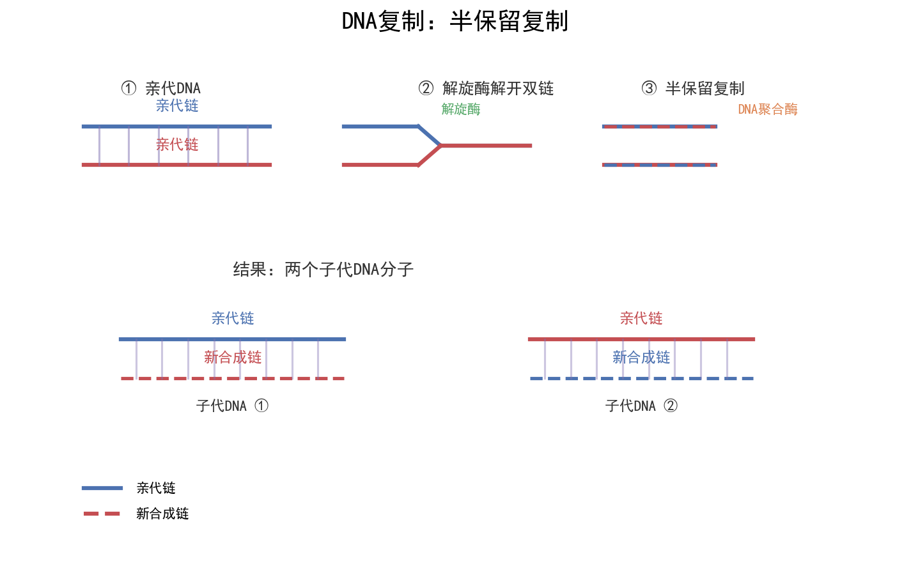
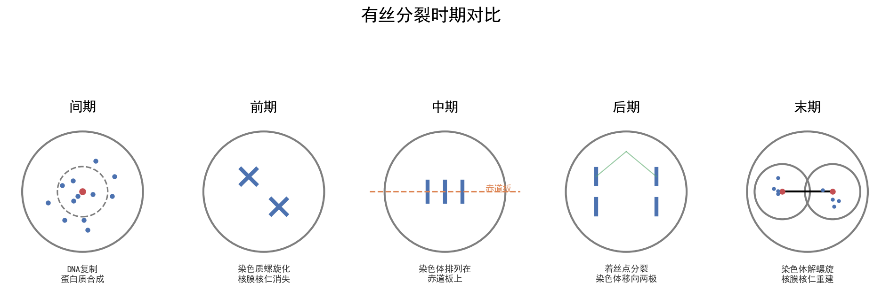
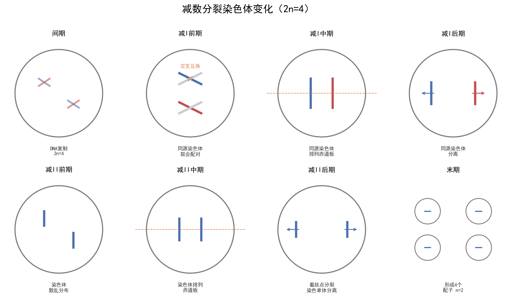

# 🧬 有丝分裂与减数分裂 | 核心知识网络

| 字段 | 内容 |
|------|------|
| **来源** | 人教版必修第一册 第6章 / 必修第二册 第2章 / 广东选择性考试 |
| **时间标签** | #高一筑基 |
| **难度** | ★★★★☆ |
| **状态** | ⚠️待强化 |
| **试卷来源** | #广东选择性考试 |
| **广东考情** | 高频（近5年广东卷5次考查，必考图像辨析）；中档偏难；图像辨析题是广东卷特色，常结合遗传病分析考查分裂过程；赋分提示：分裂时期判断错误会导致后续连锁失分，需确保图像辨析零失误 |

---








## 核心内容

### 关键概念

#### 一、细胞周期

```
细胞周期 = 分裂间期（G1期 + S期 + G2期）+ 分裂期（M期：前/中/后/末）
```

| 时期 | 主要事件 | 记忆关键词 |
|------|----------|------------|
| **G1期** | 合成蛋白质、RNA，为DNA复制做准备 | "复制准备" |
| **S期** | DNA复制，染色体复制 | "DNA复制" |
| **G2期** | 合成蛋白质（纺锤丝相关），为分裂做准备 | "分裂准备" |
| **M期** | 染色体分离，细胞分裂 | "分裂执行" |

> ⚠️ 只有**连续分裂的细胞**才有细胞周期（如根尖分生区、造血干细胞、皮肤生发层）。高度分化细胞（神经元、红细胞）无细胞周期。

#### 二、有丝分裂各时期特征

| 时期 | 染色体行为 | 核膜核仁 | 纺锤体 | 染色体形态 | 记忆口诀 |
|------|------------|----------|--------|------------|----------|
| **前期** | 染色体出现，纺锤体形成 | 消失 | 形成 | 散乱分布 | "膜仁消失现两体" |
| **中期** | 着丝点排列在赤道板上 | 无 | 有 | 形态最固定，数目最清晰 | "形定数晰赤道齐" |
| **后期** | 着丝点分裂，姐妹染色单体分离，移向两极 | 无 | 有 | 染色体数目加倍 | "点裂数加均两极" |
| **末期** | 染色体解螺旋，细胞分裂 | 重建 | 消失 | 染色质状态 | "两消两现重开始" |

> **后期是着丝点分裂，不是DNA复制！** 染色体数目在后期加倍，DNA数目在间期加倍。

#### 三、减数分裂过程（核心：染色体复制一次，细胞分裂两次）

**减数第一次分裂（减Ⅰ）——同源染色体分离**

| 时期 | 主要特征 | 关键事件 |
|------|----------|----------|
| **减Ⅰ前期** | 同源染色体联会，形成四分体 | **交叉互换**（基因重组） |
| **减Ⅰ中期** | 同源染色体排列在赤道板两侧 | — |
| **减Ⅰ后期** | **同源染色体分离**，非同源染色体自由组合 | **自由组合**（基因重组） |
| **减Ⅰ末期** | 细胞分裂，染色体数目减半 | 2n → n |

> 减Ⅰ的核心是**同源染色体**的行为。联会、四分体、交叉互换都只在减Ⅰ前期发生。

**减数第二次分裂（减Ⅱ）——姐妹染色单体分离**

| 时期 | 主要特征 | 与有丝分裂对比 |
|------|----------|----------------|
| **减Ⅱ前期** | 染色体散乱分布 | 类似有丝分裂前期，但无同源染色体 |
| **减Ⅱ中期** | 着丝点排列赤道板 | 类似有丝分裂中期 |
| **减Ⅱ后期** | 着丝点分裂，姐妹染色单体分离 | **与有丝分裂后期相同** |
| **减Ⅱ末期** | 细胞分裂，形成配子 | — |

> 减Ⅱ**无同源染色体**（因为减Ⅰ已经分离），这是判断减Ⅱ的关键依据。

#### 四、精卵形成对比

| 比较项目 | 精子形成 | 卵细胞形成 |
|----------|----------|------------|
| **场所** | 睾丸（精巢） | 卵巢 |
| **细胞质分裂** | 均等分裂 | 不均等分裂（极体小，卵细胞大） |
| **结果** | 1个精原细胞 → 4个精子 | 1个卵原细胞 → 1个卵细胞 + 3个极体 |
| **变形** | 需要（细胞核变头部，细胞质变尾部） | 不需要 |
| **发生时间** | 从初情期开始，连续进行 | 胚胎期开始，分娩后暂停，性成熟后每月1个 |

> **同源染色体分离 ≠ 姐妹染色单体分离**：前者发生在减Ⅰ后期，后者发生在减Ⅱ后期或有丝分裂后期。

#### 五、有丝分裂 vs 减数分裂 核心对比

| 对比项 | 有丝分裂 | 减数分裂 |
|--------|----------|----------|
| **分裂次数** | 1次 | 2次 |
| **同源染色体配对** | 无 | 有（联会） |
| **交叉互换** | 无 | 有（减Ⅰ前期） |
| **子细胞染色体数** | 与亲代相同（2n） | 减半（n） |
| **子细胞类型** | 体细胞 | 配子（精子/卵细胞） |
| **子细胞数量** | 2个 | 4个（精）或1个（卵） |
| **意义** | 生长、修复、保持遗传稳定性 | 产生配子，增加遗传多样性 |

#### 六、DNA / 染色体 / 染色单体 数量变化曲线

**设体细胞染色体数为2n，DNA数为2n**

| 时期 | 染色体数 | DNA数 | 染色单体数 | 判断要点 |
|------|----------|-------|------------|----------|
| 间期（G1） | 2n | 2n | 0 | 复制前 |
| 间期（S） | 2n | 2n→4n | 0→4n | DNA复制 |
| 前期/中期 | 2n | 4n | 4n | 1条染色体 = 2条单体 = 2个DNA |
| **后期** | **4n** | 4n | **0** | **着丝点分裂，单体消失** |
| 末期 | 2n | 2n | 0 | 细胞分裂 |

> **减数分裂特殊点**：
> - 减Ⅰ结束：染色体2n→n，DNA 4n→2n（同源染色体分离）
> - 减Ⅱ后期：染色体n→2n（着丝点分裂），DNA 2n→n（细胞分裂）

---

### 核心方法

#### 图像辨析四步法

1. **看有无同源染色体**：无 → 减Ⅱ；有 → 进入步骤2
2. **看同源染色体行为**：联会/四分体/排列在两侧 → 减Ⅰ；无特殊行为 → 有丝分裂
3. **看着丝点位置**：排列赤道板 → 中期；移向两极 → 后期
4. **数染色体数目**：判断是几倍体、哪个时期

#### 快速判断口诀
> "有同源，看行为；联会排列是减Ⅰ；不联不排是丝裂。无同源，定减Ⅱ；着丝点分看后期。"

---

### 曲线分析要点

| 曲线类型 | 上升原因 | 下降原因 | 关键点 |
|----------|----------|----------|--------|
| DNA曲线 | 间期复制（S期） | 末期细胞分裂 | 有丝分裂：2n→4n→2n；减数分裂：2n→4n→2n→n |
| 染色体曲线 | 后期着丝点分裂 | 末期细胞分裂 | 有丝分裂：后期瞬间加倍；减Ⅱ：后期短暂加倍后恢复n |
| 染色单体曲线 | 间期复制出现 | 后期着丝点分裂消失 | 只有0或4n两种状态，不会出现2n |

---

## 关联卡片

- [高一筑基_生物_核心知识网络_遗传定律体系](高一筑基_生物_核心知识网络_遗传定律体系.md) — 减数分裂是遗传定律的细胞学基础（分离定律→减Ⅰ同源染色体分离；自由组合→减Ⅰ非同源染色体自由组合）
- [高一筑基_生物_核心知识网络_变异与进化](高一筑基_生物_核心知识网络_变异与进化.md) — 交叉互换导致基因重组，突变发生在间期
- [高二深化_生物_核心知识网络_基因工程与生物技术](高二深化_生物_核心知识网络_基因工程与生物技术.md) — 植物组织培养涉及有丝分裂，减数分裂用于杂交育种

---

## 备注

- **广东卷高频陷阱**：
  1. "减数分裂后期染色体数目与体细胞相同" → 减Ⅱ后期染色体数 = 2n（与体细胞相同），但DNA = 2n（体细胞DNA = 2n），注意区分
  2. "一个精原细胞经过减数分裂产生4种精子" → 无交叉互换时只有2种；有交叉互换时最多4种
  3. 图像辨析中："赤道板"是位置，不是结构，不存在"赤道板结构"
- **广东卷常考图像**：
  - 细胞分裂图（判断时期、分裂方式）
  - 数量变化曲线（DNA/染色体/染色单体）
  - 柱形图（不同时期三种物质的对比）
- 有丝分裂和减数分裂的图像辨析是广东卷**每年必考**知识点，必须做到零失误

---

> #高一筑基 #生物 #核心知识网络 #广东选择性考试 #广东特色
