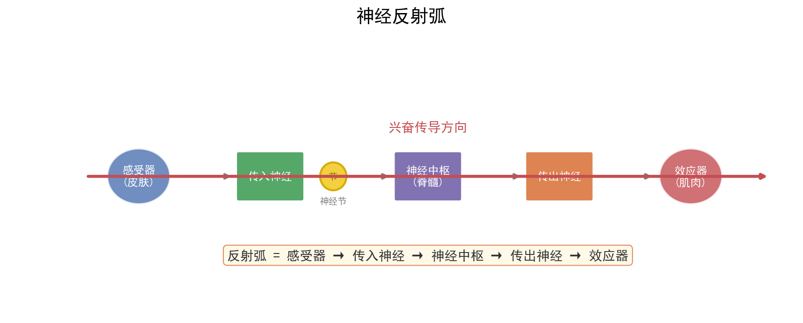

# 神经—体液—免疫调节

| 字段 | 内容 |
|------|------|
| **来源** | 人教版选择性必修第一册 / 2023-2025广东选择性考试·生物调节专题 |
| **时间标签** | #高一筑基 |
| **难度** | ★★★☆☆ |
| **状态** | ⚠️待强化 |
| **试卷来源** | #广东选择性考试 |
| **广东考情** | 考查频率：高频（近5年广东卷每年必考，常以1道选择题+1道非选择题组合出现）；难度定位：中档（选择题偏基础，非选择题情境化后可达中高档）；特色描述：广东卷注重真实生理情境，常结合血糖调节、体温调节、疫苗免疫、下丘脑—垂体—靶腺轴等命题，要求用规范术语解释调节机制，负反馈分析是高频设问；赋分提示：调节机制长句表达的逻辑链完整性直接影响赋分档次，激素名称、靶器官、信号类型等术语写错即失分 |

---




## 核心内容

### 关键概念
- **神经调节**：通过神经系统完成的调节，基本方式是反射，结构基础是反射弧
- **体液调节**：激素等化学物质通过体液运输作用于靶细胞/靶器官的调节
- **免疫调节**：免疫系统识别和清除抗原，维持内环境稳态
- **稳态**：正常机体通过调节作用，使各器官系统协调活动，维持内环境相对稳定的状态
- **负反馈**：系统输出抑制系统输入，使系统趋于稳定（如血糖调节、甲状腺激素调节）
- **正反馈**：系统输出促进系统输入，使系统偏离加剧（如排尿、分娩、凝血）

### 核心知识体系

#### 1. 神经调节

##### 反射弧结构
```
感受器 → 传入神经 → 神经中枢 → 传出神经 → 效应器

关键特征：
- 完整性：任何环节受损，反射不能完成
- 单向传导：反射弧中兴奋只能单向传递（感受器→效应器）
- 效应器：传出神经末梢 + 所支配的肌肉或腺体
```

##### 兴奋在神经纤维上的传导
```
形式：电信号（神经冲动/局部电流）
方向：双向传导（实验条件下）；反射弧中单向传导

过程：
静息电位：外正内负（K⁺外流，协助扩散）
动作电位：外负内正（Na⁺内流，协助扩散）
恢复：主动运输（Na⁺-K⁺泵）排出Na⁺、回收K⁺

特点：
- 不衰减性：传导过程中信号强度不变
- 绝缘性：相邻神经纤维互不干扰
- 相对不疲劳性：可连续传导
```

##### 兴奋在神经元之间的传递（突触）
```
结构：突触前膜 → 突触间隙 → 突触后膜

过程：
电信号 → 突触前膜 → 释放神经递质（胞吐）→ 突触间隙 → 与突触后膜受体结合 → 化学信号→电信号

特点：
- 单向传递：递质只能由突触前膜释放，作用于突触后膜
- 延搁：电信号→化学信号→电信号，需要时间（0.5ms）
- 易疲劳：递质数量有限，高频刺激易耗尽
- 易受药物影响：麻醉剂、兴奋剂等可作用于突触

递质类型：
- 兴奋性递质：乙酰胆碱、谷氨酸 → 引起Na⁺内流，突触后膜去极化
- 抑制性递质：GABA、甘氨酸 → 引起Cl⁻内流或K⁺外流，突触后膜超极化
```

#### 2. 体液调节（激素调节）

##### 主要激素及功能速查表
| 激素 | 分泌器官 | 靶器官/靶细胞 | 主要功能 | 异常症 |
|------|---------|-------------|---------|--------|
| 生长激素 | 垂体 | 全身细胞 | 促进生长，促进蛋白质合成 | 幼年过少→侏儒症；过多→巨人症/肢端肥大 |
| 甲状腺激素 | 甲状腺 | 全身细胞 | 促进新陈代谢，促进生长发育，提高神经兴奋性 | 幼年过少→呆小症；过多→甲亢 |
| 胰岛素 | 胰岛B细胞 | 全身细胞 | 降低血糖（促进摄取、利用、储存葡萄糖） | 过少→糖尿病 |
| 胰高血糖素 | 胰岛A细胞 | 肝脏 | 升高血糖（促进肝糖原分解、非糖物质转化） | — |
| 肾上腺素 | 肾上腺髓质 | 全身细胞 | 促进新陈代谢，升高血糖，加快心跳 | — |
| 性激素 | 性腺 | 生殖器官 | 促进生殖器官发育、配子形成、第二性征 | 过少→性发育迟缓 |
| 抗利尿激素 | 下丘脑分泌，垂体释放 | 肾小管/集合管 | 促进水分重吸收 | 过少→尿崩症 |

##### 甲状腺激素分级调节与反馈
```
寒冷/紧张 → 下丘脑分泌TRH → 垂体分泌TSH → 甲状腺分泌甲状腺激素 → 促进代谢
                                    ↑_______________________________|
                                    （负反馈：甲状腺激素过多抑制TRH和TSH分泌）
```
> 注意：TRH（促甲状腺激素释放激素）、TSH（促甲状腺激素）、甲状腺激素

#### 3. 免疫调节

##### 免疫系统组成
```
免疫器官：骨髓、胸腺、脾、淋巴结、扁桃体
免疫细胞：吞噬细胞、淋巴细胞（T细胞、B细胞）
免疫活性物质：抗体、淋巴因子、溶菌酶
```

##### 特异性免疫两阶段
| 免疫类型 | 细胞参与 | 过程 | 特点 |
|----------|---------|------|------|
| **体液免疫** | B细胞、T细胞、吞噬细胞 | 抗原→吞噬细胞→T细胞→B细胞→浆细胞→抗体 | 针对胞外抗原，抗体发挥作用 |
| **细胞免疫** | T细胞、吞噬细胞 | 抗原→吞噬细胞→T细胞→效应T细胞→裂解靶细胞 | 针对胞内抗原（病毒、癌细胞），直接接触 |

> 记忆细胞：寿命长，对抗原敏感，二次免疫反应更快更强（产生抗体更多）

##### 免疫失调
| 类型 | 机制 | 例子 |
|------|------|------|
| 过敏反应 | 已免疫机体再次接触相同过敏原 | 花粉过敏、青霉素过敏 |
| 自身免疫病 | 免疫系统攻击自身组织 | 类风湿性关节炎、系统性红斑狼疮 |
| 免疫缺陷病 | 免疫功能不足或缺乏 | 艾滋病（HIV攻击T细胞） |

#### 4. 三大调节方式比较
| 调节方式 | 作用速度 | 作用范围 | 作用时间 | 结构基础 |
|----------|---------|---------|---------|---------|
| 神经调节 | 快 | 准确、局限 | 短暂 | 反射弧 |
| 体液调节 | 慢 | 广泛 | 较长 | 体液运输 |
| 免疫调节 | 较慢 | 针对特定抗原 | 产生记忆 | 免疫系统 |

> 关系：神经调节占主导地位，体液调节可看作神经调节的环节；内分泌腺本身也受神经调节；三者相互协调，共同维持稳态

### 方法步骤

#### 血糖调节分析框架
```
血糖升高 → 胰岛B细胞 → 胰岛素分泌↑ → 促进葡萄糖摄取、利用、储存 → 血糖降低
    ↑_______________________________________________________________|
血糖降低 → 胰岛A细胞 → 胰高血糖素分泌↑ → 促进肝糖原分解、非糖物质转化 → 血糖升高
    ↑_______________________________________________________________|

额外调节：下丘脑血糖中枢、肾上腺素（协同胰高血糖素）
```
> 注意：胰岛素是唯一降血糖激素；胰高血糖素和肾上腺素是升血糖激素；肌糖原不能直接分解为葡萄糖

#### 长句表达模板（广东卷高频）
| 问题类型 | 答题模板 |
|----------|---------|
| 为什么血糖升高引起胰岛素分泌？ | 血糖升高 → 胰岛B细胞感受到血糖变化 → 胰岛素分泌增加 → 促进组织细胞加速摄取、利用和储存葡萄糖 → 从而使血糖降低 |
| 为什么甲状腺激素分泌过多会抑制TRH分泌？ | 甲状腺激素对下丘脑和垂体存在负反馈调节，当甲状腺激素含量过高时，会抑制下丘脑分泌TRH和垂体分泌TSH，从而维持甲状腺激素含量的相对稳定 |
| 二次免疫为什么更快更强？ | 初次免疫时产生的记忆细胞，在相同抗原再次入侵时能迅速增殖分化，产生大量浆细胞/效应T细胞，从而更快更强地产生抗体/裂解靶细胞 |

### 记忆口诀/技巧
> **反射弧口诀**：感受传入中枢出，效应器来把事做；反射弧要完整，缺一环节反不做。
> **突触传递口诀**：电化电，单向走；递质释放靠胞吐，作用后分解不回收。
> **激素调节口诀**：下丘脑是总指挥，垂体传令到腺体；激素分级又反馈，负反馈来保稳态。
> **免疫口诀**：体液免疫靠抗体，细胞免疫靠T细胞；初次免疫慢慢做，二次免疫快又强。
> **广东情境提示**：广东卷调节题常以广东生活方式为情境（如糖尿病调查、岭南地区甲状腺肿、广东高温环境对体温调节的影响），注意从情境中提取调节方式和反馈机制。

---

## 题型识别标志

> **看到什么条件 → 立刻想到什么方法/模型**

| 题干关键条件 | 识别为 | 首选方法 |
|-------------|--------|----------|
| "感染病毒初期，体内快速增殖，T 细胞和抗体尚未产生" | 特异性免疫未激活 / 体液+细胞免疫 | 据图判断免疫类型与机理 |
| "下丘脑→TRH→垂体→TSH→甲状腺"分级调节，患者 TSH 高但甲状腺激素低 | 甲状腺功能异常 / 负反馈 | 分级调节与反馈分析 |
| "神经递质释放方式、突触单向传递" | 神经调节（突触） | 电信号→化学信号→电信号 |
| "二次免疫更快更强、记忆细胞" | 特异性免疫（记忆） | 二次免疫应答特点 |
| "接种/加强针，抗体中和多种变异株" | 免疫预防（疫苗） | 体液免疫 + 记忆细胞 |
| "胰岛素唯一降血糖、胰高血糖素升血糖" | 血糖调节（体液） | 激素协同/拮抗 + 反馈 |
| "过敏反应/自身免疫病/免疫缺陷" | 免疫失调 | 三类机制区分 |

## 解题路径（调节机制与免疫过程分析四步法）

> 广东卷调节题常以真实生理情境（血糖、体温、疫苗、下丘脑—垂体—靶腺轴）命题，长句表达要求规范术语，逻辑链完整性直接影响赋分。

### 第一步：判定调节方式
- 神经（反射弧/突触）、体液（激素/反馈）、免疫（抗原-抗体）快速定位。
- 广东卷常综合考查神经—体液—免疫网络。

### 第二步：画调节通路（尤其分级与反馈）
- 下丘脑 → 垂体 → 靶腺；标出"促进/抑制"。
- 负反馈：靶腺激素过多抑制上游 TRH/TSH。

### 第三步：免疫过程按"识别-呈递-活化-效应-记忆"梳理
- 体液免疫：抗原 → APC → 辅助性 T → B 细胞 → 浆细胞 → 抗体。
- 细胞免疫：细胞毒性 T → 裂解靶细胞。
- 二次免疫：记忆细胞快速增殖分化。

### 第四步：长句作答（广东卷核心赋分）
- 写清"信号分子 / 靶细胞 / 作用结果"；术语准确（如"辅助性 T 细胞分泌细胞因子"）。

> ⚠️ 易错：神经递质释放是胞吐（非主动运输）；激素与靶细胞结合后即灭活；抗体不能进入宿主细胞。

## 母题（2022 广东选择性考试·第17题，10分）

**题目**：迄今新型冠状病毒仍在肆虐全球，我国始终坚持"人民至上，生命至上"的抗疫理念和动态清零的防疫总方针。图 a 示免疫力正常的人感染新冠病毒后，体内病毒及免疫指标的变化趋势（病毒抗原、T 细胞、抗体、病毒核酸随时间变化）；图 b 示一些志愿受试者完成接种后，体内产生的抗体对各种新冠病毒毒株中和作用的情况。回答下列问题：

(1) 人体感染新冠病毒初期，______ 免疫尚未被激活，病毒在其体内快速增殖（曲线①、②上升部分）。曲线③、④上升趋势一致，表明抗体的产生与 T 细胞数量的增加有一定的相关性，其机理是 ______。此外，T 细胞在抗病毒感染过程中还参与 ______ 过程。

(2) 准确、快速判断个体是否被病毒感染是实现动态清零的前提。目前除了核酸检测还可以使用抗原检测法，因其方便快捷可作为补充检测手段，但抗原检测的敏感性相对较低，据图 a 分析，抗原检测在 ______ 时间段内进行才可能得到阳性结果，判断的依据是此阶段 ______。

(3) 接种新冠病毒疫苗能大幅降低重症和死亡风险。图 b 示一些志愿受试者完成接种后，体内产生的抗体对各种新冠病毒毒株中和作用的情况。据图分析，当前能为个体提供更有效保护作用的疫苗接种措施是 ______。

**解**：

**(1)** 特异性；机理：在体液免疫中，辅助性 T 细胞将抗原呈递细胞摄取、处理的新冠病毒呈递给 B 细胞，辅助性 T 细胞开始分裂、分化并分泌细胞因子，B 细胞受到两个信号的刺激后开始分裂、分化，大部分分化为浆细胞，小部分分化为记忆 B 细胞，浆细胞分泌抗体。此外，T 细胞还参与**细胞免疫**过程。

**(2)** 乙；此阶段病毒抗原的数量较大（先迅速增加后降低），抗原检测才可能得到阳性结果。

**(3)** 全程接种 + 加强针（图 b 中该条件下抗体对野生型、德尔塔、奥密克戎的中和能力均强于仅全程接种）。

> 💡 **关键技巧**：免疫题"看图说话"先看横轴（时间）纵轴（指标），再对应 T 细胞、抗体、病毒三者出现的先后顺序——抗原先出现，T 细胞随后，抗体最后，病毒被清除在抗体上升之后。

---

## 关联卡片

- [细胞结构与功能](高一筑基_生物_核心知识网络_细胞结构与功能.md) — 神经元、细胞膜受体结构基础
- [酶与ATP及细胞代谢](高一筑基_生物_核心知识网络_酶与ATP及细胞代谢.md) — 激素作用与细胞代谢的关系
- [生物长句表达标准模板](../典型题型与方法/高二深化_生物_典型题型与方法_生物长句表达标准模板.md) — 调节类原因解释题的核心模板
- [广东生物实验设计题答题框架](../典型题型与方法/高二深化_生物_典型题型与方法_广东生物实验设计题答题框架.md) — 激素调节相关实验设计

---

## 备注

- 神经-体液-免疫调节是广东卷生物大题的重要考点，特别是与实验设计和长句表达结合
- 高频陷阱：
  - 神经递质释放方式是胞吐（不是主动运输），体现了膜的流动性
  - 突触后膜上的受体化学本质是糖蛋白，识别递质后引起离子通道开放
  - 激素不组成细胞结构，不提供能量，只起调节作用；激素与靶细胞结合后即被灭活
  - 下丘脑既是神经中枢（体温调节中枢、血糖调节中枢、水盐平衡中枢），又是内分泌枢纽（分泌TRH、抗利尿激素等）
  - 细胞免疫和体液免疫相互协作：体液免疫清除胞外抗原，细胞免疫裂解靶细胞使抗原暴露，再由体液免疫清除
- 广东卷常考：反射弧完整性分析、突触传递特点、血糖调节过程、甲状腺激素分级调节、免疫过程图、调节类长句表达
- 实验设计高频：验证某激素的生理作用（切除法、注射法、饲喂法）、验证神经递质的作用
