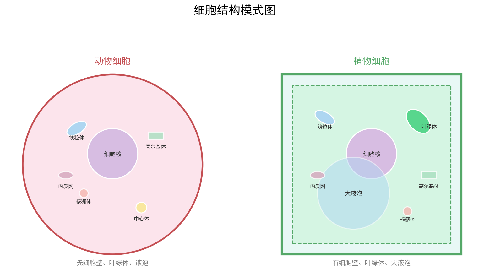

# 细胞结构与功能

| 字段 | 内容 |
|------|------|
| **来源** | 人教版必修第一册 / 2023-2025广东选择性考试·生物细胞专题 |
| **时间标签** | #高一筑基 |
| **难度** | ★★☆☆☆ |
| **状态** | ⚠️待强化 |
| **试卷来源** | #广东选择性考试 |
| **广东考情** | 考查频率：高频（近5年广东卷每年均有涉及，多以选择题形式单独考查或作为非选择题的基础铺垫）；难度定位：基础~中档；特色描述：广东卷常结合生活科技情境命题，如分泌蛋白合成运输、物质跨膜运输方式判断、原核真核细胞对比，偏爱用模式图、电镜图考查结构与功能的对应关系；赋分提示：基础概念题是赋分"基本盘"，物质运输方式判断与细胞器功能对应是常设陷阱，务必稳拿不丢分 |

---




## 核心内容

### 关键概念
- **细胞膜**：系统的边界，控制物质进出；主要由磷脂和蛋白质组成
- **细胞器**：细胞质中具有特定功能的结构，包括双层膜（线粒体、叶绿体）、单层膜（内质网、高尔基体、溶酶体、液泡）、无膜（核糖体、中心体）
- **细胞核**：遗传信息库，是细胞代谢和遗传的控制中心
- **生物膜系统**：细胞膜、核膜及细胞器膜共同构成，功能上紧密联系
- **原核细胞 vs 真核细胞**：有无核膜包被的细胞核

### 核心知识体系

#### 1. 细胞膜结构与功能
```
结构：流动镶嵌模型
- 磷脂双分子层（基本骨架）+ 蛋白质（镶嵌/贯穿/覆盖）+ 糖类（糖蛋白/糖脂）
- 结构特点：具有一定的流动性
- 功能特性：选择透过性

功能：
① 将细胞与外界环境分隔开
② 控制物质进出（自由扩散、协助扩散、主动运输、胞吞胞吐）
③ 进行细胞间信息交流（糖蛋白识别、激素受体、胞间连丝、突触）
```

#### 2. 细胞器速查表
| 细胞器 | 结构 | 功能 | 分布 | 广东考点 |
|--------|------|------|------|---------|
| 线粒体 | 双层膜，内膜折叠成嵴 | 有氧呼吸主要场所（第二、三阶段） | 真核动植物 | 供能中心，与代谢旺盛程度正相关 |
| 叶绿体 | 双层膜，内有类囊体和基质 | 光合作用场所 | 植物绿色细胞 | 光合色素分布、光反应/暗反应场所 |
| 核糖体 | 无膜，rRNA+蛋白质 | 蛋白质合成场所 | 所有细胞 | 游离型→胞内蛋白；附着型→分泌蛋白 |
| 内质网 | 单层膜，连核膜 | 蛋白质加工、脂质合成 | 真核细胞 | 粗面→分泌蛋白加工；光面→脂质合成 |
| 高尔基体 | 单层膜，扁平囊+小泡 | 蛋白质加工、分类、包装、分泌 | 真核细胞 | 植物→细胞壁形成；动物→分泌物分泌 |
| 溶酶体 | 单层膜，含水解酶 | 分解衰老细胞器、吞噬病原体 | 动物细胞 | 细胞凋亡、细胞自噬 |
| 液泡 | 单层膜，含细胞液 | 储存、维持渗透压、调节pH | 成熟植物细胞 | 质壁分离/复原实验 |
| 中心体 | 无膜，两个中心粒 | 与有丝分裂纺锤体形成有关 | 动物细胞和低等植物 | 前期发出星射线 |

#### 3. 分泌蛋白合成与分泌途径（蛋白质分选）
```
核糖体 → 内质网（加工、折叠） → 高尔基体（加工、分类、包装） → 细胞膜（胞吐释放）
                    ↑                    ↑
                 线粒体供能          线粒体供能

研究方法：同位素标记法（³H标记亮氨酸）
放射性出现顺序：核糖体 → 内质网 → 高尔基体 → 分泌小泡 → 细胞外
```

#### 4. 生物膜系统
```
组成：细胞膜 + 核膜 + 内质网 + 高尔基体 + 线粒体 + 叶绿体 + 溶酶体 + 液泡
功能联系：内质网↔高尔基体↔细胞膜（通过囊泡运输）
意义：①区域化分工，提高效率；②为酶提供附着位点；③使细胞成为一个统一整体
```

#### 5. 原核细胞 vs 真核细胞对比
| 特征 | 原核细胞 | 真核细胞 |
|------|---------|---------|
| 核膜 | 无 | 有 |
| 染色体 | 无（有环状DNA） | 有（线性DNA+蛋白质） |
| 细胞器 | 只有核糖体 | 有多种复杂细胞器 |
| 细胞壁 | 多数有（肽聚糖） | 植物有（纤维素），动物无 |
| 代表生物 | 细菌、蓝藻、支原体 | 动植物、真菌 |
| 分裂方式 | 二分裂 | 有丝分裂/减数分裂/无丝分裂 |

### 方法步骤

#### 细胞器识别与功能判断
1. **看膜层数**：
   - 双层膜：线粒体、叶绿体、核膜
   - 单层膜：内质网、高尔基体、溶酶体、液泡、细胞膜
   - 无膜：核糖体、中心体
2. **看细胞类型**：
   - 植物特有：叶绿体、液泡、细胞壁
   - 动物特有：中心体、溶酶体
   - 原核特有：无核膜、只有核糖体
3. **看功能关联**：
   - 能量供应：线粒体（需氧）、叶绿体（产氧）
   - 分泌蛋白：核糖体→内质网→高尔基体→细胞膜

#### 物质跨膜运输方式判断
| 方式 | 方向 | 是否需载体 | 是否耗能 | 例子 |
|------|------|-----------|---------|------|
| 自由扩散 | 高→低 | 否 | 否 | O₂、CO₂、水、甘油、乙醇、苯 |
| 协助扩散 | 高→低 | 是 | 否 | 红细胞吸收葡萄糖、离子通道 |
| 主动运输 | 低→高 | 是 | 是 | 小肠上皮吸收葡萄糖/氨基酸、离子泵 |
| 胞吞/胞吐 | — | 否 | 是 | 蛋白质分泌、吞噬细胞吞噬 |

> 判断口诀：顺浓度不耗能是扩散，逆浓度耗能是主动；大分子靠胞吞胞吐。

### 记忆口诀/技巧
> **细胞器口诀**：线叶双膜有能量，内高液溶单膜藏；核糖中心无膜包，分工合作膜系统。
> **分泌蛋白路径**：核糖内质高尔基，线粒供能膜外去。
> **原核真核速判**：有核真核，无核原核；原核只有核糖体，真核分工多样化。
> **广东情境提示**：广东卷细胞题常以广东本地生物为情境（如荔枝/龙眼细胞结构、红树林耐盐机制、南海珊瑚共生体系），注意从情境中提取细胞类型和结构功能信息。

---

## 题型识别标志

> **看到什么条件 → 立刻想到什么方法/模型**

| 题干关键条件 | 识别为 | 首选方法 |
|-------------|--------|----------|
| "将线粒体/叶绿体各部分分离，问某成分位于何处" | 细胞器亚结构 | 膜层数 + 基质定位（线粒体 DNA 在基质） |
| "核孔蛋白 HPR1 突变，mRNA 分布异常" | 细胞核/核孔功能 | mRNA 转录后在核内加工、经核孔出核 |
| "分泌蛋白合成路径、放射性出现顺序" | 分泌蛋白分选 | 核糖体→内质网→高尔基体→胞外（线粒体供能） |
| "质壁分离/复原、蔗糖溶液浓度比较" | 物质跨膜运输（渗透） | 浓度差判断 + 原生质层 |
| "选项涉及单层膜/双层膜/无膜细胞器" | 细胞器识别 | 膜层数速查 |
| "原核生物进行有氧呼吸/光合但无线粒体叶绿体" | 原核真核区分 | 结构简 ≠ 功能缺 |
| "流动性/选择透过性、信息交流" | 细胞膜功能 | 流动镶嵌模型 |

## 解题路径（细胞器定位与物质运输判断三步法）

> 细胞结构是广东卷选择题"基本盘"，物质运输方式判断与细胞器功能对应是常设陷阱，务必稳拿不丢分。

### 第一步：按膜层数/细胞类型初筛
- 双层膜：线粒体、叶绿体、核膜；单层膜：内质网、高尔基体、溶酶体、液泡、细胞膜；无膜：核糖体、中心体。
- 植物特有：叶绿体、液泡、细胞壁；动物特有：中心体、溶酶体；原核只有核糖体。

### 第二步：定位功能成分
- 线粒体 DNA、有氧呼吸酶 → 线粒体基质/内膜；光合色素 → 类囊体；蛋白质加工 → 内质网/高尔基体。
- 分离实验典型标注：① 膜间隙 ② 内膜 ③ 基质 ④ 外膜。

### 第三步：物质运输方式判定
- 顺浓度不耗能 → 扩散/协助扩散；逆浓度耗能 → 主动运输；大分子 → 胞吞胞吐。
- 渗透：质壁分离看外界浓度 > 细胞液浓度；原生质层 = 细胞膜 + 液泡膜 + 两层间细胞质。

> ⚠️ 易错：核糖体无膜但属生物膜系统说法错误；原核无线粒体也可有氧呼吸；细胞壁 ≠ 原生质层。

## 母题（2022 广东选择性考试·第8题，选择题）

> 题号与年份已核实；单题分值按广东卷结构（选择题第 1–12 题每题 2 分）标注，精确分值以原卷为准。

**题目**：将正常线粒体各部分分离，结果见图。含有线粒体 DNA 的是（ ）
- A. ①
- B. ②
- C. ③
- D. ④

（图中：① 线粒体内膜和外膜的间隙，② 线粒体内膜，③ 线粒体基质，④ 线粒体外膜）

**解**：

**答案：C**

- 线粒体 DNA 分布于**线粒体基质**中。
- 图中 ③ 为线粒体基质，故含线粒体 DNA 的是 ③。

> 💡 **关键技巧**：细胞器"分离实验"题先对照图注把各部分名称对应准确（间隙/内膜/基质/外膜），再调用"DNA、呼吸酶在基质，有氧呼吸第三阶段酶在内膜"的定位规律，广东卷常把①～④标号设成易混选项。

---

## 关联卡片

- [酶与ATP及细胞代谢](高一筑基_生物_核心知识网络_酶与ATP及细胞代谢.md) — 线粒体/叶绿体功能的具体反应
- [生物长句表达标准模板](../典型题型与方法/高二深化_生物_典型题型与方法_生物长句表达标准模板.md) — 细胞结构与功能的长句表达
- [广东生物实验设计题答题框架](../典型题型与方法/高二深化_生物_典型题型与方法_广东生物实验设计题答题框架.md) — 细胞相关实验设计

---

## 备注

- 细胞结构是广东卷生物选择题和实验题的基础考点，看似简单但细节决定成败
- 高频陷阱：
  - 核糖体无膜，但属于生物膜系统的组成部分（错误说法：生物膜系统只包括膜结构细胞器）
  - 原核生物无线粒体，但可进行有氧呼吸（在细胞膜和细胞质中进行）
  - 原核生物无叶绿体，但可进行光合作用（如蓝藻有光合色素）
  - 植物细胞有细胞壁，但真菌（如酵母菌）也有细胞壁（成分不同）
  - 中心体存在于动物细胞和低等植物细胞，高等植物细胞没有
- 分泌蛋白的膜面积变化：内质网面积减小，高尔基体面积基本不变（先增后减），细胞膜面积增大
- 广东卷常考：细胞亚显微结构模式图识别、物质跨膜运输方式判断、分泌蛋白路径分析
