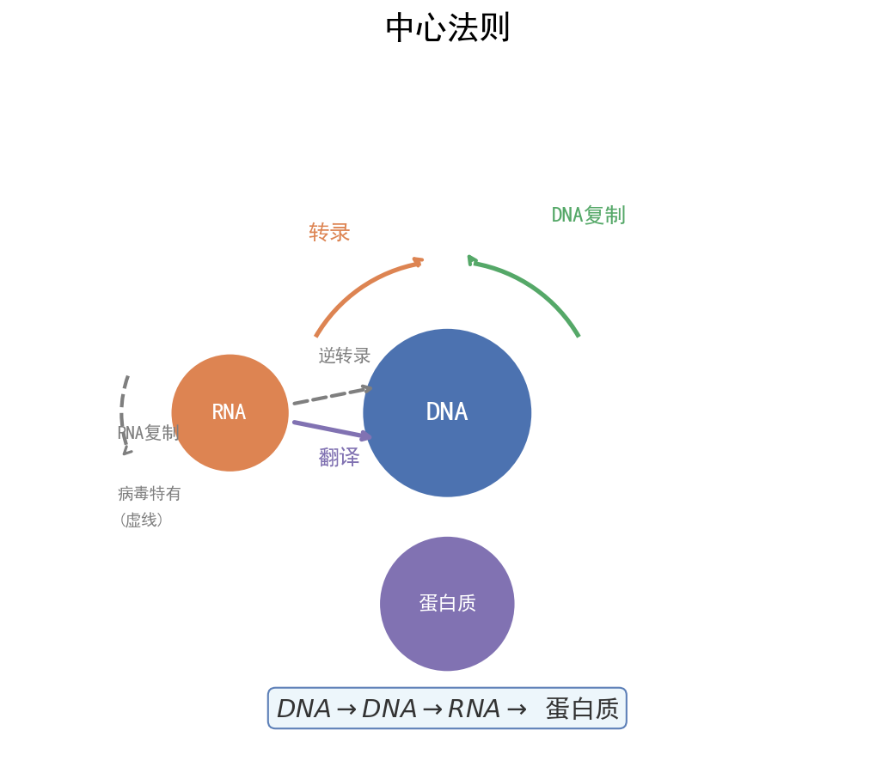

# 🧬 基因工程与生物技术 | 核心知识网络

| 字段 | 内容 |
|------|------|
| **来源** | 人教版选择性必修第三册 第3~4章 / 广东选择性考试 |
| **时间标签** | #高二深化 |
| **难度** | ★★★★☆ |
| **状态** | ⚠️待强化 |
| **试卷来源** | #广东选择性考试 |
| **广东考情** | 高频（近5年广东卷5次考查，选必三每年1道大题）；中档偏难；实验设计类题目多，常要求"写出实验步骤""分析实验结果"；情境化命题常结合广东生物医药产业（深圳基因检测、广州生物医药基地）；赋分提示：限制酶选择是易失分点，PCR条件记忆必须准确 |

---




## 核心内容

### 关键概念

#### 一、基因工程工具

| 工具 | 来源 | 功能 | 特点/注意 |
|------|------|------|-----------|
| **限制性内切核酸酶（限制酶）** | 主要从原核生物中分离 | 识别特定核苷酸序列，在**特定部位**切割DNA | 切割后产生黏性末端或平末端；一种限制酶识别一种特定序列 |
| **DNA连接酶** | 大肠杆菌、T4噬菌体 | 连接双链DNA片段，恢复磷酸二酯键 | E·coli DNA连接酶：黏性末端；T4 DNA连接酶：黏性/平末端 |
| **载体（质粒）** | 细菌、酵母菌 | 将外源基因导入受体细胞 | 必备条件：①复制原点 ②标记基因 ③多克隆位点 ④对宿主无害 |

> ⚠️ **限制酶不切割自身DNA的原因**：原核生物细胞内的限制酶与甲基化酶配合，自身DNA相应位点被甲基化修饰，避免被切割。

#### 二、基因工程基本步骤

```
获取目的基因 → 构建基因表达载体 → 导入受体细胞 → 筛选与检测
```

**步骤1：获取目的基因**

| 方法 | 适用场景 | 特点 |
|------|----------|------|
| **从基因文库获取** | 已知部分序列 | 基因组文库含全部基因；cDNA文库只含表达的基因（无内含子） |
| **PCR扩增** | 已知目的基因两端序列 | 体外快速扩增，需设计引物 |
| **人工合成** | 基因较小、序列已知 | 化学合成法；真核基因可用反转录法（先mRNA→cDNA） |

**步骤2：构建基因表达载体（核心步骤）**

```
目的基因 + 启动子 + 终止子 + 标记基因 + 复制原点 → 重组质粒
```

| 组件 | 功能 |
|------|------|
| **启动子** | RNA聚合酶识别和结合部位，**驱动基因转录** |
| **终止子** | 终止转录 |
| **目的基因** | 需要表达的基因 |
| **标记基因** | 便于筛选含目的基因的受体细胞（如抗生素抗性基因） |
| **复制原点** | 使质粒能在宿主细胞中自我复制 |

> ⚠️ **启动子 ≠ 起始密码子**：启动子是DNA上的调控序列；起始密码子是mRNA上翻译开始的信号。

**步骤3：导入受体细胞**

| 受体细胞 | 导入方法 | 关键条件 |
|----------|----------|----------|
| **植物细胞** | 农杆菌转化法（最常用）、基因枪法、花粉管通道法 | 农杆菌Ti质粒上的T-DNA可转移并整合到植物染色体DNA |
| **动物细胞** | 显微注射法（受精卵） | 导入受精卵，全能性高 |
| **微生物细胞** | Ca²⁺处理法（感受态细胞） | 用CaCl₂处理大肠杆菌，增加细胞膜通透性 |

**步骤4：筛选与检测**

| 检测层次 | 方法 | 检测目标 |
|----------|------|----------|
| **分子水平（DNA）** | DNA分子杂交（PCR/探针） | 目的基因是否导入 |
| **分子水平（mRNA）** | 分子杂交 | 目的基因是否转录 |
| **分子水平（蛋白质）** | 抗原-抗体杂交 | 目的基因是否翻译 |
| **个体水平** | 抗虫/抗病接种实验 | 目的基因是否发挥功能 |

> 检测顺序：先确认导入（DNA水平）→再确认表达（蛋白质水平）→最后功能验证（个体水平）

#### 三、PCR技术

```
PCR = 体外DNA扩增技术（聚合酶链式反应）
```

**三个步骤循环（每个循环约30次）**：

| 步骤 | 温度 | 作用 | 说明 |
|------|------|------|------|
| **变性** | 90~95℃ | 双链DNA解开为单链 | 高温破坏氢键，无需解旋酶 |
| **复性（退火）** | 55~60℃ | 引物与单链DNA互补结合 | 引物决定扩增的特异性 |
| **延伸** | 70~75℃ | Taq DNA聚合酶催化DNA链延伸 | 从引物3'端开始延伸 |

> **Taq DNA聚合酶**：热稳定DNA聚合酶，从嗜热菌中分离，耐高温。

**PCR引物设计要点**：
- 两种引物分别与目的基因两条链的3'端互补
- 引物之间不能互补配对（避免形成引物二聚体）
- 引物长度通常为20~30个核苷酸

#### 四、基因工程应用

| 领域 | 应用实例 |
|------|----------|
| **农业** | 抗虫棉（Bt毒蛋白基因）、抗除草剂大豆、黄金大米 |
| **医药** | 重组人胰岛素、干扰素、乙肝疫苗、单克隆抗体 |
| **环保** | 分解石油的"超级细菌"、净化重金属的转基因植物 |
| **基因诊断** | DNA探针检测遗传病、基因芯片 |
| **基因治疗** | 将正常基因导入患者体内（如SCID治疗） |

> **广东产业关联**：深圳华大基因（基因测序）、广州生物岛（生物医药）、珠海丽珠医药等，是广东卷情境化命题的常用素材。

#### 五、细胞工程

**植物组织培养**

```
原理：植物细胞的全能性

外植体 → 脱分化 → 愈伤组织 → 再分化 → 胚状体/丛芽 → 完整植株
            ↑            ↑
         形成愈伤      形成根/芽
         （无定形）    （再分化）
```

| 技术 | 原理 | 应用 |
|------|------|------|
| **植物体细胞杂交** | 细胞膜的流动性 + 植物细胞全能性 | 克服远缘杂交不亲和障碍（如番茄-马铃薯） |
| **微型繁殖（快速繁殖）** | 细胞全能性 | 高效繁殖优良品种 |
| **作物脱毒** | 茎尖病毒极少 | 获得脱毒苗（如脱毒马铃薯） |
| **单倍体育种** | 花药离体培养 + 秋水仙素加倍 | 快速获得纯合子，缩短育种年限 |

> 植物体细胞杂交步骤：①去壁（纤维素酶+果胶酶）→②原生质体融合（PEG诱导/电激）→③筛选杂种细胞→④组织培养

**动物细胞培养**

| 条件 | 具体要求 |
|------|----------|
| **营养** | 糖、氨基酸、无机盐、维生素 + 血清（含未知生长因子） |
| **环境** | 无菌无毒、适宜温度（36.5±0.5℃）、pH（7.2~7.4）、气体（95%空气+5%CO₂） |
| **CO₂作用** | 维持培养液pH |

> 动物细胞培养过程：原代培养（1~10代）→传代培养（10~50代）→细胞系（遗传物质改变，可无限传代）

**动物细胞融合与单克隆抗体**

```
B淋巴细胞（能产生特异性抗体，但不能无限增殖）
        +
骨髓瘤细胞（能无限增殖，但不能产生抗体）
        ↓
    灭活病毒/PEG/电激诱导融合
        ↓
   杂交瘤细胞（既能无限增殖，又能产生特异性抗体）
```

> 单克隆抗体优点：特异性强、灵敏度高、可大量制备。应用：诊断试剂、治疗疾病（"生物导弹"靶向给药）、运载药物。

#### 六、发酵工程

| 项目 | 内容 |
|------|------|
| **菌种选育** | 诱变育种、基因工程育种、从自然界筛选 |
| **培养基** | 碳源、氮源、无机盐、水、生长因子；注意pH、渗透压 |
| **灭菌** | 培养基和发酵设备必须灭菌（高压蒸汽灭菌），避免杂菌污染 |
| **发酵条件控制** | 温度、pH、溶氧量、转速（搅拌） |
| **产物提取** | 菌体内产物（破碎细胞提取）/ 菌体外产物（过滤、萃取、蒸馏） |

> 发酵工程应用：抗生素（青霉素）、氨基酸（谷氨酸）、酶制剂、酒精（酵母菌无氧呼吸）、酸奶（乳酸菌）。

---

### 核心方法

#### 限制酶选择策略

1. **不能破坏目的基因**：选择切割位点在目的基因两侧的限制酶
2. **至少保留一个标记基因**：选择切割位点不破坏标记基因的限制酶
3. **防止自身环化/反向连接**：使用**两种不同的限制酶**切割（双酶切），产生不同的黏性末端
4. **注意启动子方向**：目的基因应插入启动子下游、终止子上游，且方向正确

#### PCR引物设计检查清单
- [ ] 两种引物分别结合在目的基因两条链的两端
- [ ] 引物3'端朝向目的基因内部（延伸方向5'→3'）
- [ ] 两种引物不能互补配对
- [ ] 引物自身不能形成发夹结构

---

## 关联卡片

- [高一筑基_生物_核心知识网络_遗传定律体系](高一筑基_生物_核心知识网络_遗传定律体系.md) — 基因工程利用基因重组原理，育种方法比较需结合遗传定律
- [高一筑基_生物_核心知识网络_有丝分裂与减数分裂](高一筑基_生物_核心知识网络_有丝分裂与减数分裂.md) — 植物组织培养涉及有丝分裂，细胞融合涉及细胞膜结构
- [高二深化_生物_核心知识网络_生态系统与环境保护](高二深化_生物_核心知识网络_生态系统与环境保护.md) — 发酵工程中微生物培养涉及种群数量变化

---

## 备注

- **广东卷高频陷阱**：
  1. "基因表达载体必须含有目的基因、启动子、终止子" → 还必须有**标记基因**和**复制原点**
  2. "PCR需要DNA聚合酶和解旋酶" → 错误！高温变性代替解旋酶，用**Taq DNA聚合酶**
  3. "将目的基因导入植物细胞最常用基因枪法" → 错误！最常用的是**农杆菌转化法**
  4. "动物细胞培养需要CO₂是为了提供碳源" → 错误！CO₂是为了**维持pH**
  5. "单克隆抗体由B淋巴细胞产生" → 错误！由**杂交瘤细胞**产生
- **广东情境化命题方向**：
  - 深圳华大基因：基因测序、PCR应用
  - 广州生物医药：单克隆抗体药物研发
  - 广东农业：转基因抗虫作物、植物组织培养（兰花等花卉）
- **实验设计题答题框架**：见 [高二深化_生物_典型题型与方法_广东生物实验设计题答题框架](../典型题型与方法/高二深化_生物_典型题型与方法_广东生物实验设计题答题框架.md)

---

> #高二深化 #生物 #核心知识网络 #广东选择性考试 #广东特色 #广东情境
